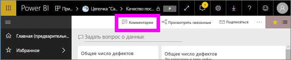
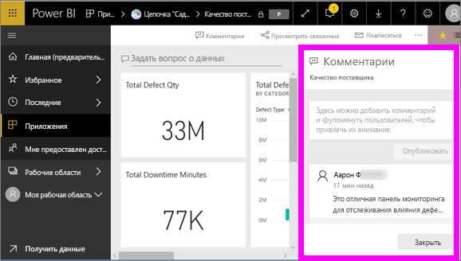
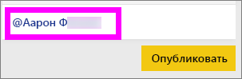
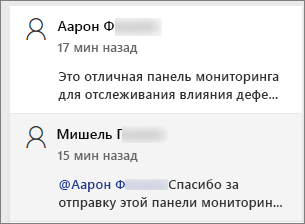
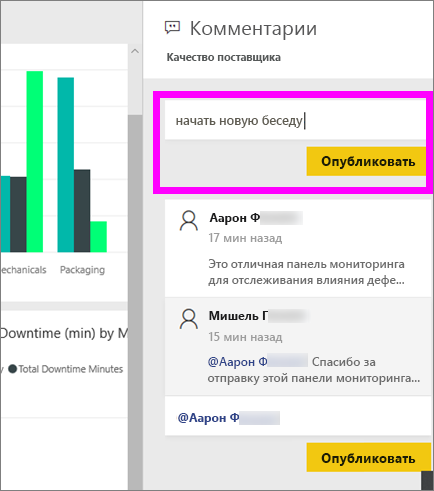
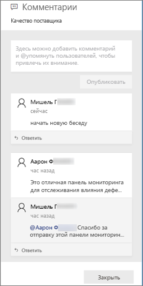
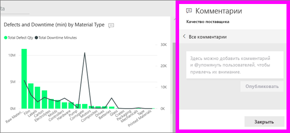
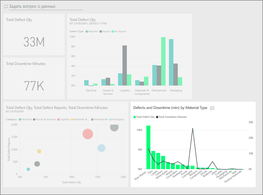
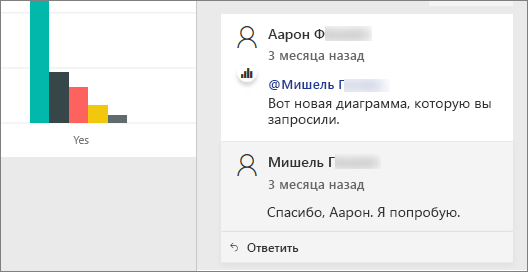

# Добавление комментариев на панель мониторинга
Добавьте собственный комментарий личным или начните беседу о панели мониторинга со своими коллегами. Функция **комментариев** — лишь один из способов, которыми *пользователь* может взаимодействовать с другими. 

## Как использовать функцию комментариев
Комментарии можно добавлять ко всей панели мониторинга или для отдельных визуальных элементов на панели мониторинга. Добавьте общий комментарий или комментарий для конкретных коллег.  

### Добавление общего комментария к панели мониторинга
1. Откройте панель мониторинга Power BI и нажмите на значок **Комментарии**. Откроется диалоговое окно комментариев.

    

    Здесь мы видим, что создатель панели мониторинга уже добавил общий комментарий.  Все, кто имеют доступ к этой панели мониторинга, видят этот комментарий.

    

2. Для ответа нажмите **Ответить**, введите ответ и выберите **Опубликовать**.  

    

    По умолчанию Power BI направляет ваш ответ коллеге, который открыл ветку комментариев, в данном случае Аарон Ф. 

    

 3. Если вы хотите добавить комментарий к панели мониторинга в отдельной ветке, введите его в верхнем текстовом поле.

    

    Комментарии для этой панели мониторинга теперь выглядят следующим образом.

    

### Добавление комментария к определенному визуальному элементу на панели мониторинга
1. Наведите указатель мыши на визуальный элемент и нажмите значок многоточия (...).    
2. В раскрывающемся списке выберите **Добавить комментарий**.

      

3.  Откроется диалоговое окно **комментариев**. Этот визуальный элемент еще не содержит никаких комментариев. 

      

4. Напишите комментарий и нажмите **Опубликовать**.

      

    Значок диаграммы  позволяет узнать, что этот комментарий привязан к определенному визуальному элементу. Выберите значок, чтобы выделить связанный визуальный элемент на панели мониторинга.

    

5. Нажмите **Закрыть**, чтобы вернуться в панель мониторинга или отчет.

### Привлеките внимание коллеги с помощью знака @
Когда вы комментируете панель мониторинга или отдельный визуальный элемент, привлеките внимание коллег с помощью символа \@.  Когда вы вводите символ \@, Power BI открывает раскрывающийся список, где можно найти и выбрать отдельных пользователей из вашей организации. Проверенное имя, перед которым стоит символ \@, отображается синим. 

Это беседа, состоявшаяся с *разработчиком* визуализации. Он использовал символ @, чтобы я обязательно увидел комментарий. Я знаю, что этот комментарий для меня. Когда я открываю эту панель мониторинга приложения в Power BI, я выбираю **Комментарии** в заголовке. Появляется панель **Комментарии** с нашей беседой.

  

## Дальнейшие действия
Возврат к [визуализациям для пользователей](end-user-visualizations.md)    
<!--[Select a visualization to open a report](end-user-open-report.md)-->
