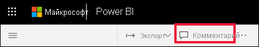
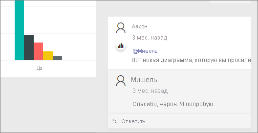

# Добавление комментариев к панели мониторинга или отчета
Добавить комментарий личных или начать диалог о панели мониторинга или отчета с коллегами. Функция **комментариев** — лишь один из способов, которыми *пользователь* может взаимодействовать с другими. 

## Как использовать функцию комментариев
Комментарии можно добавлять для всей панели мониторинга, чтобы отдельные визуальные элементы на панели мониторинга, на странице отчета и для отдельных визуальных элементов на странице отчета. Добавьте комментарий общего рода или комментарий, предназначенные для конкретных коллег.  

При добавлении комментария в отчет Power BI собирает текущего значения фильтра и среза. Это означает, что при выберите или ответить на комментарий, страницы отчета или отчета visual может измениться Показать фильтр и изменение параметров среза, которые были активны при первом комментарий добавлен.  

Почему это важно? Предположим, что ваш коллега применен фильтр, показал интересных сведений, он хочет поделиться с разработчиками. Без этого фильтра, выбранного комментарий не может быть целесообразно. 

### Добавление общего комментария к панели мониторинга или отчета
Процесс добавления комментариев к панели мониторинга или отчета похожи. В этом примере мы используем панели мониторинга. 

1. Откройте панель мониторинга Power BI или отчет и выберите **комментарии** значок. Откроется диалоговое окно комментариев.

    

    Здесь мы видим, что создатель панели мониторинга уже добавил общий комментарий.  Все, кто имеют доступ к этой панели мониторинга, видят этот комментарий.

    

2. Для ответа нажмите **Ответить**, введите ответ и выберите **Опубликовать**.  

    

    По умолчанию Power BI направляет ваш ответ коллеге, который открыл ветку комментариев, в данном случае Аарон Ф. 

    

 3. Если вы хотите добавить комментарий, который не является частью существующего обсуждения, введите комментарий в верхнем поле.

    

    Комментарии для этой панели мониторинга теперь выглядят следующим образом.

    

### Добавление комментария к определенной панели мониторинга или визуального элемента отчета
Помимо добавления комментариев всей панели мониторинга или целой страницы отчета, можно добавить комментарии к отдельной панели мониторинга плитки и отдельным визуальным элементам отчетов. Процессы аналогичны, и в этом примере мы используем отчета.

1. Наведите указатель мыши на визуальный элемент и нажмите значок многоточия (...).    
2. В раскрывающемся списке выберите **Добавить комментарий**.

      

3.  **Комментарии** откроется диалоговое окно, и другие визуальные элементы на странице отображаются серым. Этот визуальный элемент еще не содержит никаких комментариев. 

      

4. Напишите комментарий и нажмите **Опубликовать**.

      

    - В отчете странице, выбрав Комментарий, который был сделан на визуальный элемент, выделены визуальный (см. выше).

    - На панели мониторинга значок диаграммы  позволяет узнать, что комментарий привязан к конкретного визуального. Комментарии, которые применяются к всю панель мониторинга не имеют специальный значок. Выбрав значок диаграммы выделяются связанные визуального элемента на панели мониторинга.

        

5. Нажмите **Закрыть**, чтобы вернуться в панель мониторинга или отчет.

### Привлеките внимание коллеги с помощью знака @
При создании панели мониторинга, отчетов, плитки или визуального комментарий захвата внимания ваших коллег с помощью "\@" символов.  При вводе "\@" символ, Power BI откроет раскрывающийся список, где можно найти и выбрать отдельных пользователей из вашей организации. Проверенное имя, перед которым стоит символ \@, отображается синим. 

Это беседа, состоявшаяся с *разработчиком* визуализации. Он использовал символ @, чтобы я обязательно увидел комментарий. Я знаю, что этот комментарий для меня. Когда я открываю эту панель мониторинга приложения в Power BI, я выбираю **Комментарии** в заголовке. Появляется панель **Комментарии** с нашей беседой.

  

## Дальнейшие действия
Возврат к [визуализациям для пользователей](end-user-visualizations.md)    
<!--[Select a visualization to open a report](end-user-open-report.md)-->
