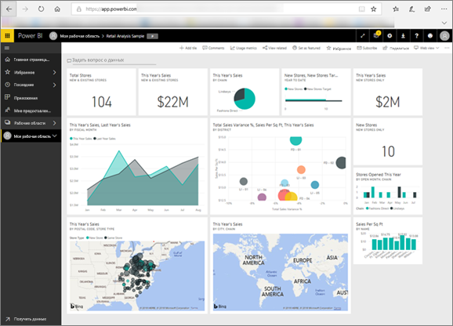

# Power BI для потребителей
Способ вашего взаимодействия с Power BI будет зависеть от вашей должности. Как *конечный пользователь* или *потребитель* вы являетесь тем, кто получает панели мониторинга, отчеты и приложения от коллег. При работе в ***службе Power BI*** вы просматриваете это содержимое и взаимодействуете с ним с целью принятия бизнес-решений.

Если вы еще не знакомы с Power BI, мы рекомендуем сначала прочитать статью [Обзор Power BI](../power-bi-overview.md). Из нее вы узнаете о наборе средств, входящих в состав Power BI.

Как потребитель вы не сможете получить доступ ко всем возможностям Power BI и это нормально. В ваши задачи не входит конструирование панелей мониторинга и отчетов. То, что вам нужно, — это использование Power BI для анализа, мониторинга, изучения и принятия решений.

По мере чтения статей для потребителей вы ознакомитесь с терминологией, с основными принципами работы службы Power BI, узнаете, как находить нужное содержимое, а затем научитесь взаимодействовать с этим содержимым.  Давайте начнем.

