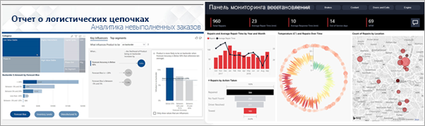

# Служба Power BI для потребителей

[!INCLUDE[consumer-appliesto-ynny](../includes/consumer-appliesto-ynny.md)]

Вас окружает культура данных, где принятие бизнес-решений основано на фактах, а не мнениях. Для этого вам требуются данные, и ваши коллеги делают все возможное.     
 
Они отправляют вам все типы отчетов, электронные таблицы, сообщения электронной почты с диаграммами и даже печатные раздаточные материалы. По мере роста объема имеющихся данных становится все труднее находить нужную информацию, и вы беспокоитесь о том, что, возможно работаете с уже устаревшими сведениями.  
 

## Служба Power BI для *потребителей*

Power BI упрощает выполнение ваших задач и повышает их эффективность. Все данные преобразуются в диаграммы и графики, наглядно отображающие нужные сведения. Длинные списки или таблицы с числами и словами потеряли свою актуальность. Теперь ваши аналитические данные имеют вид ***привлекательных*** цветных визуальных элементов, которые представляют ценную информацию. 

 
Просто откройте службу Power BI в браузере или на мобильном устройстве. Вы и ваши коллеги работаете с одними и теми же надежными панелями мониторинга и отчетами, которые обновляются автоматически, поэтому у вас под рукой всегда самое последнее содержимое.   

Поскольку содержимое не является статическим, вы можете углубленно изучать его, искать тенденции, аналитические сведения и другие данные бизнес-аналитики. Анализируйте доступное содержимое и даже задавайте ему вопросы своими словами. Или просто откиньтесь на спинку стула и позвольте своим данным выполнять интересные аналитические операции, отправлять вам оповещения при изменении данных и отсылать отчеты по электронной почте в соответствии с заданным расписанием. Все ваши данные доступны вам в любое время и с любого устройства независимо от их расположения — в облаке или локальной среде. Это лишь часть возможностей Power BI. 

## Являюсь ли я *потребителем* Power BI?

Способ вашего взаимодействия с Power BI будет зависеть от вашей должности. Как конечный пользователь или *потребитель* вы являетесь тем, кто получает содержимое (панели мониторинга, отчеты и приложения) от коллег. Вы работаете в сетевой или мобильной версии Power BI, которая называется службой Power BI, просматриваете содержимое и взаимодействуете с ним, чтобы принимать важные бизнес-решения. 
   
Как потребитель вы не сможете получить доступ ко всем возможностям Power BI. Это абсолютно нормально. В ваши задачи не входит создание панелей мониторинга и отчетов. Вы будете использовать Power BI для анализа, мониторинга, изучения и принятия решений. 

Вам, несомненно, встретится термин "Power BI Desktop" или просто "Desktop". Это автономное средство, используемое *разработчиками*, которые создают и панели мониторинга, и отчеты и представляют общий доступ к ним.  Важно знать, что существуют и другие средства Power BI, но если вы являетесь потребителем, вы будете работать только со службой Power BI. 

Вы работаете с *общим* содержимым, поэтому вам потребуется только **бесплатная лицензия**, так как в вашей организации используется емкость **Премиум**. [Какая у меня лицензия?](end-user-license.md)

## Безопасная работа с содержимым 
Когда вы применяете фильтры и срезы, подписываетесь на данные, экспортируете их, не беспокойтесь, — это не влияет на базовый набор данных или исходное общее содержимое (панели мониторинга, отчеты и приложения).  

Вы не можете повредить данные.  Power BI отлично подходит для исследования и экспериментов; работайте, не беспокоясь о возможных изменениях.  
 
Это не значит, что вы не можете сохранять изменения. Они сохраняются, но касаются только вашего представления содержимого. А чтобы вернуться к исходному представлению по умолчанию, нужно просто нажать соответствующую кнопку.  

## Дальнейшие действия

[Take a tour of the Power BI service for consumers](end-user-reading-view.md)   (Краткое руководство. Сведения о возможностях Power BI для потребителей)  
[Power BI service training for consumers](https://docs.microsoft.com/learn/paths/consume-data-with-power-bi/)   (Обучение потребителей работе со службой Power BI)  
[Терминология и основные понятия для *потребителей* Power BI](end-user-basic-concepts.md)    

