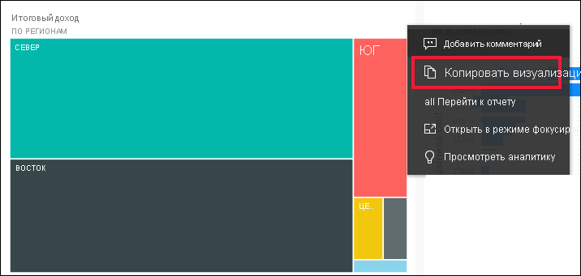
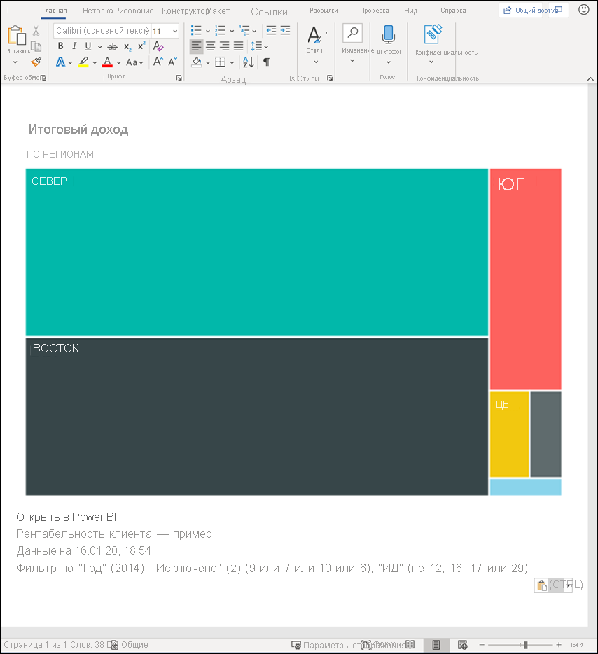
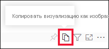
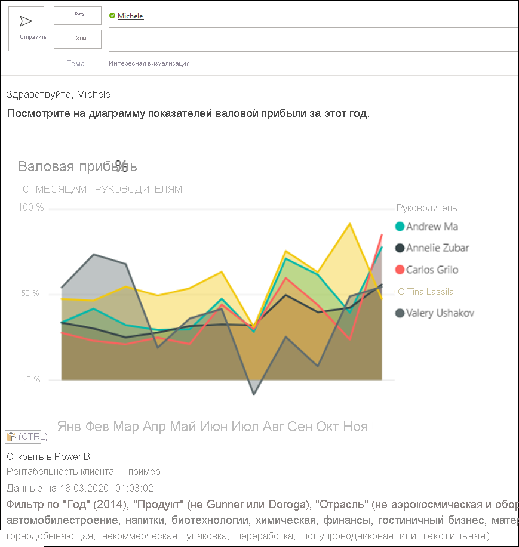
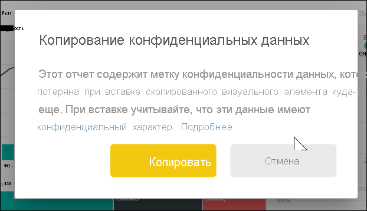
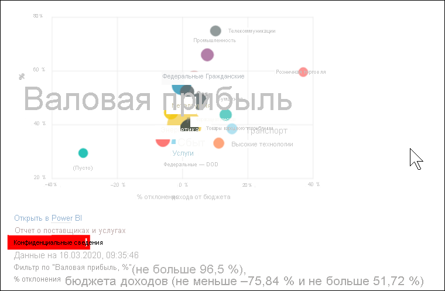
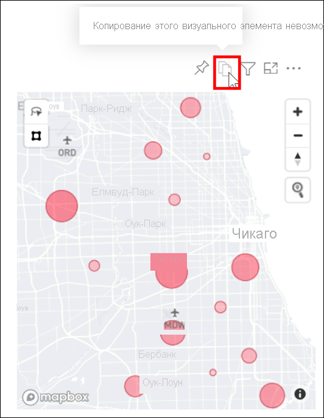

# Копирование визуального элемента в качестве изображения в буфер обмена

[!INCLUDE[consumer-appliesto-yyyn](../includes/consumer-appliesto-yyyn.md)]

Возникала ли у вас когда-либо потребность поделиться изображением из отчета или панели мониторинга Power BI? Теперь вы можете скопировать визуальный элемент и вставить его в любое другое приложение, которое поддерживает вставку. 

При копировании статического изображения визуального элемента вы получаете его копию вместе с метаданными. В том числе:
* ссылка на исходный отчет или панель мониторинга Power BI;
* название отчета или панели мониторинга;
* уведомление о наличии конфиденциальной информации на изображении;
* метка времени последнего обновления;
* фильтры, примененные к визуальному элементу.

### Копирование с плитки панели мониторинга

1. Перейдите к панели мониторинга, с которой необходимо выполнить копирование.

2. В правом верхнем углу визуального элемента щелкните **Дополнительные действия (...)** и выберите пункт **Копировать визуализацию как изображение**. 

    

3. Когда откроется диалоговое окно **Визуальный элемент готов к копированию**, выберите команду **Копировать в буфер обмена**.

    

4. Скопировав визуализацию, вставьте ее в другое приложение. Для этого нажмите клавиши **CTRL+V** или **щелкните правой кнопкой мыши** и выберите пункт **Вставить**. На приведенном ниже снимке экрана визуальный элемент был вставлен в Microsoft Word. 

    

### Копирование из визуального элемента отчета 

1. Перейдите к отчету, из которого необходимо выполнить копирование.

2. В правом верхнем углу визуального элемента щелкните значок **Копировать визуализацию как изображение**. 

    

3. Когда откроется диалоговое окно **Визуальный элемент готов к копированию**, выберите команду **Копировать в буфер обмена**.

    

4. Скопировав визуализацию, вставьте ее в другое приложение. Для этого нажмите клавиши **CTRL+V** или **щелкните правой кнопкой мыши** и выберите пункт **Вставить**. На приведенном ниже снимке экрана визуальный элемент был вставлен в сообщение электронной почты.

    

5. Если к отчету применена метка конфиденциальности данных, то при выборе значка копирования появится предупреждение.  

    

    Метка конфиденциальности будет добавлена к метаданным под вставленным визуальным элементом. 

    

## Рекомендации и устранение неполадок

   

Вопрос. Почему значок копирования отключен на визуальном элементе?    
A. В настоящее время поддерживаются собственные визуальные элементы Power BI и сертифицированные пользовательские визуальные элементы. Поддержка ограничена для некоторых визуальных элементов, в том числе следующих. 
- ESRI и другие визуальные элементы карт 
- Визуализация с помощью инструментов Python 
- Визуальные элементы R 
- Визуализации PowerApps   

A. Возможность копирования визуального элемента может быть отключена ИТ-отделом или администратором Power BI.

Вопрос. Почему визуальный элемент вставляется неправильно?    
A. Существуют ограничения для пользовательских визуальных элементов и анимированных визуальных элементов. 

## Дальнейшие действия
Подробнее о [визуализациях в отчетах Power BI](end-user-visual-type.md).

Если у вас есть разрешения на изменение отчета, вы можете [копировать и вставлять визуализации в этом отчете](../visuals/power-bi-visualization-copy-paste.md). 

Появились дополнительные вопросы? [Ответы на них см. в сообществе Power BI.](https://community.powerbi.com/)

