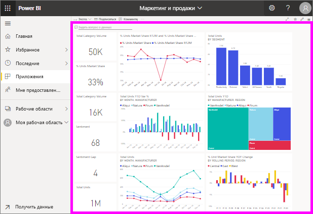

# Просмотр панели мониторинга
Power BI *потребителей* тратить много времени, просматривать панели мониторинга. Панели мониторинга разработаны так, чтобы обращать внимание на определенные сведения из исходных отчетов и наборов данных. Пользователи Power BI применяют эти сведения для отслеживания, мониторинга, тестирования, получения ответов и т. п., а затем на этой основе принимают бизнес-решения.

В Power BI Pro требуется для совместного использования панели мониторинга и просмотра общей панели мониторинга.

## Открытие панели мониторинга

|              |         |
|------------|--------------------------------|
|      |Панели мониторинга можно открыть из различных расположений в службе Power BI.   Просто найдите этот значок панели мониторинга. После определения  панели мониторинга открыть ее просто: выберите ее и панель мониторинга  заполнит холст Power BI. |
|                    |          |

Панели мониторинга могут попадаться в любых контейнерах на панели навигации слева. 

- **Домашняя** 
- **Избранное** — если вы уже [отметили избранную панель мониторинга](end-user-favorite.md).
- **Последние** — если вы недавно просматривали панели мониторинга.
- **Приложения** — многие приложения содержат панели мониторинга и отчеты.
- **Мне предоставлен доступ** — если коллеги [предоставили вам совместный доступ к панели мониторинга](end-user-shared-with-me.md).
- **Моя рабочая область** — если вы скачали любой из [примеров для Power BI](../sample-datasets.md).

## Дальнейшие действия
* Ознакомьтесь с обзорными сведениями об использовании на примере одной из наших [панелей мониторинга](../sample-tutorial-connect-to-the-samples.md).
* Узнайте, что такое [плитки панели мониторинга](end-user-tiles.md) и что произойдет, если выбрать одну из них.