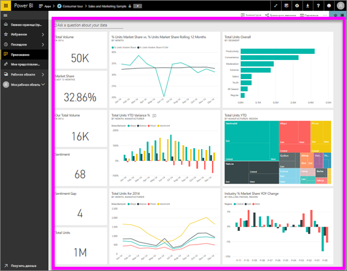

# Просмотр панели мониторинга
Пользователи Power BI тратят много времени на просмотр панелей мониторинга. Панели мониторинга разработаны так, чтобы обращать внимание на определенные сведения из исходных отчетов и наборов данных. Пользователи Power BI применяют эти сведения для отслеживания, мониторинга, тестирования, получения ответов и т. п., а затем на этой основе принимают бизнес-решения.

В Power BI Pro требуется для совместного использования панели мониторинга и просмотра общей панели мониторинга.

## Открытие панели мониторинга
Панели мониторинга можно открыть в службе Power BI из нескольких расположений.  Важно лишь понять, какое содержимое соответствует панели мониторинга (а не отчету, например). Найдя в интерфейсе панель мониторинга, ее можно открыть простым щелчком. Выбранная панель мониторинга заполняет собой холст Power BI.

|              |         |
|------------|--------------------------------|
|      |Чтобы найти панель мониторинга, проще всего найти вот такой  значок панели мониторинга. Увидев содержимого с этим значком, щелкните его, чтобы открыть панель мониторинга. |
|                    |          |

 

<!--insert aGIF-->

Панели мониторинга могут попадаться в любых контейнерах на панели навигации слева. 
- **Главная** (предварительная версия).
- **Избранное** — если вы уже [отметили избранную панель мониторинга](end-user-favorite.md).
- **Последние** — если вы недавно просматривали панели мониторинга.
- **Приложения** — многие приложения содержат панели мониторинга и отчеты.
- **Мне предоставлен доступ** — если коллеги [предоставили вам совместный доступ к панели мониторинга](end-user-shared-with-me.md).
- **Моя рабочая область** — если вы скачали любой из [примеров для Power BI](../sample-datasets.md).

## Дальнейшие действия
* Ознакомьтесь с обзорными сведениями об использовании на примере одной из наших [панелей мониторинга](../sample-tutorial-connect-to-the-samples.md).
* Узнайте, что такое [плитки панели мониторинга](end-user-tiles.md) и что произойдет, если выбрать одну из них.
* Хотите отслеживать отдельную плитку панели мониторинга и получать сообщения электронной почты при достижении определенного порога? [Создавайте оповещения, связанные с плитками](end-user-alerts.md).
* Не стесняйтесь задавать вопросы о панели мониторинга. Узнайте, как использовать функцию ["Вопросы и ответы" Power BI](end-user-q-and-a.md), задавайте вопросы о своих данных и получайте ответы в виде визуализации. 