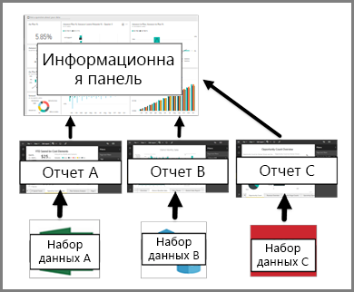

# Панели мониторинга с точки зрения потребителей службы Power BI

***Панель мониторинга*** Power BI — это отдельная страница (часто называется полотном), на которой данные отображаются в виде визуализаций. Будучи ограниченной одной страницей, продуманная панель мониторинга содержит самые важные фрагменты таких данных.

Визуализации, отображаемые на панели мониторинга, называются *плитки* и *закрепленные* к панели мониторинга, отчетов *конструкторы*. В большинстве случаев выберете плитку, можно перейти на страницу отчета место создания визуализации. Если вы недавно начали использовать службу Power BI, ознакомьтесь со статьей [Power BI — основные понятия](end-user-basic-concepts.md), где приведены базовые сведения.

> [!NOTE]
> Панели мониторинга можно [просматривать и совместно использовать на мобильных устройствах](mobile/mobile-apps-view-dashboard.md).
>
> Чтобы просмотреть панель мониторинга, для которой был предоставлен доступ, воспользуйтесь Power BI Pro.
> 

Визуализации на панели мониторинга появляются из отчетов, а каждый отчет создается на основе набора данных. Фактически панель мониторинга можно рассматривать как средство представления базовых отчетов и наборов данных. Выбирая визуализацию, вы можете перейти к отчету (и набору данных), который использовался для ее создания.

## Преимущества панелей мониторинга
Панели мониторинга — прекрасный способ отслеживать положение дел в бизнесе, находить ответы на вопросы и быстро просматривать наиболее важные метрики. Визуализации на панели мониторинга могут поступать из одного или нескольких базовых наборов данных и из одного или нескольких базовых отчетов. Панель мониторинга обеспечивает объединенное представление локальных и облачных данных независимо от того, где они расположены.

Панели мониторинга не просто симпатичная картинка; он является интерактивным и обновление плитки при изменении базовых данных.

## Сравнение панелей мониторинга и отчетов для ***пользователей*** Power BI
Отчеты зачастую путают с панелями мониторинга, так как они также являются полотнами, которые заполнены визуализациями. Но *пользователям* Power BI следует учитывать некоторые существенные различия.

| **Возможность** | **Панели мониторинга** | **Отчеты** |
| --- | --- | --- |
| Страницы |Одна страница |Одна или несколько страниц |
| Источники данных |Один или несколько отчетов и один или несколько наборов данных на каждую панель мониторинга |Один набор данных на каждый отчет |
| Фильтрация |Невозможно выполнить фильтрацию и срез |Множество различных способов для выполнения фильтрации, выделения и среза |
| Настройка оповещений |Можно создавать оповещения, которые будут отправляться вам по электронной почте при соблюдении некоторых условий |Нет |
| Подборка |Можно задать одну панель мониторинга в качестве избранной |Нельзя создать избранный отчет |
| Просмотр таблиц и полей базового набора данных |Нет. Можно экспортировать данные, но нельзя просматривать таблицы и поля непосредственно на панели мониторинга |Да. Можно просматривать таблицы, поля и значения набора данных |

## Создатели и потребители панелей мониторинга
***Пользователи*** Power BI получают панели мониторинга от их *создателей*. Продолжите изучение панелей мониторинга и ознакомьтесь со следующими статьями:

* [Просмотр панели мониторинга](end-user-dashboard-open.md)
* Узнайте, что такое [плитки панели мониторинга](end-user-tiles.md) и что произойдет, если выбрать одну из них.
* Хотите отслеживать отдельную плитку панели мониторинга и получать сообщения электронной почты при достижении определенного порога? [Создавайте оповещения, связанные с плитками](end-user-alerts.md).
* Не стесняйтесь задавать вопросы о панели мониторинга. Узнайте, как использовать функцию ["Вопросы и ответы" Power BI](end-user-q-and-a.md), задавайте вопросы о своих данных и получайте ответы в виде визуализации.

> [!TIP]
> Если здесь вы не нашли ответ на интересующий вас вопрос, используйте оглавление, расположенное слева.
> 

## Дальнейшие действия
[Просмотр панели мониторинга](end-user-dashboard-open.md) 