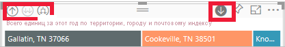
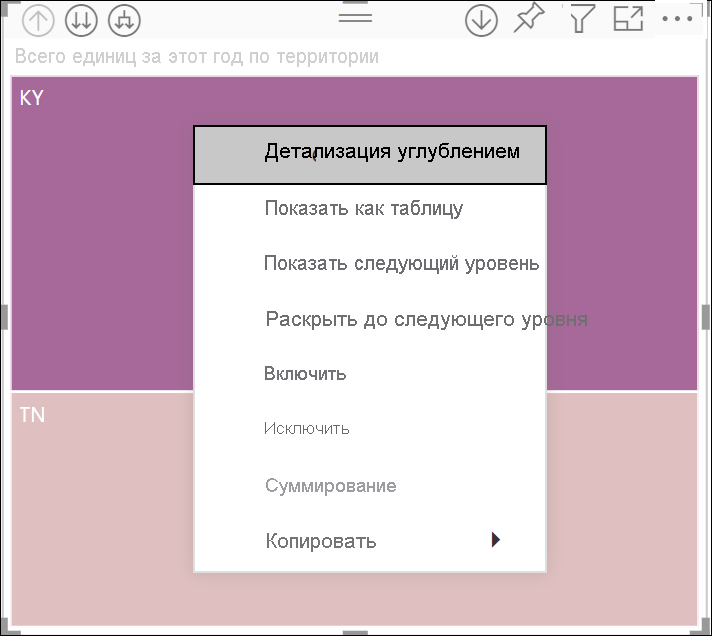
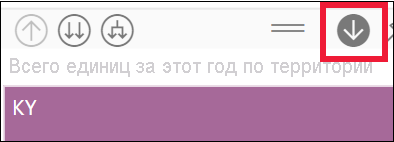
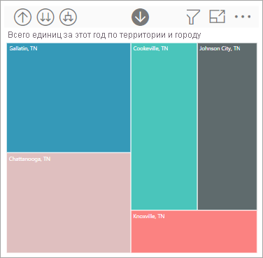
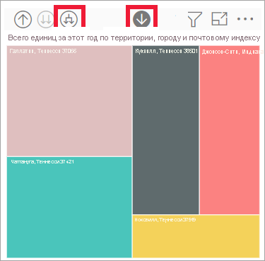
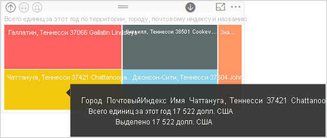

# Режим детализации в визуальном элементе в Power BI

[!INCLUDE[consumer-appliesto-yyny](../includes/consumer-appliesto-yyny.md)]

[!INCLUDE [power-bi-service-new-look-include](../includes/power-bi-service-new-look-include.md)]

В этой статье демонстрируется детализация углублением в визуальном элементе в службе Microsoft Power BI. Выполняя детализацию углублением и обобщением в точках данных, вы можете просматривать подробные сведения о данных. 

## Детализация с использованием иерархии

Если визуализация имеет иерархию, вы можете выполнить детализацию, чтобы отобразить дополнительные сведения. Например, вы можете создать визуальный элемент, который отслеживает количество олимпийских медалей, с иерархией, состоящей из категорий "Спорт", "Дисциплина" и "Событие". По умолчанию в визуальном элементе количество медалей будет отображаться по спортивным дисциплинам, таким как гимнастика, лыжный спорт, водные виды спорта и т. д. Но так как он имеет иерархию, после выбора одного из визуальных элементов (например, линейчатой диаграммы, графика или пузырьковой диаграммы) отобразятся более подробные данные. Выберите элемент **Водные виды спорта** , чтобы просмотреть данные по плаванию, прыжкам в воду и водному поло.  Затем выберите элемент **Прыжки в воду** , чтобы просмотреть данные по прыжкам с трамплина, прыжкам в воду и синхронным прыжкам в воду.

Даты — это уникальный тип иерархии.  *Конструкторы отчетов* часто добавляют в визуальные элементы иерархии на основе дат. Как правило, такая иерархия содержит год, квартал, месяц и день. 

## Определение визуальных элементов, для которых возможна детализация
Не можете определить, какой визуальный элемент Power BI содержит иерархию? Наведите указатель мыши на визуальный элемент. Если сверху появятся указанные элементы управления детализацией, значит, этот визуальный элемент содержит иерархию.

  

## Выполнение детализации углублением и обобщением

В этом примере мы используем диаграмму дерева, которая содержит иерархию с указанием территории, города, почтового индекса и названия магазина. До выполнения детализации на диаграмме дерева отображается общее количество проданных единиц товаров по территориям. Территория — это верхний уровень иерархии.

  

### Два способа доступа к функциям детализации

У вас есть два способа вызвать функции детализации углублением, детализации обобщением и развертывания для визуальных элементов с иерархиями. Опробуйте их и выберите наиболее удобный.

- Первый способ: наведите указатель мыши на визуальный элемент, чтобы отобразились значки. Сначала включите детализацию, щелкнув стрелку вниз. Серый фон показывает, что детализация активна.   

    

- Второй способ: щелкните визуальный элемент правой кнопкой мыши, чтобы открыть меню.

    

## Пути детализации

### Детализация по всем полям одновременно

Детализировать визуальный элемент можно несколькими способами. Выбор значка двойной стрелки  детализации перенесет на следующий уровень в иерархии. Если вы просматриваете уровень **Территория** для Кентукки и Теннесси, для обоих штатов вы можете выполнить детализацию углублением до уровней городов, затем до уровней почтовых индексов и, наконец, до уровней названий магазинов. На каждом этапе отображаются новые сведения.

Щелкайте значок детализации обобщением  до возврата на уровень общего количества единиц за этот год по территориям.

### Развертывание всех полей одновременно

При **развертывании** к текущему представлению добавляется дополнительный уровень иерархии. Поэтому, если вы просматриваете уровень **Территория** , можно развернуть все текущие листья в дереве одновременно.  Первый уровень детализации добавляет данные города для **KY** и **TN** . Следующий уровень детализации добавляет данные почтовых индексов для **KY** и **TN** , а также сохраняет данные города. На каждом последующем этапе отображаются те же сведения, что и на предыдущем, с добавлением одного нового уровня.

### Детализация по одному полю за раз

1. Чтобы включить детализацию, щелкните значок детализации. .

    Теперь можно выполнять детализацию по **одному полю за раз** , выбирая визуальный элемент. В качестве примеров визуальных элементов можно привести линейчатую или пузырьковую диаграмму либо листовой узел.

    

    Если детализация отключена, при выборе визуального элемента (например, линейчатой, пузырьковой диаграммы или листового узла) детализация углублением не будет выполняться. Вместо этого будет выполняться перекрестная фильтрация других диаграмм на странице отчета.

1. Выберите листовой узел для штата **TN** . Теперь на диаграмме дерева приводятся все города в штате Теннесси, в которых есть магазины.

    

1. На данном этапе вы можете сделать следующее:

    1. продолжить выполнять детализацию для Теннесси;

    1. выполнить детализацию для определенного города в штате Теннесси;

    1. вместо этого выполнить развертывание.

    Давайте произведем детализацию по одному полю за раз.  Выберите **Ноксвилл, TN** . Теперь на диаграмме "дерево" приводится почтовый индекс магазина в Ноксвилле.

    

    Обратите внимание, что при выполнении детализации и возвращении на прежний уровень изменяется заголовок.

    И детализирует еще одно поле. Выберите почтовый индекс **37919** и увеличьте детализацию до имени магазина. 

        

    Для этих данных детализация всех уровней одновременно может быть неинтересна. Давайте вместо этого попробуем расширить представление.

### Развертывание всех полей и одного поля за раз

Диаграмма "дерево", показывающая только почтовый индекс или имя магазина, неинформативна.  Давайте *развернем* ее на один уровень вниз в иерархии.  

1. Сначала увеличьте детализацию до уровня почтового индекса.     
1. На активной диаграмме "дерево" щелкните значок *развертывания вниз*  . Теперь на диаграмме "дерево" отображаются два уровня иерархии: почтовый индекс и название магазина.

    

1. Чтобы увидеть все четыре уровня иерархии данных для штата Теннесси, щелкайте стрелку детализации обобщением, пока не достигнете второго уровня: **Всего единиц в этом году по территории и городу** .

    

1. Убедитесь, что детализация по-прежнему включена,  и щелкните значок *развертывания вниз*  . Теперь на диаграмме дерева отображается то же количество листовых узлов (прямоугольников), однако для каждого из них выводятся дополнительные сведения. помимо города и штата, также отображается почтовый индекс.

    

1. Еще раз щелкните значок *развертывания вниз* , чтобы на диаграмме "дерево" отобразились все четыре уровня иерархии данных для штата Теннесси. Чтобы просмотреть еще более подробные сведения, наведите указатель на листовой узел.

    

## Отображение данных по мере детализации
Используйте **Показывать как таблицу** , чтобы заглянуть глубже. При выполнении каждой операции детализации или развертывания в области **Показать как таблицу** будут выводиться данные, используемые для построения визуального элемента. Это позволяет понять, каким образом иерархии, детализация и развертывание обеспечивают построение визуальных элементов. 

В правом верхнем углу нажмите **Дополнительные действия**  (...), а затем выберите команду **Показать как таблицу** . 

Power BI открывает диаграмму "дерево", чтобы заполнить холст. Данные, составляющие диаграммы "дерево", отображаются под визуальным элементом. 

С помощью визуального элемента на холсте продолжайте детализацию. Следите за изменением данных в таблице, чтобы отразить данные, используемые для создания диаграммы "дерево". В следующей таблице показаны результаты детализации углублением всех полей за один раз с уровня территории до названия магазина. Первая таблица представляет верхний уровень иерархии, диаграмма "дерево" представляет два листа — один для **KY** , а один для **TN** . Следующие три таблицы представляют данные диаграммы "дерево" при детализации одновременно всех уровней — от территории до города, до почтового индекса, а затем до уровня названия магазина.

Обратите внимание, что для уровней **Город** , **Почтовый индекс** и **Название** отображаются одинаковые итоговые значения. Совпадающие результаты не всегда являются случайными.  Тем не менее в данном случае для каждого почтового индекса и каждого города существует только один магазин.  

## Рекомендации и ограничения
- По умолчанию при детализации другие визуальные элементы в отчете не фильтруются. Тем не менее при необходимости разработчик отчета может изменить это заданное по умолчанию поведение. По мере детализации также обращайте внимание на возможность перекрестной фильтрации или перекрестного выделения других визуальных элементов на странице.

- Для просмотра отчета, к которому вам предоставлен доступ, требуется лицензия Power BI Pro или Premium, либо отчет должен храниться в емкости Power BI Premium. [Какая у меня лицензия?](end-user-license.md)

## Дальнейшие действия

[Визуализации в отчетах Power BI](../visuals/power-bi-report-visualizations.md)

[Отчеты Power BI](end-user-reports.md)

[Power BI — основные понятия](end-user-basic-concepts.md)

Появились дополнительные вопросы? [Ответы на них см. в сообществе Power BI.](https://community.powerbi.com/)
