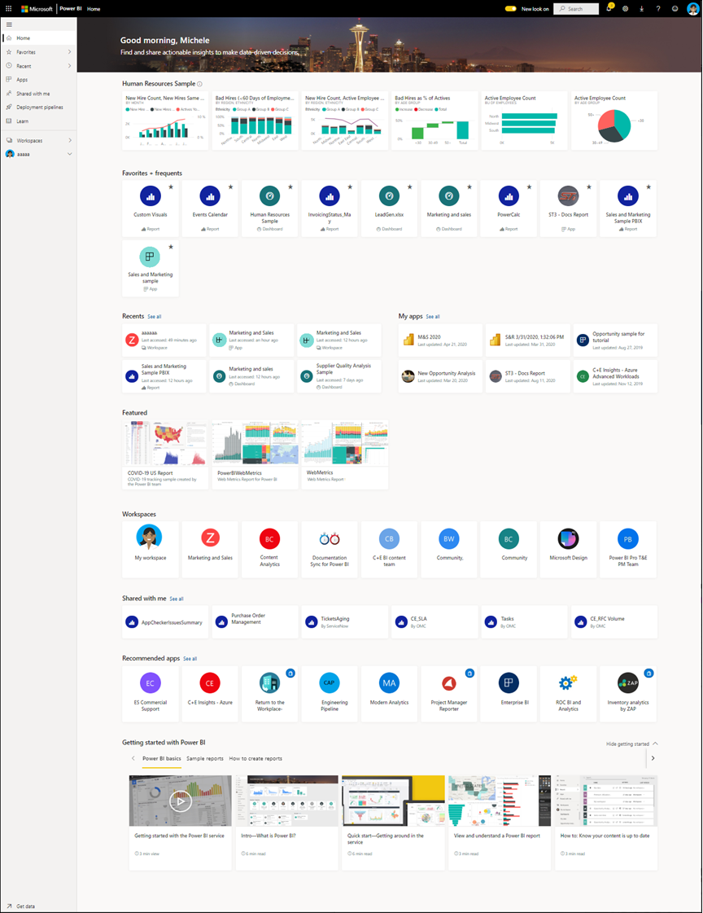
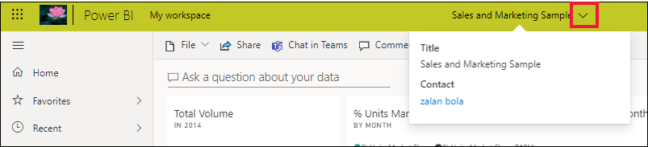

# Краткое руководство. Навигация в службе Power BI

[!INCLUDE [power-bi-service-new-look-include](../includes/power-bi-service-new-look-include.md)]

Теперь, когда вы изучили [основы Power BI](end-user-basic-concepts.md), давайте ознакомимся с интерфейсом **службы Power BI** . Как упоминалось в предыдущей статье, участники вашей команды могут работать только в **Power BI Desktop** , формируя данные и создавая отчеты, панели мониторинга и приложения для других пользователей. Это *конструкторы* . Вы же можете проводить все время в службе Power BI, просматривая и используя содержимое, созданное другими ( **потребляя** его). Вы являетесь *бизнес-пользователем* . Это краткое руководство предназначено для *бизнес-пользователей* . 

   
 
## Обязательные условия

- Если вы не зарегистрированы в Power BI, перед началом работы [пройдите бесплатную регистрацию](https://app.powerbi.com/signupredirect?pbi_source=web).

- Прочитайте статью [Power BI — основные понятия](end-user-basic-concepts.md).

- Для просмотра содержимого Power BI (отчеты, панели мониторинга, приложения), созданного *конструкторами* , необходимо соблюдение одного из двух условий:
    - наличие лицензии Power BI Pro;
    - ваша организация должна иметь подписку Power BI Premium и содержимое, к которому вам предоставлен доступ из емкости Premium.    
    [Сведения о лицензиях и подписках](end-user-license.md).     

    Для работы с этим кратким руководством не требуется соблюдение ни одного из этих условий. Корпорация Майкрософт предоставила доступ к примеру содержимого непосредственно из интерфейса службы Power BI. Мы будем использовать этот пример содержимого для изучения службы Power BI. 

## откроете службу Power BI;

Для начала откройте службу Power BI (app.powerbi.com). 
1. Если левая область навигации свернута, щелкните значок области навигации.  чтобы развернуть его. 

1. В левом нижнем углу выберите **Получить данные** . Давайте получим образец данных для ознакомления со службой Power BI. Мы подготовили для вас самые разные образцы данных, и в этот раз мы используем данные по маркетингу и продажам. 

   

1. После открытия окна **получения данных** щелкните **Примеры** .

   

1. Последовательно выберите **Продажи и маркетинг** > **Подключить** . 

   

5. Служба Power BI устанавливает пример в разделе **Моя рабочая область** .  **Моя рабочая область**  — частная песочница для обучения и экспериментов.  Содержимое можно просмотреть только в области **Моя рабочая область** . Пример включает панель мониторинга, один отчет и один набор данных. Как правило, *бизнес-пользователи* не получают наборы данных, но этот пример предназначен для всех пользователей, поэтому он содержит набор.

    

    Большая часть совместно используемого содержимого не поддерживает прямой доступ к базовым наборам данных для *бизнес-пользователей* . Поскольку примеры для Power BI ориентированы на всех клиентов Power BI, они включают в себя необходимые наборы данных.   

    Дополнительные сведения о примерах см. в статье [Получить примеры для Power BI](../create-reports/sample-datasets.md).

## Просмотр содержимого (панели мониторинга и отчеты)
Содержимое упорядочено в контексте рабочей области. Каждому бизнес-пользователю предоставляется как минимум одна рабочая область, которая называется **Моя рабочая область** . Когда *коллеги-конструктора* предоставят вам общий доступ к содержимому, вы сможете получить дополнительные рабочие области.  Например, если *конструктор* назначает вам разрешения на доступ к одной из рабочих областей, эта рабочая область будет отображаться на сайте Power BI.  

**Моя рабочая область** хранит все содержимое, которое вы создали и которое принадлежит вам. Это своего рода личная песочница или рабочая область для хранения личного содержимого. У многих *бизнес-пользователей* службы Power BI **Моя рабочая область** остается пустой, поскольку выполняемые ими задачи не предусматривают создание нового содержимого.  *Бизнес-пользователи* используют создаваемые другими данные для принятия бизнес-решений. Если вам предстоит самостоятельно создавать содержимое, мы рекомендуем ознакомиться со [статьями по службе Power BI для *конструкторов отчетов*](../index.yml).

И все же, рабочая область — это не просто список содержимого. На этой странице вы узнаете много полезного о панелях мониторинга и отчетах в рабочей области. Например, это может быть информация о владельце содержимого, дате его последнего обновления, конфиденциальных данных и подтверждениях. Выберите **More actions (...)** (Дополнительные действия (...)), чтобы отобразить список действий для панели мониторинга и отчета.   

Дополнительные сведения см. в статье [Совместная работа в рабочих областях](end-user-workspaces.md).

Кроме того, рабочая область — это один из способов получить доступ к данным. В рабочей области можно открыть панель мониторинга или отчет, выбрав нужный элемент из списка.  Чтобы добавить панель мониторинга или отчет в избранное, наведите указатель мыши на нужный элемент и щелкните значок звездочки. Если *конструктор* предоставил вам [разрешения на общий доступ](end-user-shared-with-me.md), вы также можете поделиться содержимым из этой рабочей области. 

1. Выберите имя панели мониторинга, чтобы открыть ее. Наличие панелей мониторинга отличает службу Power BI от средства Power BI Desktop. [Ознакомьтесь со сведениями о панелях мониторинга](end-user-dashboards.md)

    

2. Действия, которые можно выполнить на панели мониторинга, отображаются в верхней строке меню.    

    

3. Наведите указатель мыши на фрагмент панели мониторинга и щелкните **More options (...)** (Дополнительные параметры (...)), чтобы просмотреть параметры, необходимые для взаимодействия с этим фрагменту.

    

4. Выберите фрагмент панели мониторинга, чтобы открыть отчет, который использовался для создания этого фрагмента. Отчет откроется на странице, содержащей визуальный элемент, расположенный на фрагменте. Здесь выбрана Фрагмент панели мониторинга с диаграммой дерева. Служба Power BI открывает страницу отчета **YTD Category** .

    

    В отчетах есть несколько разделов. Слева находится список страниц отчета, доступных для щелчка. В верхней части находится строка меню, содержащая действия, которые можно выполнить с отчетом.  Доступные параметры будут зависеть от роли и разрешений, назначенных *конструктором отчетов* . Справа находится панель **Фильтры** . Центральный холст содержит сам отчет. Как и на панели мониторинга, здесь существуют действия, которые можно выполнить для всего отчета, для отдельных визуальных элементов, а также для одной страницы отчета. 

    См. дополнительные сведения об отчетах [Power BI](end-user-reports.md).

## Использование левой панели навигации
Панель навигации станет более эффективной, так как коллеги совместно используют содержимое. В этом разделе краткого руководства мы отложим пример *Продажи и маркетинга* и рассмотрим панель мониторинга и отчет, который используется *бизнес-пользователями* Power BI, работающими с большим объемом общего содержимого.

1. **Главная страница**  — это целевая страница по умолчанию при входе в службу Power BI. Главная страница — это отличная стартовая точка и альтернативный способ навигации по содержимому. Содержимое на главной странице организовано по избранным, последним, частым и популярным запросам. На этой странице также отображаются последние рабочие области и приложения. Просто выберите элемент, чтобы открыть его.

    На ней представлены все средства поиска и сортировки, область навигации и холст с *картами* , выбирая которые можно открывать панели мониторинга, отчеты и приложения. Поначалу на холсте главной страницы может быть не слишком много карт, но все изменится, когда вы начнете использовать Power BI совместно с коллегами. На вашем холсте главной страницы также будут обновляться сведения о рекомендованном содержимом и обучающих ресурсах.

   

    Дополнительные сведения см. в статье [Поиск панелей мониторинга, отчетов и приложений](end-user-home.md).

2. На вкладках **Избранное** и **Недавние** есть стрелки. Щелкните стрелку, чтобы быстро просмотреть пять первых избранных или пять недавно открытых элементов. Во всплывающем элементе выберите содержимое, чтобы открыть его. 

   

    Чтобы просмотреть полный список избранных или недавно открытых элементов, выберите слово или значок. Эти списки содержимого содержат дополнительные сведения об отчетах, приложениях и панелях мониторинга.

    

    Дополнительные сведения см. в разделах [Недавнее содержимое в службе Power BI](end-user-recent.md) и [Избранное содержимое в службе Power BI](end-user-recent.md).

4. Выберите пункт **Приложения** , чтобы отобразить все приложения, к которым вам предоставили доступ или которые были установлены. Щелкните пункт **Мне предоставлен доступ** для просмотра панелей мониторинга и отчетов, к которым вам предоставлен доступ. Так как вы только начинаете работать со службой Power BI, эти области содержимого будут пустыми. 

    Дополнительные сведения см. в статьях [Приложения в Power BI](end-user-apps.md) и [Отображение панелей мониторинга и отчетов, к которым мне предоставлен доступ](end-user-shared-with-me.md).

### Поиск и сортировка содержимого
Если вы работаете со службой Power BI недавно, содержимого у вас может быть не так много. Однако по мере загрузки новых приложений и работы с предоставляемым вашими коллегами содержимым его объем может значительно увеличиваться. В таких случаях вам пригодятся функции поиска и сортировки.

Поиск можно выполнять практически из любого места службы Power BI. Для этого вам потребуется поле поиска или значок лупы.    

Начните вводить название панели мониторинга, отчета, книги, приложения или имя владельца в поле поиска. Поиск нужного содержимого в службе Power BI будет выполняться автоматически.

Также предусмотрено множество способов сортировки содержимого. Если навести указатель мыши на заголовок столбца, могут появиться стрелки, указывающие на возможность его сортировки. Не все столбцы могут быть отсортированы. 

Кроме того, вы можете воспользоваться фильтрами **поиска** , которые представлены в верхнем правом углу списка содержимого. Здесь можно выполнить быстрый поиск содержимого, выбрав тип содержимого, имя владельца или любое другое доступное поле.

Дополнительные сведения см. в статье [Поиск и сортировка: навигация в Power BI](end-user-search-sort.md).

## Поиск имени владельца
Завершим работу с этим кратким руководством полезным советом. Если у вас есть вопросы о панели мониторинга, отчете или приложении, вы можете найти имя владельца. Открыв содержимое, щелкните раскрывающееся меню заголовка, чтобы отобразить имя владельца. Владельцем может быть пользователь или группа.

## Очистка ресурсов
Завершив работу с этим кратким руководством, вы можете при необходимости удалить примеры панели мониторинга, отчета и набора данных.

1. Откройте службу Power BI (app.powerbi.com) и войдите в нее.    
2. Откройте главную страницу Power BI, прокрутите вниз и выберите элемент **Моя рабочая область** .      

3. Наведите указатель мыши на панель мониторинга, отчет или набор данных и выберите **Дополнительные параметры (...)**  > **Удалить** . Повторите эти действия, чтобы удалить все необходимое.

    

## Дальнейшие действия

> [!div class="nextstepaction"]
> [Представление чтения в службе Power BI](end-user-reading-view.md)
