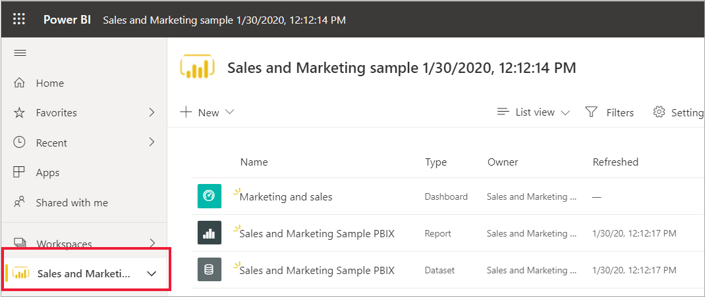
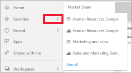

# Краткое руководство. Навигация в службе Power BI

[!INCLUDE [power-bi-service-new-look-include](../includes/power-bi-service-new-look-include.md)]

Теперь, когда вы изучили основы Power BI, давайте ознакомимся с интерфейсом **службы Power BI**. Как упоминалось ранее, некоторые участники команды могут работать только в **Power BI Desktop**, формируя данные и создавая отчеты для других пользователей. Другие же участники могут проводить все время в службе Power BI, просматривая и используя содержимое, созданное другими (**потребляя** его). В этом кратком руководстве вы импортируете образец данных и с его помощью ознакомитесь с интерфейсом службы Power BI. 
 
## Технические условия

- Если вы не зарегистрированы в Power BI, перед началом работы [пройдите бесплатную регистрацию](https://app.powerbi.com/signupredirect?pbi_source=web).

- Прочитайте статью [Power BI — основные понятия](end-user-basic-concepts.md).

## откроете службу Power BI;

Для начала откройте службу Power BI (app.powerbi.com) и перейдите на страницу **Главная**. 
1. Если левая область навигации свернута, щелкните значок области навигации.  чтобы развернуть его. 

1. Если страница **Главная** не открыта, выберите ее. 

1. Получите примеры данных. Давайте получим образец данных для ознакомления со службой Power BI. Мы подготовили для вас самые разные образцы данных, и в этот раз мы используем данные по маркетингу и продажам. 

    Для продолжения выполните приведенные инструкции, чтобы установить пример приложения [Продажи и маркетинг](end-user-app-marketing.md).

1. После установки приложения выберите **Приложения** в области навигации. 

   

2. На экране **Приложения** выберите приложение **Продажи и маркетинг — пример**.

    

2. Выберите **Исследовать приложение**.

    

3. В службе Power BI откроется панель мониторинга приложения. Наличие панелей мониторинга отличает службу Power BI от средства Power BI Desktop. Этот образец также включает в себя отчет и набор данных. 

    

    Большинство приложений для *потребителя* не предоставляют прямой доступ к базовым источникам данных. Поскольку примеры для Power BI ориентированы на всех клиентов Power BI, они включают в себя необходимые наборы данных. На основе этих наборов данных *разработчики* создают новые панели мониторинга и отчеты. 

## Просмотр содержимого (панели мониторинга и отчеты)
Рассмотрим организацию основного содержимого (панели мониторинга, отчеты и приложения). Содержимое отображается в контексте рабочей области. Каждому потребителю предоставляется как минимум одна рабочая область, которая называется **Моя рабочая область**. При установке приложения для него каждый раз создается рабочая область.  Таким образом, после установки примера приложения "Продажи и маркетинг" у нас будет две рабочих области. 

Вы можете убедиться в этом, выбрав элемент **Рабочие области** в левой области навигации. 

**Моя рабочая область** хранит все содержимое, которое вы создали и которое принадлежит вам. Это своего рода личная песочница или рабочая область для хранения личного содержимого. У многих *потребителей* службы Power BI **Моя рабочая область** остается пустой, поскольку выполняемые ими задачи не предусматривают создание нового содержимого.  Исходя из определения, *потребители* используют создаваемые другими данные для принятия бизнес-решений. Если вам предстоит самостоятельно создавать содержимое, мы рекомендуем ознакомиться со [статьями по службе Power BI для *конструкторов отчетов*](../index.yml).

В разделе **Рабочие области приложения** находится все содержимое, относящееся к конкретному приложению.  Создавая приложение, *разработчик* упаковывает вместе с ним все необходимое содержимое.  Выберите рабочую область "Продажи и маркетинг", чтобы просмотреть, какое содержимое *разработчик* упаковал вместе с ним. 

Рабочая область "Продажи и маркетинг" содержит одну панель мониторинга, один отчет и один набор данных. Приложения не обязательно включают все эти три вида содержимого. Например, приложение может содержать только одну панель мониторинга, по три элемента каждого вида и даже двадцать отчетов. Все зависит от того, что именно *разработчик* включает в приложение. Поскольку приложение "Продажи и маркетинг" является примером, в его состав включен набор данных. Тем не менее, как правило рабочие области приложения для *потребителей* не включают набор данных. 

И все же, рабочая область — это не просто список содержимого. На этой странице вы узнаете много полезного о панелях мониторинга и отчетах в рабочей области. Например, это может быть информация о владельце содержимого, дате его последнего обновления, связанном содержимом и подтверждениях. В необязательном описании рабочей области могут приводиться дополнительные сведения о ее предназначении, а также о способах ее применения для решения бизнес-задач. Кроме того, вы сможете выполнять поиск и сортировку, что заметно упрощает работу с областями, в которых хранится большой объем содержимого.

Кроме того, рабочая область — это один из способов получить доступ к данным. Откройте панель мониторинга или отчет, выбрав нужный элемент в списке.  Чтобы добавить панель мониторинга или отчет в избранное, наведите указатель мыши на нужный элемент и щелкните значок звездочки. Если *конструктор* предоставил вам [разрешения на общий доступ](end-user-shared-with-me.md), при наведении указателя мыши также будет отображаться соответствующее действие. 

Откройте панель мониторинга, выбрав ее имя.

## Добавление панели мониторинга или отчета в избранное
**Избранное** позволяет быстро открывать самое важное для вас содержимое. Итак, вы узнали, как добавить панель мониторинга в избранное из рабочей области. Кроме того, вы можете создавать избранные элементы непосредственно из панели мониторинга или отчета.

1. Откройте панель мониторинга и щелкните **Добавить в избранное** в строке меню.
   
   
   
   Элемент **Добавить в избранное** изменится на **Удалить из избранного**, и значок звездочки станет желтым.
   
   

2. Чтобы отобразить список всего содержимого, добавленного в избранное, в области навигации щелкните стрелку справа от пункта **Избранное**. Область навигации — постоянная функция службы Power BI, поэтому этот список доступен из любого расположения в службе.
   
    
   
    Этот пользователь Power BI добавил в избранное четыре элемента. В избранное можно добавлять панели мониторинга, отчеты и приложения.  

См. статью [Избранное](end-user-favorite.md) для получения дополнительных сведений.

## Доступ к последнему содержимому

1. Как и в случае с избранным, вы можете быстро открывать последнее содержимое откуда угодно в службе Power BI, щелкнув стрелку рядом с пунктом **Последнее** в области навигации.

   

    Во всплывающем элементе выберите содержимое, чтобы открыть его.

2. Иногда нужно не открыть последнее содержимое, а просмотреть сведения о нем или выполнить другое действие, например экспортировать в Excel или просмотреть аналитику. В таком случае откройте панель **Последние**, выбрав пункт **Последние** или щелкнув соответствующий значок на панели навигации. В этом примере у пользователя Power BI есть несколько рабочих областей, поэтому в данный список может включаться содержимое всех этих областей.

   

Дополнительные сведения см. в статье [Недавно просмотренное содержимое в службе Power BI](end-user-recent.md).

### Поиск и сортировка содержимого
Если вы работаете со службой Power BI недавно, содержимого у вас может быть не так много. Однако по мере загрузки новых приложений и работы с предоставляемым вашими коллегами содержимым его объем может значительно увеличиваться. В таких случаях вам пригодятся функции поиска и сортировки.

Поиск можно выполнять практически из любого места службы Power BI. Для этого вам потребуется поле поиска или значок лупы.    

Начните вводить название панели мониторинга, отчета, книги, приложения или имя владельца в поле поиска. Поиск нужного содержимого в службе Power BI будет выполняться автоматически.

Также предусмотрено множество способов сортировки содержимого. Если навести указатель мыши на заголовок столбца, могут появиться стрелки, указывающие на возможность его сортировки. Не все столбцы могут быть отсортированы. 

Также вы можете воспользоваться элементами управления сортировкой, которые представлены в верхнем правом углу холста. Укажите порядок сортировки: по возрастанию или по убыванию, а также по дате, названию или имени владельца.  

Дополнительные сведения см. в статье [Поиск и сортировка: навигация в Power BI](end-user-search-sort.md).

## Главная страница Power BI
Это краткое руководство завершается там же, где мы его начали, — на странице **Главная** службы Power BI. 

На ней представлены все средства поиска и сортировки, область навигации и холст с *картами*, выбирая которые можно открывать панели мониторинга, отчеты и приложения. Поначалу на холсте главной страницы может быть не слишком много карт, но все изменится, когда вы начнете использовать Power BI совместно с коллегами. На вашем холсте главной страницы также будут обновляться сведения о рекомендованном содержимом и обучающих ресурсах.

Дополнительные сведения см. в разделе [Главная страница Power BI](end-user-home.md).

## Очистка ресурсов
Завершив работу с этим кратким руководством, вы можете при необходимости удалить примеры панели мониторинга, отчета и набора данных.

1. Откройте службу Power BI (app.powerbi.com) и войдите в нее.    
2. Откройте страницу "Главная" Power BI, выполните прокрутку до раздела **Рабочие области** и выберите элемент *Продажи и маркетинг*.      

3. Наведите указатель мыши на панель мониторинга, отчет или набор данных и выберите **Дополнительные параметры (...)**  > **Удалить**. Повторите эти действия, чтобы удалить все необходимое.

    

## Дальнейшие действия

> [!div class="nextstepaction"]
> [Представление чтения в службе Power BI](end-user-reading-view.md)
