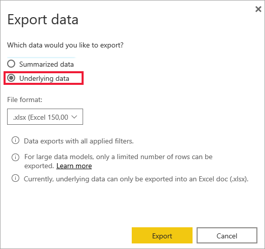

# Экспорт данных из визуального элемента

[!INCLUDE[consumer-appliesto-yyny](../includes/consumer-appliesto-yyny.md)]

[!INCLUDE [power-bi-service-new-look-include](../includes/power-bi-service-new-look-include.md)]

Чтобы просмотреть данные, которые используются для создания визуального элемента, [откройте их в Power BI](end-user-show-data.md) или экспортируйте в Excel. Для экспорта данных требуется конкретный тип или лицензия и права на редактирование содержимого. Если не получается экспортировать, обратитесь за помощью к администратору Power BI или в службу технической поддержки. 

Для экспорта данных требуется лицензия Power BI Pro. Она также требуется для предоставления общего доступа к панели мониторинга или отчету с использованием емкости Premium. Дополнительные сведения см. в разделе [Типы лицензий Power BI](end-user-license.md).

## Экспорт из визуального элемента на панели мониторинга Power BI

1. Начните с панели мониторинга Power BI. Здесь мы используем панель мониторинга из примера приложения ***для маркетинга и продаж***. Это приложение [можно скачать на сайте AppSource.com.](https://appsource.microsoft.com/en-us/product/power-bi/microsoft-retail-analysis-sample.salesandmarketingsample
)

    

2. Наведите указатель мыши на визуальный элемент, чтобы отобразилась кнопка **Дополнительные параметры** (...), и щелкните ее, чтобы открыть меню действий.

    

3. Выберите **Экспорт в CSV**.

4. Дальнейшее зависит от используемого браузера. Вам может быть предложено сохранить файл, или вы увидите ссылку на экспортированный файл в нижней части браузера. 

    

5. Откройте файл в Excel. 

    > [!NOTE]
    > Если у вас нет разрешений на доступ к данным, вы не сможете экспортировать их или открыть в Excel.  

    

## Экспорт из визуального элемента в отчете
Данные можно экспортировать из визуального элемента в отчете в формате CSV или XLSX (Excel). 

1. На панели мониторинга выберите плитку, чтобы открыть соответствующий отчет.  В этом примере мы выбираем тот же визуальный элемент, что и выше —*Общее отклонение с начала года в процентах.* 

    

    Так как эта плитка была создана из отчета по примеру *приложения для маркетинга и продаж*, откроется этот отчет. Он откроется на странице, содержащей выбранный визуальный элемент плитки. 

2. Выберите визуальный элемент в отчете. Обратите внимание на панель **Фильтры** справа. К этому визуальному элементу применены фильтры. Дополнительные сведения о фильтрах см. в статье [Ознакомление с панелью "Фильтры" отчета](end-user-report-filter.md).

    

3. Выберите **Дополнительные параметры (...)** в правом верхнем углу визуализации. Выберите **Экспорт данных**.

    

4. Вы увидите параметры экспорта сводных или базовых данных. Если вы используете пример приложения для *маркетинга и продаж*, вариант **Базовые данные** будет отключен. Но можно столкнуться с отчетами, в которых включены оба варианта. Ниже приведено объяснение различий.

    **Сводные данные**: выберите этот вариант, если вы хотите экспортировать данные, которые отображаются в визуальном элементе в настоящий момент.  Этот тип экспорта отображает только те данные, которые использовались для создания текущего состояния визуального элемента. Если к визуальному элементу применены фильтры, экспортируемые данные также будут отфильтрованы. Например, для этого визуального элемента экспорт будет включать только данные для 2014 года и центрального региона и только данные для четырех производителей: VanArsdel, Natura, Aliqui и Pirum. Если в визуальном элементе есть агрегаты (сумма, среднее и т. д.), экспортируемые данные также будут агрегированы. 
  

    **Базовые данные**: выберите этот вариант, если вы хотите экспортировать данные, которые отображаются в визуальном элементе, **а также** дополнительные данные из базового набора данных.  Это могут быть данные, содержащиеся в наборе данных, но не используемые в визуальном элементе. Если к визуальному элементу применены фильтры, экспортируемые данные также будут отфильтрованы.  Если в визуальном элементе есть агрегаты (сумма, среднее и т. д.), они будут удалены из экспортируемых данных, то есть данные будут преобразованы в плоскую структуру. 

    

5. Дальнейшее зависит от используемого браузера. Вам может быть предложено сохранить файл, или вы увидите ссылку на экспортированный файл в нижней части браузера. 

    

    > [!NOTE]
    > Если у вас нет разрешений на доступ к данным, вы не сможете экспортировать их или открыть в Excel.  

6. Откройте файл в Excel. Сравните объем ранее экспортированных данных с данными, которые мы только что экспортировали из того же визуального элемента на панели мониторинга. Разница заключается в том, что этот экспорт включает в себя **базовые данные**. 

    

## Дальнейшие действия

[Отображение данных, использованных для создания визуализации](end-user-show-data.md)