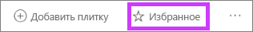
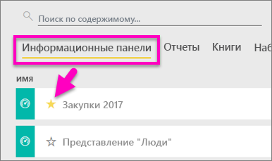
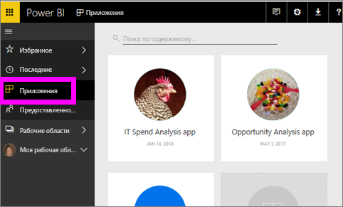
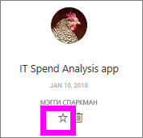
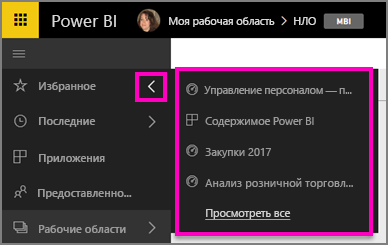
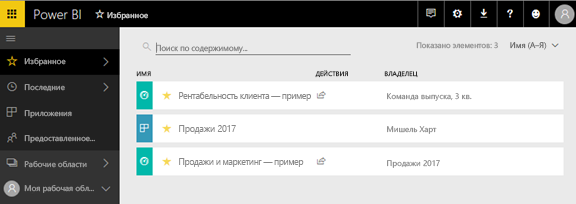
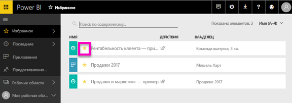

# Избранные панели мониторинга, отчеты и приложения в службе Power BI
Добавив содержимое в *Избранное*, вы сможете открывать его из всех своих рабочих областей.  Избранными обычно являются те элементы, которые вы просматриваете чаще всего.

> [!NOTE]
> Сведения, приведенные в этом разделе, относятся к службе Power BI, но не к Power BI Desktop.
> 
> 

В службе Power BI одну из панелей мониторинга можно сделать [основной](end-user-featured.md).

## Добавление панели мониторинга или отчета в *избранное*
Узнайте, как Аманда добавляет избранные элементы в рабочую область, а затем сделайте то же самое, выполнив пошаговые инструкции, приведенные под видео.

<iframe width="560" height="315" src="https://www.youtube.com/embed/G26dr2PsEpk" frameborder="0" allowfullscreen></iframe>

1. Откройте часто используемую панель мониторинга или отчет. Вы можете добавлять в *избранное* даже содержимое, предоставленное вам другими пользователями.
2. В правом верхнем углу экрана службы Power BI выберите **Favorite** (Избранное) или нажмите значок звездочки .
   
   
   
   Вы также можете добавить в избранное панель мониторинга или отчет на вкладке представления содержимого **Панели мониторинга** или **Отчеты** в вашей рабочей области.
   
   

## Добавление приложения в *избранное*

1. В левой области навигации выберите **Приложения**.

   

2. Наведите указатель на приложение для показа дополнительных сведений.  Выберите значок звездочки,   чтобы добавить приложение в избранное.
   
   

## Работа с *избранным*
1. Чтобы получить доступ к избранным компонентам, в любой рабочей области щелкните стрелку справа от **Избранное**.  Отсюда вы можете выбрать избранный компонент и открыть его. Перечислены только пять избранных панелей мониторинга (в алфавитном порядке). Если у вас больше пяти избранных компонентов, выберите **Показать все**, чтобы открыть экран "Избранное" (см. пункт 2 ниже). 
   
   
2. Чтобы увидеть **все** содержимое, добавленное в избранное, в левой панели навигации выберите **Favorites** (Избранное) или нажмите значок добавления в избранное .  
   
    
   
   Здесь вы можете открыть содержимое, определить его владельцев и даже поделиться им с коллегами.

## Удаление содержимого из избранного
Отчет уже не нужен вам так часто, как раньше?  В этом случае можно удалить ее из избранного. Содержимое будет удалено из списка "Избранное", но не из Power BI.

1. В области навигации слева выберите **Избранное**, чтобы открыть экран **Избранное**.
   
   
2. Нажмите на желтую звездочку рядом с содержимым, чтобы удалить его из избранного.

> **ПРИМЕЧАНИЕ**. Вы также можете удалить из избранного панель мониторинга, отчет или само приложение. Просто откройте содержимое и отмените выбор желтой звездочки.   
> 
> 

## Дальнейшие действия
[Что такое Power BI?](../power-bi-overview.md)

[Power BI — основные понятия](end-user-basic-concepts.md)

Появились дополнительные вопросы? [Ответы на них см. в сообществе Power BI.](http://community.powerbi.com/)

