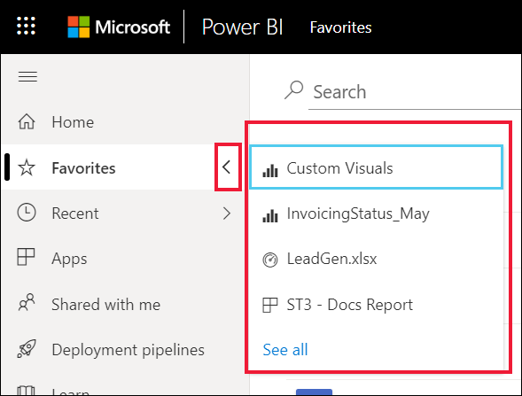

# Избранные панели мониторинга, отчеты и приложения в службе Power BI

[!INCLUDE[consumer-appliesto-yyny](../includes/consumer-appliesto-yyny.md)]

Добавив содержимое в *избранное*, вы сможете быстро открывать его из списка **Избранное** и из раздела **Главная страница Power BI** > **Избранные и часто используемые**. Избранными обычно являются те элементы, которые вы просматриваете чаще всего. Они обозначаются заполненной звездой.

   

   

## Добавление панели мониторинга или отчета в избранное

1. Откройте часто используемую панель мониторинга или отчет. Вы можете добавлять в избранное даже содержимое, предоставленное вам другими пользователями.

2. В верхней строке меню службы Power BI выберите **Избранное** или значок звездочки .
   
   
   
   Вы также можете добавить панель мониторинга или отчет в избранное из любой области, где отображается значок звездочки, например с главной страницы, страницы "Последние", "Приложения" и "У меня есть доступ". 
   
   

## Добавление приложения в избранное

1. В области навигации выберите **Приложения**.

   

2. Наведите указатель на приложение для показа дополнительных сведений. Выберите значок звездочки,  чтобы добавить приложение в избранное.
   
   

## Работа с избранным
1. Чтобы получить доступ к избранным компонентам, щелкните стрелку справа от **Избранное**. Отсюда вы можете выбрать избранный компонент и открыть его. Перечисляется до пяти избранных панелей мониторинга (в алфавитном порядке). Если у вас больше пяти избранных компонентов, выберите **Показать все**, чтобы открыть список избранного содержимого. 
   
   
2. Чтобы отобразилось все содержимое, добавленное в избранное, в области навигации выберите **Избранное** или значок добавления в избранное . . 
   
    
   
   Позволяет предпринять следующие действия. Здесь вы можете открыть избранное, определить его владельцев и даже поделиться им с коллегами.

## Удаление содержимого из избранного
Отчет уже не нужен вам так часто, как раньше? Его можно убрать из избранного. Содержимое будет удалено из списка "Избранное", но не из Power BI.

1. В области навигации выберите **Избранное**, чтобы открыть экран **Избранное**.
   
   
2. Нажмите черную звездочку рядом с содержимым, чтобы удалить его из избранного.

> [!NOTE]
> Вы также можете удалить из избранного панель мониторинга, отчет или само приложение. Просто откройте и выберите черную звездочку, чтобы снова превратить ее в белую звездочку. 
> 
> 
## Рекомендации и ограничения
Сейчас вы можете добавить приложение в избранное, и при этом в избранное автоматически добавляются все предназначенные для него отчеты и панели мониторинга. Добавить в избранное отдельные отчеты или панели мониторинга приложения невозможно. 

## Дальнейшие действия
- [Power BI: основные понятия](end-user-basic-concepts.md)
- Остались вопросы? Ответы на них см. в [сообществе Power BI](https://community.powerbi.com/).

