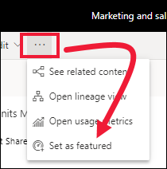
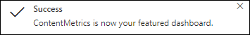
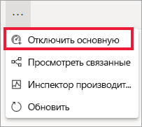

# Основные панели мониторинга в службе Power BI

[!INCLUDE [power-bi-service-new-look-include](../includes/power-bi-service-new-look-include.md)]

У многих из нас есть одна панель мониторинга, с которой мы работаем больше, чем с другими. Это может быть панель мониторинга, используемая для нашего бизнеса. Возможно, это панель мониторинга, которая содержит несколько плиток из разных панелей мониторинга и отчетов.

## Создание основной панели мониторинга
Если указать панель мониторинга как *основную*, она будет отображаться при каждом открытии службы Power BI. 

Вы также можете выбрать несколько панелей мониторинга и включить их в избранные. См. раздел [Добавление панелей мониторинга в "Избранное"](end-user-favorite.md).

Если вы еще не настроили основную панель мониторинга, Power BI откроет последнюю использованную панель либо **главную страницу** Power BI. 

### Настройка основной панели мониторинга

1. Откройте панель мониторинга, которую необходимо задать как основную. 
2. В верхней строке меню щелкните **Дополнительные параметры** (...) и выберите команду **Указать в качестве основной**. 
   
    
3. Подтвердите выбор.
   
    

## Изменение основной панели мониторинга
Разумеется, в дальнейшем вы можете задать другую панель мониторинга в качестве основной. Отключение основной панели мониторинга не приводит к ее удалению из Power BI. 

1. Выполните предыдущие шаги 1 и 2.
   
2. Выберите **Установить в качестве основной панели мониторинга**. 
   
    

## Удаление основной панели мониторинга
Если вы больше не нуждаетесь в какой-либо панели мониторинга как в основной, ниже приведены действия по ее отключению.

1. Откройте текущую панель мониторинга.
2. В верхней строке меню щелкните **Дополнительные параметры** (...) и выберите команду **Отключить основную**.

    
   
## Дальнейшие действия
- [Избранные панели мониторинга в Power BI](end-user-favorite.md)    
- У вас имеются и другие вопросы? Ответы на них см. в [сообществе Power BI](https://community.powerbi.com/).

