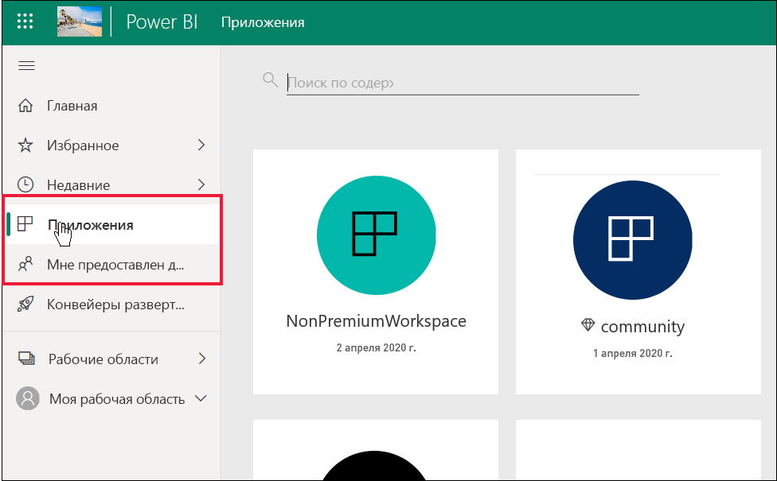
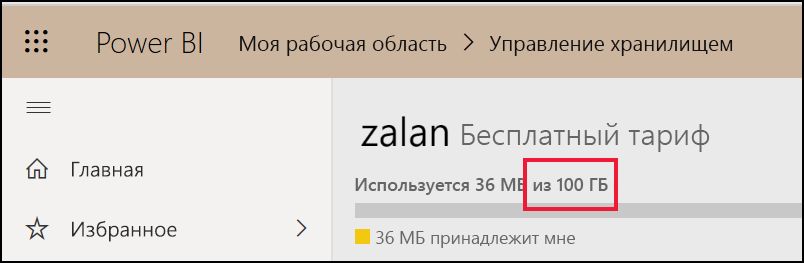
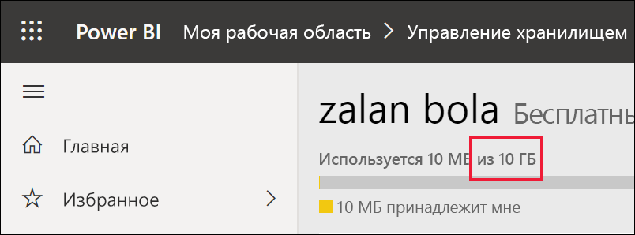

# Список функций Power BI для *потребителей* и других пользователей с бесплатными лицензиями

[!INCLUDE[consumer-appliesto-ynnn](../includes/consumer-appliesto-ynnn.md)]

В качестве *потребителя* вы используете службу Power BI для просмотра отчетов и панелей мониторинга, чтобы принимать деловые решения. Эти отчеты и панели мониторинга создаются *дизайнерами* с лицензиями Power BI *Pro*. Пользователи Pro могут обмениваться содержимым с коллегами, а также управлять тем, что их коллеги могут делать с этим содержимым. Иногда дизайнеры совместно используют содержимое, отправляя ссылки, а иногда содержимое автоматически устанавливается и отображается в Power BI в разделе **Приложения** или **Мне предоставлен доступ**.

Существует множество различных способов совместного использования содержимого дизайнерами. Но эта статья предназначена для *потребителей* Power BI и описывает только, как потребители получают содержимое и взаимодействуют с ним. Дополнительные сведения о других способах совместного использования содержимого см. в статье [Способы совместного использования работы в Power BI](../collaborate-share/service-how-to-collaborate-distribute-dashboards-reports.md).

В [предыдущей статье](end-user-license.md) вы узнали, что возможные действия с панелями мониторинга, отчетами и приложениями (содержимым) в службе Power BI зависят от трех факторов: имеющихся лицензий, имеющихся ролей и разрешений, а также места хранения содержимого.

В этой статье перечислены функции службы Power BI, доступные *потребителям*. По определению *потребители* используют бесплатные лицензии для работы в службе Power BI (не Power BI Desktop) и являются членами организации с емкостью Premium.

<art>

## Краткий обзор терминологии
Давайте рассмотрим некоторые концепции Power BI, прежде чем перейти к списку. Это будет краткий обзор. Если вам нужны дополнительные сведения, посетите разделы [Лицензии для потребителей](end-user-license.md) и [Основные понятия Power BI](end-user-basic-concepts.md).

### Рабочие области и роли
Есть два типа рабочих областей: **Моя рабочая область** и рабочие области приложения. Только у вас есть доступ к вашему разделу **Моя рабочая область**. Для совместной работы и совместного доступа требуется, чтобы *конструкторы* содержимого с лицензиями Pro использовали рабочую область приложения. 

В рабочих областях приложений конструкторы назначают *роли* для управления действиями, которые разрешены тем или иным пользователям в конкретной рабочей области. *Потребителям* назначается роль **Зритель**. 

### Емкость Premium
Если у организации есть подписка на емкость Premium, администраторы и пользователи Pro могут назначать рабочие области *выделенной емкости*. Рабочая область в выделенной емкости — это место, где пользователи Pro могут совместно использовать ресурсы и работать с бесплатными пользователями, которым для этого не требуются лицензии Pro. В этих рабочих областях бесплатные пользователи имеют повышенные разрешения (см. список ниже). 

### Лицензии 
Каждый пользователь службы Power BI имеет бесплатную лицензию или лицензию Pro. *Потребители* имеют бесплатные лицензии.

- **Бесплатная лицензия** обычно назначается *потребителям* в организации (см. первый рисунок ниже). Также назначается любому пользователю, который подписывается на службу Power BI в качестве отдельного пользователя и хочет опробовать [службу Power BI в автономном режиме](../fundamentals/service-self-service-signup-for-power-bi.md) (см. второй рисунок ниже). 

    

    Бесплатные пользователи, которые являются членами организации с емкостью Premium, обладают очень широкими возможностями. Если ваши коллеги с лицензией Pro используют рабочие области емкости Premium для обмена содержимым, бесплатные пользователи могут просматривать это содержимое и совместно работать с этими коллегами с лицензией Pro.  **Таким образом бесплатный пользователь становится *потребителем* Power BI с возможностью получения и совместного использования содержимого для принятия бизнес-решений.** 
 
    

   

## Список функций Power BI для *потребителей* и бесплатных пользователей
На приведенной ниже диаграмме показано, какие задачи может выполнять *потребитель*, взаимодействующий с содержимым в емкости Premium и в общей емкости.    

Первый столбец представляет собой бесплатного пользователя, работающего с содержимым в разделе **Моя рабочая область**. Этот пользователь не может сотрудничать с коллегами в службе Power BI. Коллеги не могут напрямую обмениваться содержимым с этим пользователем, и этот пользователь не может предоставить общий доступ из раздела **Моя рабочая область**. 

Второй столбец представляет *потребителя*.  Потребитель:

- имеет бесплатную лицензию пользователя;
- является частью организации с подпиской на емкость Premium;
- получает содержимое (приложения, панели мониторинга, отчеты) от пользователей Pro, которые предоставляют общий доступ к этому содержимому с помощью рабочих областей приложений в выделенной емкости;
- получает роль **Зритель** для этих рабочих областей приложений. 

### Условные обозначения
 — функция доступна в текущем сценарии.    
 — функция недоступна в текущем сценарии.    
 **** — функция доступна только в разделе **Моя рабочая область**. Содержимое в разделе **Моя рабочая область** предназначено для личного использования владельца и не может быть предоставлено другим пользователям в Power BI.    
 \* — доступ к этой функции может быть включен или отключен пользователем Pro или администратором.    
   

### Список функций

|Функции   | Сценарий 1. Бесплатный пользователь Power BI, у которого нет доступа к содержимому, размещенному в выделенной емкости.    | Сценарий 2. Бесплатный пользователь Power BI с разрешениями **зрителя** для содержимого, размещенного в выделенной емкости. Это *потребитель* в Power BI. |
|---|---|---|
|**Приложения** 
|Устанавливается автоматически |  | *| 
|Открыть |  |   | 
|Добавить в избранное |  |   |
 |Изменение, обновление, повторное предоставление общего доступа, повторная публикация |  |   |
 |Создание приложения |  |   |
 |AppSource: загрузка и открытие |   | | 
|Хранилище организации: загрузка и открытие|  |  |
 |**Рабочие области приложений**
| Создание, изменение или удаление рабочей области или содержимого  |   | |
|Добавление подтверждений |   | | 
|Открытие и просмотр  |   |    | 
| Читать данные, хранящиеся в потоках данных рабочей области. | ||
|**Панели мониторинга**
|Получение, просмотр и взаимодействие с панелями мониторинга от коллег |  |    | 
| Добавление оповещений в плитки  |   |    | 
| Просмотр комментариев от других и ответ на них: добавление собственных комментариев  |   |  *  | 
| Сохранить копию |  | | 
|Копировать визуальный элемент как изображение? | ||
|Создание, изменение, обновление, удаление |  | | 
|Экспорт плитки в Excel | | |
|Добавить в избранное || |
|Признак | ||
|Полноэкранный режим и режимы фокусировки | | |
|Глобальный поиск |* |* |
|Аналитические сведения на плитках |     | *|
|  Вопросы и ответы: использование на панели мониторинга  |* |* |
|Вопросы и ответы: добавление избранных и сохраненных вопросов |   | |
|Вопросы и ответы: просмотр заданных вопросов |   | |  
|Инспектор производительности |  | |
|Закрепление плиток из вопросов и ответов или отчетов |  | | 
|Печать |* |* |
|Обновить |  | | 
|Повторное предоставление общего доступа |   | | 
|Подписка для себя |* |*  |
|Подписка для других пользователей |   | | 
|**Наборы данных**
|  Добавление, удаление, изменение  |    |   |   
| Создание отчета в другой рабочей области на основе набора данных в этой области |   | |  
|  Аналитические сведения по наборам данных  |   || 
|Расписание обновления |  || 
|**Отчеты**
|Получение отчетов от коллег |  |    | 
| Совместная работа с коллегами в одной версии отчета | |    | 
| Анализ отчета в Excel  |*  |*  | 
| Просмотр закладок, созданных другими пользователями, и добавление собственных закладок  | |  |
| Просмотр комментариев от других и ответ на них: добавление новых комментариев  | |  |
|Изменение размеров отображения   |  |   | 
| Сохранить копию | |*  
|Копирование визуального элемента как изображения * |
| Визуальные элементы отчета с перекрестным выделением и перекрестной фильтрацией   | |  |
|  Детализация   |  |  |
| Детализация |* |* |
|  Внедрение (публикация в Интернете, общедоступная версия) | * | |  
|  Экспорт сводных данных из визуальных элементов отчета *  | | |
|Экспорт базовых данных из визуальных элементов отчета * |  |  | 
|  Добавление отчета в избранное  | | |
|  Фильтры: типы изменений  |* |* |
|  Фильтры: взаимодействие   || |
|  Фильтры: сохраняемые  |* |* |
| Поиск в области фильтра |* |* |
| Полноэкранный режим и режимы фокусировки   | | |
|  Аналитические сведения об отчетах 1  |   || 
| Представление происхождения  | | |
|PDF: создание из страниц отчета | |  |
|Инспектор производительности || |
| PowerPoint: создание из страниц отчета *   | | |
|  Повышение уровня содержимого до домашней страницы  |   | | 
| Печать страниц отчета * | | |
|Взаимодействие с визуальным элементом "Вопросы и ответы" | | |
|QR-код | | |
|  Обновить  | | |
|  Предоставление внешним пользователям общего доступа к содержимому  |   | | 
| Предоставление общего доступа: разрешать другим пользователям повторно предоставлять общий доступ к элементам |   | | 
|Показывать как таблицу (показывать данные)| | |
|  Срезы: добавление или удаление  | | |
| Взаимодействие со срезами | | |
|  Сортировка визуальных элементов отчетов  | | |
|  Подписка на отчеты для себя * | | |
|  Подписка на отчеты для других  |   | | 
|  Просмотреть связанные | | |
|  Визуальные элементы: изменение типов в отчетах  |* |* |
|  Изменение взаимодействий визуальных элементов  |  | |
|  Визуальные элементы: добавить новый  |  | |
|  Визуальные элементы: добавить новые поля  |   | |
|Визуальные элементы: изменить тип |  | |
| Визуальные элементы: наведение указателя мыши для отображения подробных сведений и всплывающих подсказок  |  | |

1. Доступно только в представлении содержимого **Мне предоставлен доступ** 

## Дальнейшие действия
[Power BI для *потребителей*](end-user-consumer.md)    
