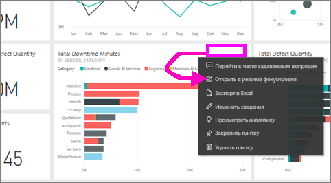
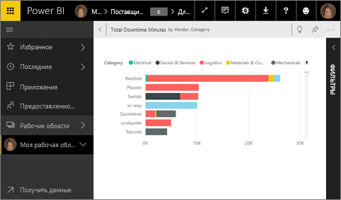
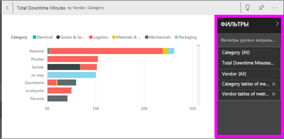
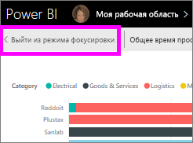
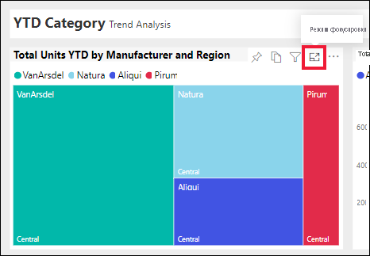
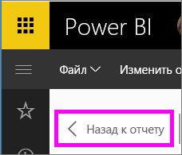

# Отображение плитки панели мониторинга или визуального элемента отчета в режиме фокусировки

<iframe width="560" height="315" src="https://www.youtube.com/embed/dtdLul6otYE" frameborder="0" allowfullscreen></iframe>

## Что такое режим фокусировки?

***Режим фокусировки*** позволяет развернуть содержимое, чтобы просмотреть более подробные сведения.  В этом режиме вы можете просматривать и изменять фильтры, которые были применены при создании этого визуального элемента.  В службе Power BI можно использовать режим фокусировки с плиткой панели мониторинга или визуальным элементом отчета. В Power BI Desktop этот режим можно использовать с [визуальным элементом отчета](../desktop-report-view.md).

> [!NOTE]
> Режим фокусировки отличается от [полноэкранного режима](../service-fullscreen-mode.md).
> 

## Режим фокусировки для плиток панели мониторинга

1. Наведите указатель мыши на визуализацию, щелкните многоточие (…) и выберите пункт **Открыть в режиме фокусировки**. 

    .

2. Плитка откроется и заполнит весь холст. 

   

3. Разверните панель фильтров для просмотра всех фильтров, примененных к данному визуальному элементу.
   
   

4. Для более глубокого изучения измените фильтры и в случае, если обнаружите что-нибудь интересное, прикрепите визуальный элемент к панели мониторинга.

5. Выйдите из режима фокусировки и вернитесь на панель мониторинга, выбрав значок **< Выйти из режима фокусировки** (в левом верхнем углу визуального элемента).
   
        

## Режим фокусировки для визуализаций отчета

1. Наведите указатель мыши на визуализацию отчета и выберите значок **режима фокусировки** .  
   
   
2. Визуализация откроется и заполнит весь холст. 

   
3. Разверните панель фильтров для просмотра всех фильтров, примененных к данному визуальному элементу.
   
   
4. Для более глубокого изучения измените фильтры и в случае, если обнаружите что-нибудь интересное, прикрепите визуальный элемент к панели мониторинга.   
5. Выйдите из режима фокусировки и вернитесь в отчет, выбрав значок **Назад к отчету** (в левом верхнем углу визуального элемента). 
   
      

## Переход из режима фокусировки в полноэкранный режим
Из режима фокусировки плитку или визуальный элемент можно развернуть для [просмотра в полноэкранном режиме (режиме ТВ)](../service-fullscreen-mode.md). В полноэкранном режиме данные можно просматривать, не отвлекаясь на меню и кнопки навигации.

## Рекомендации и устранение неполадок
* Используя режим фокусировки для визуализации в отчете, вы сможете просматривать и изменять фильтры всех уровней: визуальных элементов, страниц, детализаций и отчетов.    
* Используя режим фокусировки для визуализации на панели мониторинга, вы сможете просматривать и изменять только фильтр уровня визуальных элементов.

Появились дополнительные вопросы? [Ответы на них см. в сообществе Power BI.](http://community.powerbi.com/)

