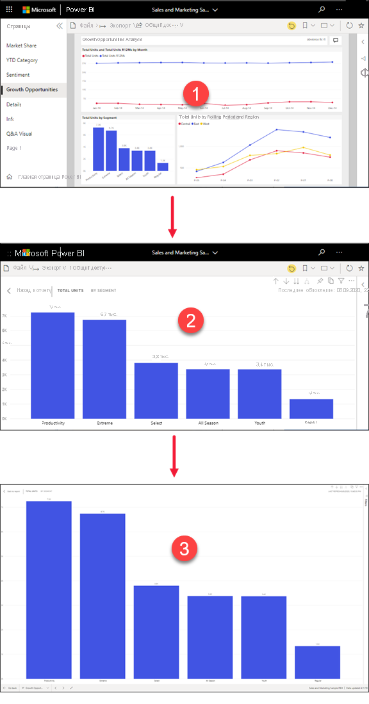
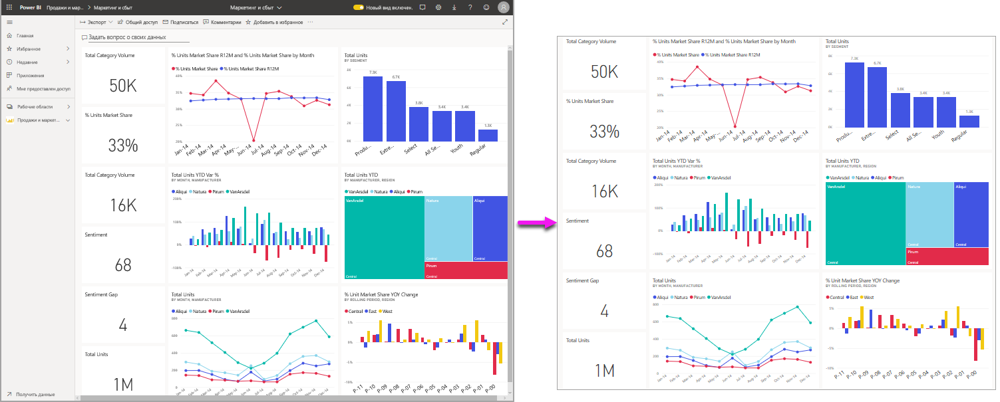
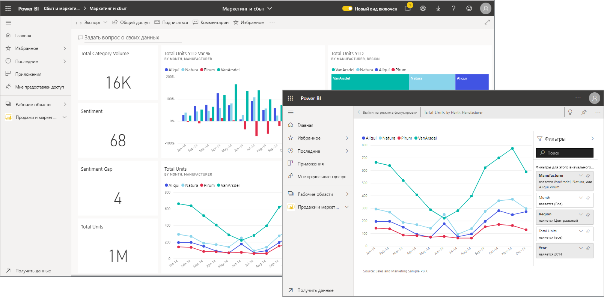
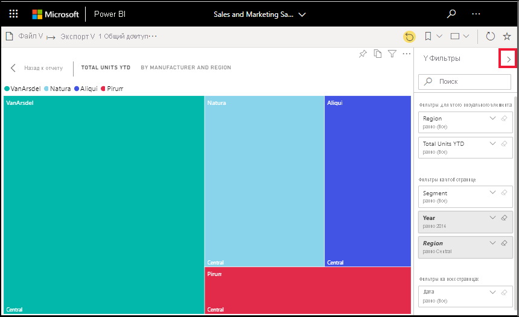
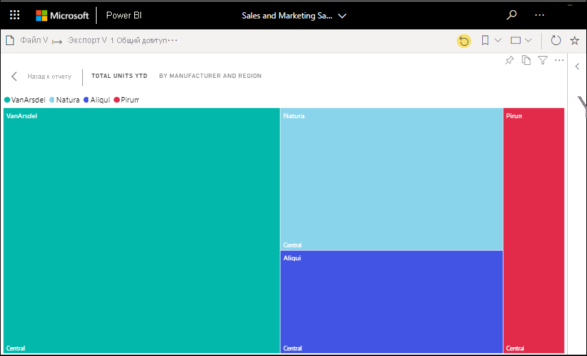
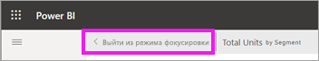
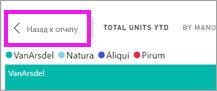

# Отображение содержимого с дополнительными подробностями: режим фокусировки и полноэкранный режим

[!INCLUDE [consumer-appliesto-yynn](../includes/consumer-appliesto-yynn.md)]

[!INCLUDE [power-bi-service-new-look-include](../includes/power-bi-service-new-look-include.md)]    

<iframe width="560" height="315" src="https://www.youtube.com/embed/dtdLul6otYE" frameborder="0" allowfullscreen></iframe>

Режим фокусировки и полноэкранный режим — это два разных способа увидеть больше подробностей на визуальных элементах, панелях мониторинга и в отчетах.  Различие между ними заключается в том, что полноэкранный режим скрывает все панели, размещенные вокруг содержимого, а режим фокусировки сохраняет возможность взаимодействовать с визуальными элементами. Давайте более подробно рассмотрим их сходства и различия.  

|Содержимое    | Режим фокусировки  |Полноэкранный режим  |
|---------|---------|----------------------|
|Панель мониторинга     |   Невозможно     | да |
|Страница отчета   | Невозможно  | да|
|Визуальный элемент отчета | да    | да |
|Плитка панели мониторинга | да    | Невозможно |
|Windows 10 для мобильных устройств | Невозможно | Да |

В этом примере мы начали работу с отчетом (1), открыли один из визуальных элементов в режиме фокусировки (2), а затем открыли этот же визуальный элемент в полноэкранном режиме (3). 

## Когда следует использовать полноэкранный режим?

Отображайте содержимое службы Power BI (панели мониторинга, страницы отчетов и визуальные элементы) без отвлекающих внимание меню и областей навигации.  Так вы можете быстро просматривать все содержимое целиком. Иногда это также называется режимом ТВ.   

Если вы используете Power BI для мобильных устройств, [в мобильных приложениях для Windows 10 доступен полноэкранный режим](./mobile/mobile-windows-10-app-presentation-mode.md). 

Некоторые варианты применения полноэкранного режима:

* презентация панели мониторинга, визуального элемента или отчета на собрании или конференции;
* отображение в офисе на выделенном большом экране или проекторе;
* просмотр на небольшом экране;
* просмотр в режиме блокировки — вы можете коснуться экрана или наводить указатель мыши на плитки без открытия базового отчета или панели мониторинга.

## Когда следует использовать режим фокусировки?

***Режим фокусировки*** позволяет развернуть визуальный элемент или плитку, чтобы увидеть больше подробностей.  Представьте, что панель мониторинга или отчет перегружены визуальными элементами и вы хотите сосредоточиться только на одном из них.  Это идеальная ситуация для режима фокусировки.  

В режиме фокусировки *бизнес-пользователь* Power BI может взаимодействовать с фильтрами, которые были применены при создании этого визуального элемента.  В службе Power BI вы можете применить режим фокусировки к плитке панели мониторинга или к визуальному элементу отчета.

## Работа в полноэкранном режиме

Полноэкранный режим доступен для панелей мониторинга, страниц отчетов и визуальных элементов. 

- Чтобы открыть панель мониторинга в полноэкранном режиме, щелкните значок полноэкранного режима  в строке меню вверху. 

- Чтобы открыть страницу отчета в полноэкранном режиме, выберите **Вид** > **Во весь экран**.

    

- Чтобы просмотреть визуальный элемент в полноэкранном режиме, сначала откройте его в режиме фокусировки, а затем выберите **Вид** > **Во весь экран**.  

Выбранное содержимое отображается во весь экран. Когда вы находитесь в полноэкранном режиме, перейдите с помощью строк меню в верхней и нижней части (отчеты) или меню, которое появляется при перемещении курсора (панели мониторинга и визуальные элементы). Поскольку полноэкранный режим доступен для широкого спектра содержимого, параметры навигации различаются.   

  * Выберите **Назад**, **Вернуться** или **Назад к отчету**, чтобы перейти к предыдущей странице в браузере. Если предыдущей является страница Power BI, она также отобразится в полноэкранном режиме.  Полноэкранный режим будет использоваться, пока вы не выйдете из него.

  *     
    Используйте кнопку **По размеру экрана**, чтобы панель мониторинга отобразилась в максимальном размере без полос прокрутки.  

    

  *        
    Иногда полосы прокрутки не мешают, но нужно, чтобы панель мониторинга занимала всю ширину доступного пространства. Для этого нажмите кнопку **По ширине**.    

    

  *        
    В отчетах, развернутых на весь экран, используйте эти стрелки для перемещения между страницами.    
  *      
  Чтобы выйти из полноэкранного режима, выберите значок **Выйти из полноэкранного режима**.

      

## Работа в режиме фокусировки

Режим фокусировки доступен для плиток панелей мониторинга и визуальных элементов отчетов. 

- Чтобы открыть плитку панели мониторинга в режиме фокусировки, наведите указатель мыши на плитку панели мониторинга или визуальный элемент отчета, щелкните **Дополнительные параметры** (…) и выберите пункт **Открыть в режиме фокусировки**.

    .. 

- Чтобы открыть визуальный элемент отчета в режиме фокусировки, наведите указатель мыши на него и выберите значок **режима фокусировки** .  

   

Визуальный элемент откроется и заполнит весь холст. Обратите внимание, что у вас по-прежнему есть область **Фильтры**, которую можно использовать для взаимодействия с визуальным элементом. Область **Фильтры** можно свернуть.

   

     

Попробуйте [изменить фильтры](end-user-report-filter.md) и найти интересные факты в данных. Как *бизнес-пользователь* вы не можете добавлять новые фильтры, изменять поля в визуальных элементах или создавать новые визуальные элементы.  Однако вы можете взаимодействовать с существующими фильтрами. 

Для плитки панели мониторинга изменения сохранить невозможно. Для визуального элемента отчета все изменения, которые вы вносите в существующие фильтры, сохраняются при выходе из Power BI. Если вы не хотите сохранять в Power BI внесенные изменения, щелкните **Вернуться к значениям по умолчанию**.   

Выйдите из режима фокусировки и вернитесь в отчет или на панель мониторинга, выбрав значок **Выйти из режима фокусировки** или **Назад к отчету** (в левом верхнем углу визуального элемента).

    

  

## Рекомендации и устранение неполадок

* Используя режим фокусировки для визуального элемента отчета, вы сможете просматривать и настраивать фильтры любого уровня: "Визуальные элементы", "Страницы", "Детализации" и "Отчеты".    
* Используя режим фокусировки для визуализации на панели мониторинга, вы сможете просматривать и настраивать только фильтр уровня визуальных элементов.

## Дальнейшие действия

[Просмотр параметров отчетов](end-user-report-view.md)