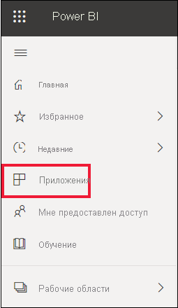
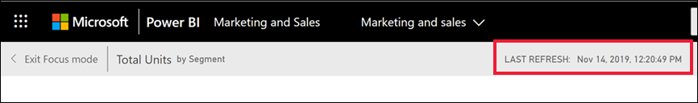

# Содержимое актуально

[!INCLUDE[consumer-appliesto-ynny](../includes/consumer-appliesto-ynny.md)]

[!INCLUDE [power-bi-service-new-look-include](../includes/power-bi-service-new-look-include.md)]

Как *бизнес-пользователь* вы можете взаимодействовать с содержимым, которое создается *разработчиками* и предоставляется вам посредством общего доступа. Может возникнуть вопрос, актуально ли такое содержимое, или может потребоваться узнать, когда последний раз оно обновлялось. Знание того, что вы работаете с самыми новыми версиями содержимого, придает уверенность.  
 

Часто для принятия правильных решений крайне важно располагать актуальными данными. Что можно сделать, чтобы убедиться, что вы используете последние материалы? Во многих случаях вам вообще не нужно ничего делать. Приложения, которыми поделились с вами, автоматически обновляются по расписанию, заданному разработчиком. То же касается панелей мониторинга и отчетов, которые вам были предоставлены: разработчик либо вручную, либо с помощью расписания автоматического обновления гарантирует, что содержимое будет актуальным.  

Если у вас есть вопросы относительно актуальности данных, обратитесь к разработчику.

## Как найти имя разработчика или владельца

### Панель мониторинга или отчет

Имя владельца доступно в строке заголовка панелей мониторинга и отчетов. Выберите имя отчета или панели мониторинга, чтобы отобразить дополнительные сведения, в том числе **имя владельца**.

### Приложения

На экране приложения показано имя разработчика, а также дата последнего обновления приложения.  

1. В области навигации выберите **Приложения**.

    

2. Наведите на приложение, чтобы вывести название, дату обновления и имя разработчика. 

    

### Панель "Мне предоставлен доступ"
Экран **Мне предоставлен доступ** показывает имя владельца содержимого, а также последнюю дату, когда содержимое было вам предоставлено.

 

## Как найти дату последнего обновления
Вы можете найти дату последнего обновления для большей части содержимого. 

### Плитки панели мониторинга
Для плиток панели мониторинга откройте плитку в режиме фокусировки, чтобы увидеть метку времени последнего обновления.

1. На плитке панели мониторинга щелкните **Дополнительные параметры** (…) и выберите пункт **Открыть в режиме фокусировки**.

    

2. В правом верхнем углу появится дата последнего обновления. Если вы не видите его, разверните окно браузера, чтобы сделать его шире. 

    

### Панели мониторинга и отчеты
Другой способ поиска даты последнего обновления — с помощью **просмотра связанного содержимого**.  Чтобы перейти к **просмотру связанного содержимого**, щелкните **Дополнительные действия** (...) в верхнем меню Power BI.

В области **Связанное содержимое** отображаются последние обновленные сведения по базовому набору данных для панели мониторинга или отчета.

## Что произойдет, если разработчик удалит приложение

Если разработчик удаляет приложения, панели мониторинга и отчеты, связанные с этим приложением, также автоматически удаляются из рабочей области Power BI. Эти элементы станут недоступны, и приложение перестанет отображаться в контейнере приложений и где-либо еще в области навигации.

## Подпишитесь на изменения
Другой способ оставаться в курсе — подписаться на отчет или панель мониторинга. Вместо того, чтобы войти и открыть отчет или панель мониторинга, вы указываете Power BI отправлять моментальные снимки по заданному расписанию.  Дополнительные сведения см. в разделе [Подписка на панели мониторинга и отчеты](end-user-subscribe.md).

## Настройка оповещений о данных
Хотите получать уведомления при изменении данных, вышедших за предельное значение? [Создайте предупреждение данных](end-user-alerts.md).  Оставаться в курсе будет легко с помощью предупреждений данных. Используя их, вы указываете Power BI отправить вам сообщение электронной почты, если значение в отчете превышает определенный порог.  Например, если объем запасов на складе стал ниже 25 единиц или продажи превышают цели.  

## Дальнейшие действия
[Создание предупреждения данных](end-user-alerts.md)    
[Подписка на панели мониторинга и отчеты](end-user-subscribe.md)    
[Просмотр связанного содержимого](end-user-related.md)    
