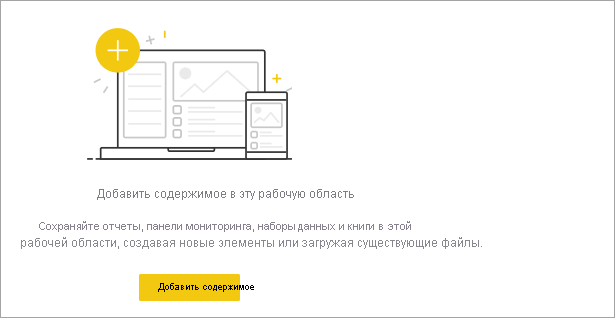
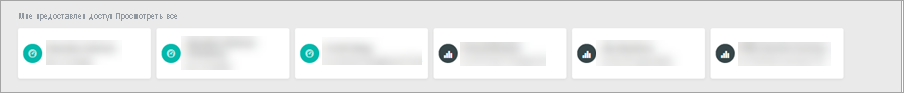
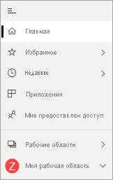

# Поиск панелей мониторинга, отчетов и приложений

[!INCLUDE[consumer-appliesto-yynn](../includes/consumer-appliesto-yynn.md)]
В Power BI термин *содержимое* обозначает приложения, панели мониторинга и отчеты. Содержимое создается *конструкторами* Power BI, которые делятся им с коллегами, такими как вы. Содержимое доступно для просмотра и использования в службе Power BI, а лучшим местом для начала работы с Power BI является **Главная страница** Power BI.

## Обзор главной страницы Power BI
После входа в службу Power BI в области навигации выберите **Главная страница**. 

Power BI отображает холст главной страницы, как показано на следующем рисунке.
 

Главная страница Power BI предоставляет три разных способа для поиска и просмотра содержимого. Все они обращаются к одному и тому же пулу содержимого — это просто разные способы получения такого содержимого. Иногда поиск будет самым простым и быстрым способом найти что-либо, а в других случаях наилучшим вариантом станет выбор *карточки* на холсте главной страницы.

- Холст главной страницы отображает и упорядочивает избранное и недавнее содержимое, а также рекомендуемое содержимое и обучающие ресурсы. Каждый фрагмент содержимого отображается в виде *карточки*с заголовком и значком. При выборе карточки открывается соответствующее содержимое.
- Вдоль левой стороны находится область навигации. В этой области то же содержимое организовано немного иначе — по разделам "Избранное", "Последние", "Приложения" и "У меня есть доступ". Здесь можно просмотреть списки содержимого и выбрать один из них, чтобы открыть его.
- В правом верхнем углу находится поле глобального поиска, позволяющее найти содержимое по заголовку, имени или ключевому слову.

В следующих разделах рассмотрен каждый из этих вариантов поиска и просмотра содержимого.

## Холст главной страницы
На холсте главной страницы можно просмотреть все содержимое, которое вы можете использовать. Поначалу на холсте главной страницы может быть не слишком много содержимого (см. изображение выше), но все изменится, когда вы начнете использовать Power BI совместно с коллегами.

На вашем холсте главной страницы также будут обновляться сведения о рекомендованном содержимом и обучающих ресурсах. 
 
При работе в службе Power BI вы будете получать панели мониторинга, отчеты и приложения от коллег, в конечном итоге главная страница Power BI будет заполнена. Со временем она может выглядеть так, как показано ниже.

 
В нескольких следующих разделах более подробно рассмотрены холсты главной страницы — в направлении сверху вниз.

## Наиболее важное содержимое всегда в вашем распоряжении

### Избранные и часто используемые
Этот верхний раздел содержит ссылки на содержимое, которое вы посещаете чаще всего или [пометили](end-user-favorite.md) как основное или избранное. Обратите внимание, что несколько карточек имеют желтые звездочки — эти два приложения и панель мониторинга помечены как избранные. 

Кроме того, содержимое можно пометить как [рекомендованные](end-user-featured.md). Чтобы упорядочить содержимое, одну из панелей мониторинга или один из отчетов, которые вы просматриваете чаще всего, можно сделать *основными*. При каждом открытии службы Power BI первой будет отображаться основная панель мониторинга. 

### "Последние" и "Мои приложения"
В следующем разделе показано содержимое, которое вы просматривали последним. Обратите внимание на метку времени на каждой карточке. В разделе **Мои приложения** перечислены приложения, к которым вам предоставлен общий доступ или которые [вы скачали из AppSource](end-user-apps.md). Здесь перечислены последние приложения. Можно выбрать **Просмотреть все**, чтобы отобразить список всех приложений, к которым вам предоставлен общий доступ.

### Рабочие области
Каждый потребитель службы Power BI имеет одну область **Моя рабочая область**. **Моя рабочая область** имеет содержимое только в том случае, если вы уже скачали примеры корпорации Майкрософт или создали собственные панели мониторинга, отчеты или приложения. Для многих *потребителей* **Моя рабочая область** будет пуста и останется пустой.  

Каждый раз, когда вы [загружаете приложение](end-user-app-marketing.md) или [вам предоставляется доступ к приложению](end-user-apps.md), создается новая рабочая область.  Чтобы открыть *рабочую область приложения*, выберите ее на холсте главной страницы. 

Приложение откроется на вашем холсте, и вы увидите имя рабочей области, указанной в области навигации. В рабочих областях служба Power BI разделяет содержимое по типу: панели мониторинга и отчеты. В некоторых случаях у вас также есть книги и наборы данных. При выборе рабочей области вы увидите, как оно упорядочено. В этом примере рабочая область **Цепочка "Садоводство"** содержит четыре панели мониторинга и два отчета.

### Мне предоставлен доступ
Коллеги делятся с вами приложениями, но они также могут поделиться и отдельными панелями мониторинга и отчетами. В разделе **У меня есть доступ** обратите внимание на три панели мониторинга и три отчета, которыми коллеги поделились с вами.

### Рекомендуемые приложения
Учитывая ваши действия и параметры учетной записи, Power BI отображает набор рекомендуемых приложений. При выборе карточки приложения открывается соответствующее приложение.
 
### Обучающие ресурсы
В нижней части холста главной страницы находится набор обучающих ресурсов. Конкретные отображаемые ресурсы зависят от ваших действий и параметров, а также от администратора Power BI. 
 
## Обзор панели навигации

В области навигации содержимое представлено в классифицированном виде, позволяющем быстрее найти то, что вам нужно.  

Используйте панель навигации для поиска панелей мониторинга, отчетов и приложений, а также перемещения между ними. Иногда использование панели навигации является самым быстрым способом доступа к содержимому. Область навигации отображается, когда вы открываете главную целевую страницу, и остается здесь при открытии других областей в службе Power BI. Ее можно свернуть, щелкнув значок "Скрыть".  .
  
Панель навигации упорядочивает содержимое по контейнерам, аналогичным тем, которые вы уже видели на холсте главной страницы: "Избранное", "Последние", "Приложения", "У меня есть доступ" и рабочие области. Можно просматривать только самое последнее содержимое в каждом из этих контейнеров с помощью всплывающих элементов либо перейти к спискам содержимого, чтобы просмотреть все содержимое для каждой категории контейнера.
 
- Чтобы открыть один из этих разделов содержимого и отобразить список всех элементов, выберите заголовок.
- Чтобы просмотреть последние сведения в каждом контейнере, выберите всплывающий элемент ( **>** ).

    

 
Панель навигации — еще одно средство для быстрого поиска нужного содержимого. Содержимое упорядочено по аналогии с холстом главной страницы, но отображается в виде списков, а не карточек. 

## Поиск всего содержимого
В некоторых случаях содержимое быстрее всего найти с помощью поиска. Например, вы могли обнаружить, что панель мониторинга, которую вы некоторое время не использовали, не отображается на холсте главной страницы. Или, возможно, вы помните, что ваш коллега Дмитрий предоставил вам к ней доступ, но не помните, как она называлась или к какому содержимому был предоставлен доступ — панели мониторинга или отчету. Или у вас может быть настолько много содержимого, что проще выполнять поиск, чем прокручивать или сортировать его. 
 
Поле поиска находится в верхней правой части строки главного меню. Вы можете ввести полное или частичное имя панели мониторинга и выполнить ее поиск. Кроме того, можно ввести имя вашего коллеги и найти содержимое, которым он с вами поделился. Поиск осуществляется по всему содержимому, которым вы владеете или к которому у вас есть доступ.

## Дальнейшие действия
Обзор [основных понятий Power BI](end-user-basic-concepts.md)
