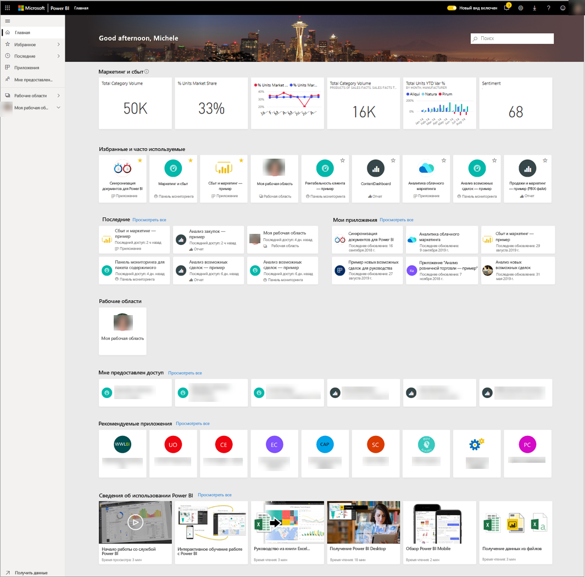
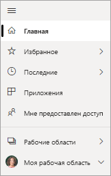
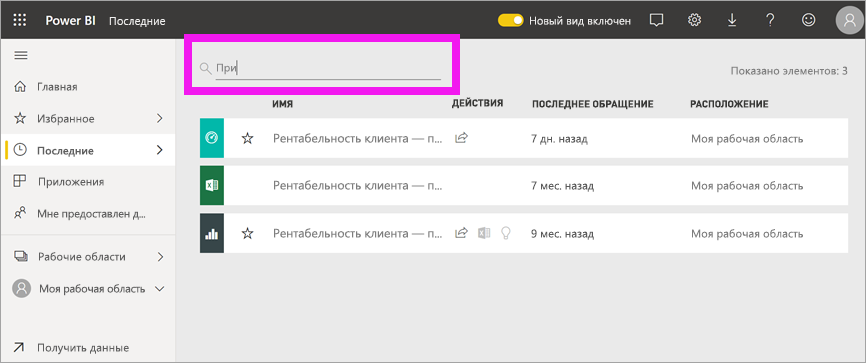

# Поиск панелей мониторинга, отчетов и приложений
В Power BI термин *содержимое* обозначает приложения, панели мониторинга и отчеты. Содержимое создается *конструкторами* Power BI, которые делятся им с коллегами, такими как вы. Содержимое доступно для просмотра и использования в службе Power BI, а лучшим местом для начала работы с Power BI является главная целевая страница.

## Обзор главной страницы Power BI
При входе в систему Power BI открывает и отображает ваш холст главной страницы, как показано на следующем рисунке.
 

Главная страница Power BI предоставляет три разных способа для поиска и просмотра содержимого. Все они обращаются к одному и тому же пулу содержимого — это просто разные способы получения такого содержимого. Иногда поиск будет самым простым и быстрым способом найти что-либо, а в других случаях наилучшим вариантом станет выбор *карточки* на холсте главной страницы.

- Холст главной страницы отображает и упорядочивает избранное и недавнее содержимое, а также рекомендуемое содержимое и обучающие ресурсы. Каждый фрагмент содержимого отображается в виде *карточки*с заголовком и значком. При выборе карточки открывается соответствующее содержимое.
- Вдоль левой стороны находится область навигации, называемая панелью навигации. В этой области то же содержимое организовано немного иначе — по разделам "Избранное", "Последние", "Приложения" и "У меня есть доступ". Здесь можно просмотреть списки содержимого и выбрать один из них, чтобы открыть его.
- В правом верхнем углу находится поле глобального поиска, позволяющее найти содержимое по заголовку, имени или ключевому слову.

В следующих разделах рассмотрен каждый из этих вариантов поиска и просмотра содержимого.

## Холст главной страницы
На холсте главной страницы можно просмотреть все содержимое, которое вы можете использовать. Поначалу на холсте главной страницы может быть не слишком много содержимого (см. изображение выше), но все изменится, когда вы начнете использовать Power BI совместно с коллегами.

На вашем холсте главной страницы также будут обновляться сведения о рекомендованном содержимом и обучающих ресурсах. 
 
При работе в службе Power BI вы будете получать панели мониторинга, отчеты и приложения от коллег, в конечном итоге ваша главная страница будет заполнена. Со временем она может походить на главную страницу, представленную ниже.

 
В нескольких следующих разделах более подробно рассмотрены элементы этой главной страницы в направлении сверху вниз.

## Наиболее важное содержимое всегда в вашем распоряжении

### Избранные и часто используемые
Этот верхний раздел содержит ссылки на содержимое, которое вы посещаете чаще всего или [пометили](end-user-favorite.md) как основное или избранное. Обратите внимание, что несколько карточек имеют желтые звездочки — эти два приложения и панель мониторинга помечены как избранные.
 
### "Последние" и "Мои приложения"
В следующем разделе показано содержимое, которое вы просматривали последним. Обратите внимание на метку времени на каждой карточке. В разделе **Мои приложения** перечислены приложения, к которым вам предоставлен общий доступ или которые [вы скачали из AppSource](end-user-apps.md). Здесь перечислены последние приложения. Можно выбрать **Просмотреть все**, чтобы отобразить список всех приложений, к которым вам предоставлен общий доступ.

### Рабочие области
Как *потребитель* Power BI, вы обычно имеете всего одну рабочую область — **Моя рабочая область**. 

### Мне предоставлен доступ
Коллеги делятся с вами приложениями, но они также могут поделиться и отдельными панелями мониторинга и отчетами. В разделе **У меня есть доступ** обратите внимание на три панели мониторинга и три отчета, которыми коллеги поделились с вами.

### Рекомендуемые приложения
Учитывая ваши действия и параметры учетной записи, Power BI отображает набор рекомендуемых приложений. При выборе карточки приложения открывается соответствующее приложение.
 
### Обучающие ресурсы
В нижней части холста главной страницы находится набор обучающих ресурсов. Конкретные отображаемые ресурсы зависят от ваших действий и параметров, а также от администратора Power BI. 
 
## Обзор панели навигации

Используйте панель навигации для поиска панелей мониторинга, отчетов и приложений, а также перемещения между ними. Иногда использование панели навигации является самым быстрым способом доступа к содержимому.
Панель навигации отображается, когда вы открываете главную целевую страницу, и остается статичной при открытии других областей в службе Power BI.
  
Панель навигации упорядочивает содержимое по контейнерам, аналогичным тем, которые вы уже видели на холсте главной страницы: "Избранное", "Последние", "Приложения" и "У меня есть доступ". Можно просматривать только самое последнее содержимое в каждом из этих контейнеров с помощью всплывающих элементов либо перейти к спискам содержимого, чтобы просмотреть все содержимое для каждой категории контейнера.
 
- Чтобы открыть один из этих разделов содержимого и отобразить список всех элементов, выберите заголовок.
- Чтобы просмотреть последние сведения в каждом контейнере, выберите всплывающий элемент ( **>** ).

    

 
Панель навигации — еще одно средство для быстрого поиска нужного содержимого. Содержимое упорядочено по аналогии с холстом главной страницы, но отображается в виде списков, а не карточек. 

## Поиск всего содержимого
В некоторых случаях содержимое быстрее всего найти с помощью поиска. Например, вы могли обнаружить, что панель мониторинга, которую вы некоторое время не использовали, не отображается на холсте главной страницы. Или, возможно, вы помните, что ваш коллега Дмитрий поделился ею с вами, но не помните, как она называлась или какой содержимого был предоставлен, будь то панель мониторинга или отчет.
 
Вы можете ввести полное или частичное имя панели мониторинга и выполнить ее поиск. Кроме того, можно ввести имя вашего коллеги и найти содержимое, которым он с вами поделился. Поиск осуществляется по всему содержимому, которым вы владеете или к которому у вас есть доступ.

## Дальнейшие действия
Обзор [основных понятий Power BI](end-user-basic-concepts.md)
