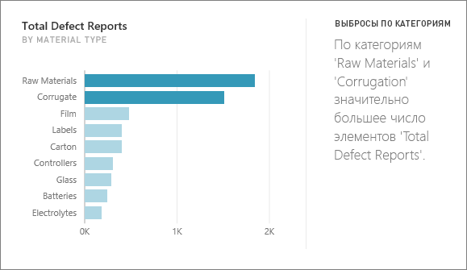
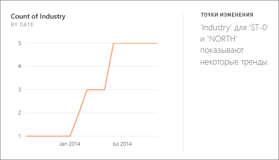
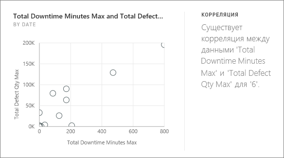
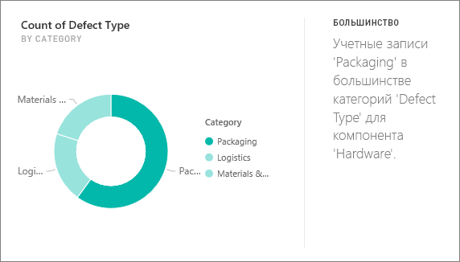
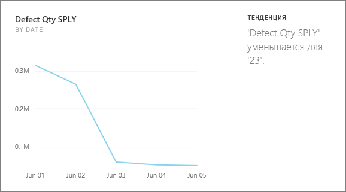
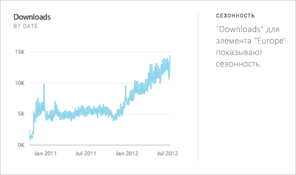
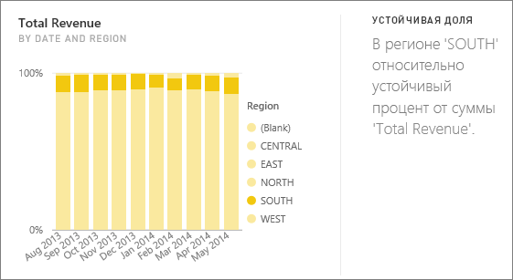
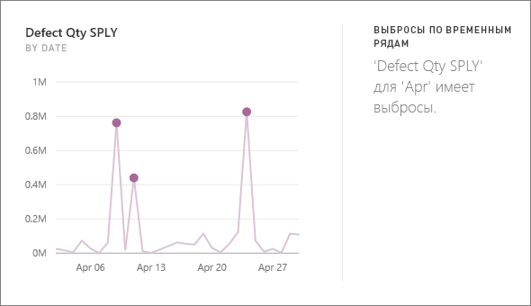

# Типы аналитики, поддерживаемые в Power BI

Служба Power BI поддерживает автоматический поиск аналитических сведений в панелях мониторинга или отчетах.

## Как выполняется аналитика?
Power BI обеспечивает быстрый поиск различных подмножеств в вашем наборе данных. При поиске Power BI применяет набор оптимизированных алгоритмов для выявления потенциально полезных аналитических сведений. Power BI сканирует максимальный объем набора данных в течение выделенного количества времени.

Аналитика может выполняться с набором данных или данных на плитке панели мониторинга.   

## Какие результаты можно получить?
Ниже перечислены некоторые используемые нами алгоритмы.

## Провалы или всплески значений
Выделяет случаи, когда при измерении по модели значения одного или двух членов измерения намного превышают значения остальных  

## Точки изменений во временных рядах
Выделяет существенные изменения в тенденциях, наблюдаемых во временном ряде данных.

## Корреляция
Выявляет случаи корреляции  между несколькими показателями, нанесенными на график в зависимости от какого-либо измерения в наборе данных.

## Низкая вариативность
Выявляет случаи, когда точки данных близки к среднему значению.

## Большинство (основные факторы)
Находит случаи, когда большую часть общего значения можно свести к одному фактору, выполнив детализацию по другому параметру.  

## Общие тенденции во временных рядах
Определяет восходящие и нисходящие тенденция в данных временных рядов.

## Сезонность во временных рядах
Находит повторяющийся рисунок в данных временных рядов, такие как недельная, месячная или годовая сезонность.

## Постоянная доля
Выделяет случаи иерархической корреляции между долей дочернего значения и суммарным значением родительского элемента в непрерывной переменной.

## Выбросы временных рядов
Определяет, есть ли во временном ряде значения даты или времени, которые существенно отличаются от остальных значений даты и времени.

## Дальнейшие действия
[Аналитика Power BI](end-user-insights.md)

Появились дополнительные вопросы? [Ответы на них см. в сообществе Power BI.](http://community.powerbi.com/)

