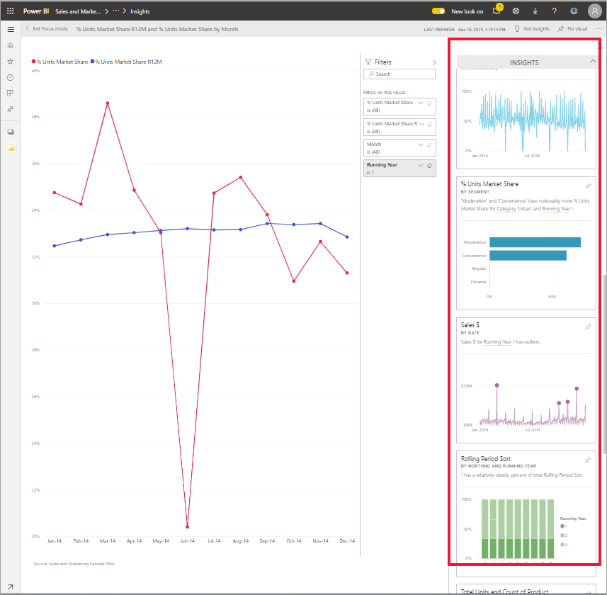

# Типы аналитики, поддерживаемые в Power BI

[!INCLUDE[consumer-appliesto-yyny](../includes/consumer-appliesto-yyny.md)]

Power BI может находить интересные тенденции и закономерности в данных. Эти тенденции и закономерности представляются в виде визуальных элементов, которые называются *аналитикой*. 

Сведения об использовании аналитики см. в статье [Аналитика Power BI](end-user-insights.md).

## Как выполняется аналитика?
Power BI обеспечивает быстрый поиск различных подмножеств в вашем наборе данных. При поиске Power BI применяет набор оптимизированных алгоритмов для выявления потенциально полезных аналитических сведений. *Пользователи* Power BI могут использовать аналитику на плитках панели мониторинга.

## Терминология
Для получения аналитических сведений в Power BI используются статистические алгоритмы. Эти алгоритмы перечислены и описаны в следующем разделе данной статьи. Но прежде чем переходить к ним, следует ознакомиться с определениями ряда терминов, которые могут незнакомы вам. 

* **Мера** — это количественное (числовое) поле, которое можно использовать для вычислений. К распространенным типам вычислений относятся суммирование, определение среднего и минимального значений. Например, если компания изготавливает и продает скейтборды, мерами могут быть число проданных скейтбордов и средний годовой доход.  
* **Измерение** — измерения представляют собой категориальные (текстовые) данные. Измерение описывает человека, объект, товар, место и время. В наборе данных измерения — это способ объединения *мер* в полезные категории. В примере компании, торгующей скейтбордами, измерения могут использоваться для анализа продаж (меры) по модели, цвету, стране или маркетинговой кампании.   
* **Корреляция** — корреляция показывает, как взаимосвязано поведение объектов.  Если два значения увеличиваются и уменьшаются одновременно, они связаны положительной корреляцией. Если же одно значение увеличивается, когда другое уменьшается, и наоборот, они связаны отрицательной корреляцией. Например, если продажи красных скейтбордов увеличиваются каждый раз при проведении маркетинговой кампании по телевидению, значит, их продажи и маркетинговая кампания имеют положительную корреляцию.
* **Временные ряды** — это способ отображения времени в виде последовательности точек данных. Точками данных могут быть инкрементные значения, например секунды, часы, месяцы или годы.  
* **Непрерывная переменная** — такая переменная может иметь любое значение в пределах от минимального до максимального. В противном случае переменная является дискретной. Примерами могут служить температура, вес, возраст и время. Непрерывные переменные могут содержать дробные значения. Общее число проданных синих скейтбордов является дискретной переменной, так как продать половину скейтборда нельзя.  

## Какие аналитические сведения можно получить?
Ниже перечислены алгоритмы, используемые в Power BI. 

### Провалы или всплески значений
Выделяет случаи, когда значения одной или двух категорий намного превышают значения остальных.  

### Точки изменений во временных рядах
Выделяет существенные изменения в тенденциях, наблюдаемых во временном ряде данных.

### Корреляция
Выявляет случаи, когда несколько мер проявляют схожие закономерности или тенденции при нанесении на график в зависимости от какой-либо категории или значения в наборе данных.

### Низкая вариативность
Выявляет случаи, когда точки данных для измерения близки к среднему значению, то есть дисперсия невелика. Предположим, что у вас есть мера "Sales" и измерение "Region" (Регион). Просматривая этот регион, вы замечаете очень малые различия между значениями точек данных и средним значением (по всем точкам данных). Триггер по этим аналитическим сведениям срабатывает, когда дисперсия продаж по всем регионам не превышает порогового значения. Иными словами, когда продажи во всех регионах примерно на одном уровне.

### Большинство (основные факторы)
Находит случаи, когда большую часть общего значения можно свести к одному фактору, выполнив детализацию по другому параметру.  

### Общие тенденции во временных рядах
Определяет восходящие и нисходящие тенденция в данных временных рядов.

### Сезонность во временных рядах
Находит повторяющийся рисунок в данных временных рядов, такие как недельная, месячная или годовая сезонность.

### Постоянная доля
Выделяет случаи иерархической корреляции между долей дочернего значения и суммарным значением родительского элемента в непрерывной переменной. Аналитические сведения об устойчивой доле относятся к контексту меры, измерения и другого измерения даты и времени. Триггер по этим аналитическим сведениям срабатывает, когда для определенного значения измерения, например "северо-восточный регион", регистрируется стабильная доля от общих продаж по соответствующему измерению даты и времени.

Аналитические сведения об устойчивой доле аналогичны сведениям о низкой дисперсии, так как оба отражают недостаточно различающиеся во времени значения. Но при этом аналитические сведения об устойчивой доле оценивают отсутствие дисперсии **в процентах от общего количества** по времени, а аналитические сведения о низкой дисперсии оценивают низкую вариативность абсолютных значений меры по измерению.

### Выбросы временных рядов
Определяет, есть ли во временном ряде значения даты или времени, которые существенно отличаются от остальных значений даты и времени.

## Дальнейшие действия
[Аналитика Power BI](end-user-insights.md)

Появились дополнительные вопросы? [Ответы на них см. в сообществе Power BI.](https://community.powerbi.com/)

