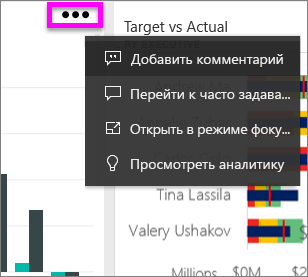
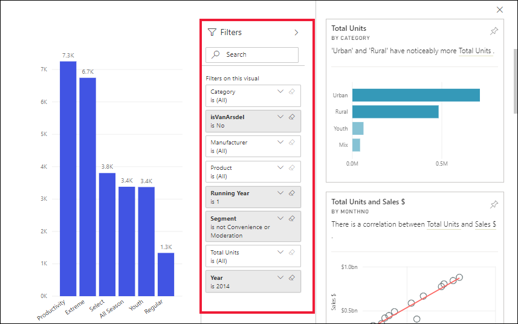
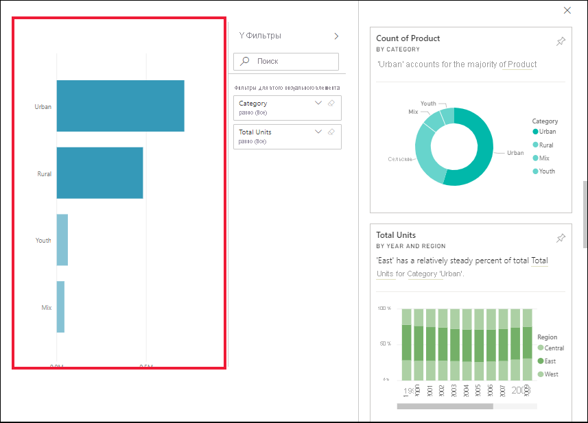

# Просмотр полезных сведений о плитках панели мониторинга с помощью Power BI

[!INCLUDE[consumer-appliesto-yyny](../includes/consumer-appliesto-yyny.md)]

Каждая [плитка](end-user-tiles.md) визуального элемента на панели мониторинга предоставляет возможности исследования данных. Щелкнув любую плитку, вы перейдете в отчет или [Вопросы и ответы](end-user-q-and-a.md), где сможете фильтровать и сортировать наборы данных, использованные для отчета. Когда вы исследуете аналитические сведения, в Power BI выполняется поиск данных.

Аналитика позволяет получить интересные интерактивные визуальные элементы на основе имеющихся данных. Аналитику можно выполнить для отдельной плитки панели мониторинга или даже для результатов предыдущей аналитики.

Функция аналитики основана на постоянно пополняемом [наборе усовершенствованных аналитических алгоритмов](end-user-insight-types.md), разработанных при сотрудничестве с подразделением Microsoft Research, которые мы продолжаем использовать, чтобы все больше людей могли анализировать данные новыми удобными способами.

## Запуск аналитики для плитки панели мониторинга
Когда вы выполняете аналитику для плитки панели мониторинга, Power BI использует для поиска только те данные, которые использовались для создания этой конкретной плитки. 

1. [Откройте панель мониторинга](end-user-dashboards.md).
2. Наведите указатель мыши на плитку. Щелкните **Дополнительные параметры** (…) и выберите команду **Просмотреть аналитические сведения**. 

    

3. Плитка откроется в [режиме фокусировки](end-user-focus.md) с карточками аналитики, которые отображаются с правой стороны.    
   
        
4. Вас заинтересовали эти сведения? Выберите карту анализа, чтобы ознакомиться с ними детально. Данные выбранного анализа отображаются слева, а справа отображаются новые карты анализа, основанные только на данных этого анализа.    

 ## Работа с карточками аналитики
Получив аналитику по одной плитке, продолжим изучение.

   * Фильтрация визуальных элементов холста.  Чтобы отобразились фильтры, в правом верхнем углу экрана выберите стрелку для развертывания панели "Фильтры".

      
   
   * Запустите аналитику для самой карточки аналитики. Часто это называют **связанными аналитическими сведениями**. Выберите карточку аналитики, чтобы сделать ее активной. Она будет перемещена в левую часть холста отчета, а новые карточки, основанные исключительно на данных в этом виде, будут отображаться справа.
   
      
   
     
Чтобы вернуться к отчету, щелкните в верхнем левом углу действие **Выйти из режима фокусировки**.

## Рекомендации и устранение неполадок
- **Просмотр аналитики** работает не со всеми типами плиток для панели мониторинга. Например, он недоступен для настраиваемых визуальных элементов Power BI.<!--[Power BI visuals](end-user-custom-visuals.md)-->

## Дальнейшие действия

Примените аналитику к визуальным элементам отчета [с помощью функции анализа](end-user-analyze-visuals.md)  .  
Дополнительные сведения о доступных типах аналитики см. [здесь](end-user-insight-types.md).

