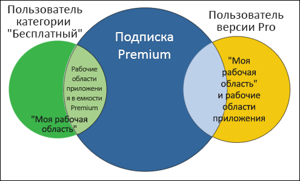
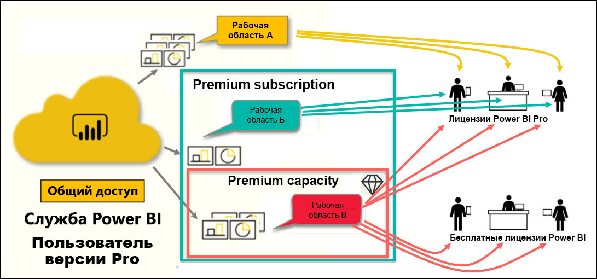

# Типы лицензий Power BI

[!INCLUDE[consumer-appliesto-ynnn](../includes/consumer-appliesto-ynnn.md)]

В качестве *потребителя* вы используете службу Power BI для просмотра отчетов и панелей мониторинга, чтобы принимать деловые решения. Если вы работаете в Power BI в течение некоторого времени или общаетесь с коллегами-*конструкторами*, вероятно, вы уже знаете, что некоторые функции работают только при наличии лицензии или подписки определенного типа. 

В этой статье объясняются различия между пользовательскими лицензиями и подписками организации (бесплатная версия, Pro, Premium и емкость Premium), а также принципы их совместной работы. Вы также узнаете, как определить, какие сочетания лицензий и подписок используются у вас.  

Начнем с рассмотрения двух категорий лицензий — пользовательских лицензий и подписок организации. Нашей отправной точкой будут возможности по умолчанию, предоставляемые каждой из них. Затем мы рассмотрим, как администратор Power BI и владельцы содержимого могут использовать роли и разрешения для изменения возможностей лицензии подписки по умолчанию. 

Например, даже если лицензия разрешает определенные действия, администратор может ограничить ее возможности, такие как экспорт данных, использование запросов на естественном языке в виде вопросов и ответов или публикация в Интернете. А когда *конструктор* отчетов назначает содержимое [рабочей области](end-user-workspaces.md), он может назначить вам роль рабочей области. Роли определяют, что вы можете и не можете делать в этой рабочей области. *Конструктор* может дополнительно настроить ограничения вашей лицензии с помощью параметров разрешений. Иными словами… это сложно. Надеюсь, эта статья разъяснит все сложности или по крайней мере большую их часть.

## Пользовательские лицензии
Первый тип лицензии — это **пользовательская** лицензия. Каждый пользователь службы Power BI имеет бесплатную лицензию или лицензию Pro. Определенные возможности доступны только пользователям с лицензиями Pro.  

- **Лицензия Power BI Pro (без подписки уровня Premium)** позволяет пользователю работать совместно с другими пользователями Pro путем создания и совместного использования содержимого. Только пользователи с лицензией Pro могут публиковать отчеты, подписываться на панели мониторинга и отчеты, а также сотрудничать с коллегами в рабочих областях. 

    

    Power BI Pro — это отдельная лицензия пользователя, которая позволяет пользователям читать отчеты и панели мониторинга, опубликованные в службе Power BI, и взаимодействовать с ними. Пользователи с этим типом лицензии могут обмениваться содержимым и совместно работать с другими пользователями Power BI Pro. Пользователи Power BI Pro могут публиковать содержимое совместно с другими пользователями или использовать содержимое, созданное другими. Исключением является содержимое, размещенное в [емкости Power BI Premium](#understanding-premium-and-premium-capacity). (Дополнительные сведения см. в разделе о [емкости Power BI Premium](#understanding-premium-and-premium-capacity) ниже.) Лицензии Pro обычно используются *конструкторами* отчетов и разработчиками. 

- **Изолированная бесплатная лицензия Power BI (без подписки уровня Premium)** , несмотря на широкий спектр возможностей, все же предназначена для тех пользователей, которые только приступили к работе с Power BI, или пользователей, создающих содержимое самостоятельно. Дополнительные сведения см. в статье [Регистрация учетной записи отдельного пользователя в Power BI](../service-self-service-signup-for-power-bi.md).   

    Бесплатная изолированная пользовательская лицензия идеально подходит для тех, кто использует примеры Майкрософт для изучения Power BI. Пользователи с бесплатными изолированными лицензиями не могут просматривать содержимое, опубликованное другими пользователями, или публиковать собственное содержимое для других пользователей Power BI. 

    

    Все клиенты с бесплатной автономной лицензией могут перейти на [бесплатную пробную лицензию Power BI Pro](../service-self-service-signup-for-power-bi.md). Пробная версия предоставляет все возможности и функции, доступные пользователю Power BI Pro.

    

- **Бесплатная лицензия на Power BI с подпиской уровня Premium**. Если у организации есть подписка уровня Premium, администраторы и пользователи Pro могут назначить рабочие области для *емкости Premium* и предоставлять доступ к ним пользователям с бесплатной лицензией. Рабочая область в емкости Premium — это место, где пользователи Pro могут совместно использовать ресурсы и работать с бесплатными пользователями, которым для этого не требуются учетные записи Pro. В этих рабочих областях пользователям с бесплатной лицензией предоставляются повышенные разрешения. Они могут совместно работать и обмениваться материалами, экспортировать данные, оформлять подписки, взаимодействовать с фильтрами и многое другое. 

Пока все понятно?  ОК. Давайте подробнее рассмотрим **емкость Premium**.

## Основные сведения о лицензиях Premium и емкости Premium
Premium представляет собой подписку **организации**. Воспринимайте ее как дополнительный уровень функциональности поверх всех **пользовательских** лицензий Power BI в организации. 

Когда организация приобретает лицензию Premium, администратор обычно назначает лицензии Pro сотрудникам, которые будут создавать и публиковать содержимое. Затем администратор назначает бесплатные лицензии всем, кто будет использовать это содержимое. Пользователи Pro создают [рабочие области приложений](end-user-workspaces.md) и добавляют в них содержимое (панели мониторинга, отчеты, приложения). Чтобы пользователи с бесплатной лицензией могли работать совместно с другими в этих рабочих областях, администратор или пользователь Pro сохраняет рабочие области в *емкости Premium*. 

Когда организация приобретает лицензию Premium, она получает в службе Power BI зарезервированную емкость. Она не является общей для других организаций. Емкость поддерживается отдельным оборудованием и полностью управляется корпорацией Майкрософт. Организации могут использовать общую выделенную емкость или распределять ее по конкретным рабочим областям. В емкости можно разместить все или некоторые рабочие области. Рабочая область в емкости Premium помечена значком бриллианта. .  Рабочая область в емкости Premium — это место, где пользователи Pro могут совместно использовать ресурсы и работать с бесплатными пользователями, которым для этого не требуются учетные записи Pro. 

В емкости Premium лицензии Pro по-прежнему требуются для конструкторов содержимого. Они создают рабочие области приложений, подключаются к источникам данных (данным модели), а также создают отчеты и панели мониторинга, которые используются совместно непосредственно или упаковываются и предоставляются для совместного использования в виде приложений. Пользователи без лицензии Pro могут получить доступ к рабочей области приложения в Power BI Premium, если она находится в *емкости Premium* и ее владелец предоставил им разрешения.

На приведенной ниже схеме слева представлены пользователи Pro, которые создают и совместно используют содержимое в рабочих областях приложений. 

- **Рабочая область A** была создана в организации без подписки уровня Premium. 

- **Рабочая область B** была создана в организации, у которой есть подписка уровня Premium, но эта рабочая область не была сохранена в емкости Premium. У этой рабочей области нет значка бриллианта.

- **Рабочая область C** была создана в организации, у которой нет подписки уровня Premium, но эта рабочая область была сохранена в емкости Premium. У этой рабочей области есть значок бриллианта.  

*Конструктор* Power BI Pro может совместно использовать ресурсы и работать с другими пользователями Pro в любой из трех рабочих областей. При условии, что он публикует рабочую область для всей организации или назначает роли рабочей области пользователям Pro. 

Пользователь Power BI Pro может совместно использовать ресурсы и работать с пользователями с бесплатной лицензией только в рабочей области C. Рабочая область должна быть сохранена в емкости Premium, чтобы пользователи бесплатной версии могли получить доступ к этой рабочей области. В рабочей области конструктор назначает роли участникам совместной работы: *Администратор*, *Участник*, *Автор* или *Зритель*. Роль определяет действия, которые можно выполнять в рабочей области. *Потребителям* Power BI, как правило, назначается роль *Зритель*. Узнайте больше о [рабочих областях для потребителей Power BI](end-user-workspaces.md).

## Определение своей лицензии и подписки
Существует несколько способов поиска сведений о лицензиях и подписках Power BI. 

Сначала определите, какая **пользовательская лицензия** у вас есть.

- Некоторые версии Microsoft Office включают лицензию Power BI Pro.  Чтобы узнать, включает ли ваша версия Office службу Power BI, перейдите на [портал Office](https://portal.office.com/account) и выберите **Подписки**.

    Первый пользователь (Прадтанна) располагает версией Office 365 E5, которая включает в себя лицензию на Power BI Pro.

    

    У второго пользователя (Залан) есть бесплатная лицензия Power BI. 

    

Затем проверьте, относится ли ваша учетная запись к подписке уровня Premium. Оба пользователя выше, Pro и бесплатный, могут принадлежать к организации с лицензией Premium.  Давайте проверим второго (это Залан).  

- В службе Power BI выберите **Моя рабочая область** и затем щелкните значок шестеренки в правом верхнем углу. Выберите **Управление личным хранилищем**.

    

    **Пользовательские** лицензии, как Pro, так и бесплатные, предоставляют 10 ГБ хранилища в облаке, которые можно использовать для размещения отчетов Power BI или книг Excel. Если у вас указано более 10 ГБ, вы являетесь членом учетной записи организации с лицензией Premium.

    

    Напомним, что на странице портала Office Залану назначена лицензия для Power BI (бесплатная версия). Но так как ваша организация приобрела подписку уровня Premium в службе Power BI, Залан получает не 10 ГБ, а 100 ГБ хранилища. Так как Залан — *потребитель* в организации с лицензией Premium, если *конструктор* размещает рабочую область в емкости Premium, Залан имеет возможность просматривать общее содержимое, совместно работать с коллегами, использовать приложения и многое другое. Спектр его разрешений задает администратор Power BI и конструктор содержимого. Обратите внимание, что пользователь Pro уже предоставил доступ к рабочей области Залану. Значок бриллианта позволяет понять, что эта рабочая область хранится в емкости Premium. 

   
## Основные сведения о ролях рабочей области
Мы уже рассмотрели пользовательские лицензии, подписки уровня Premium, рабочие области приложений и емкость Premium. Теперь перейдем к *ролям* рабочей области.

Так как это статья для *потребителей* Power BI, мы рассмотрим следующий сценарий.

-  Вы являетесь пользователем *с бесплатной лицензией* в организации с подпиской уровня Power BI Premium. 
- Пользователь Power BI Pro создал коллекцию панелей мониторинга и отчетов и опубликовал ее как *приложение* для всей организации.  
- Приложение доступно в *рабочих областях*, размещенных в емкости Premium.    
- Рабочая область приложения содержит одну панель мониторинга и два отчета.
- Пользователь Pro назначил нам роль **Зритель**.

### Роль "Зритель"
Роли позволяют конструкторам *Power BI* управлять разрешениями в рабочих областях для удобной совместной работы различных команд. Одной из этих ролей является **Зритель**. 

Если рабочая область находится в емкости Premium Power BI, пользователи с ролью зрителя могут получить доступ к области, даже если у них нет лицензии Power BI Pro. Кроме того, так как роль "Зритель" не дает доступ к базовым данным и не позволяет их экспортировать, это надежный способ взаимодействия с панелями мониторинга, отчетами и приложениями.

> [!TIP]
> Чтобы узнать больше о других ролях ("Администратор", "Участник" и "Автор"), ознакомьтесь с [созданием рабочей области](../service-new-workspaces.md).

## Дальнейшие действия
[Определите, являетесь ли вы *потребителем* Power BI.](end-user-consumer.md)    
[Ознакомьтесь с дополнительными сведениями о рабочих областях.](end-user-workspaces.md)    
<!--[View Power BI features by license type](end-user-features.md) -->

