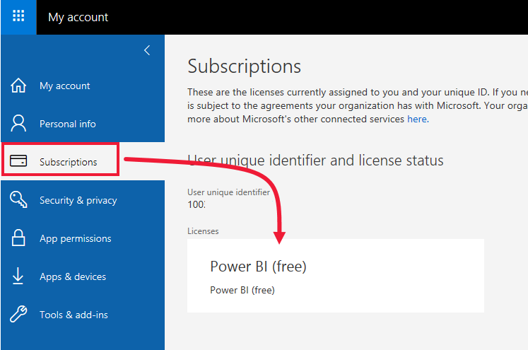
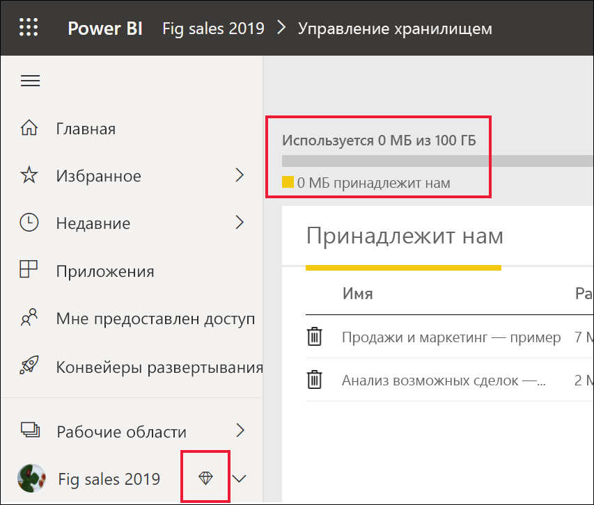
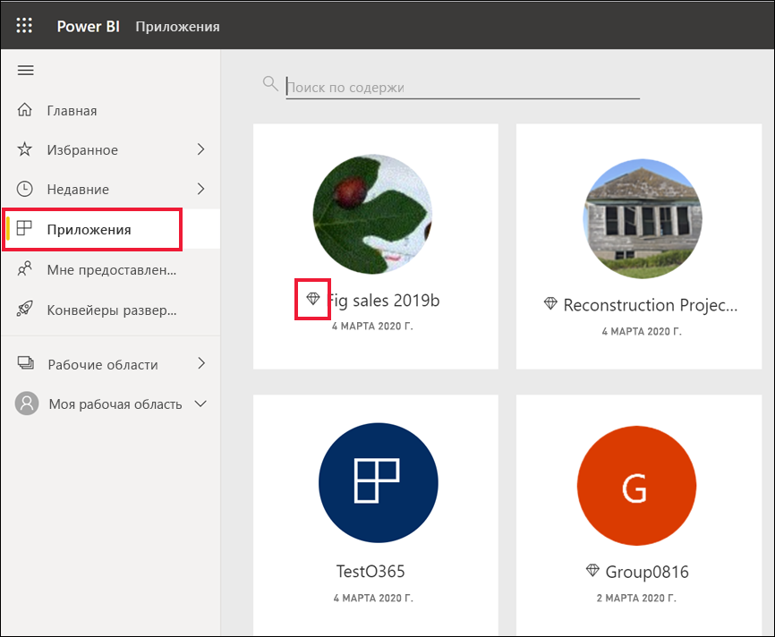
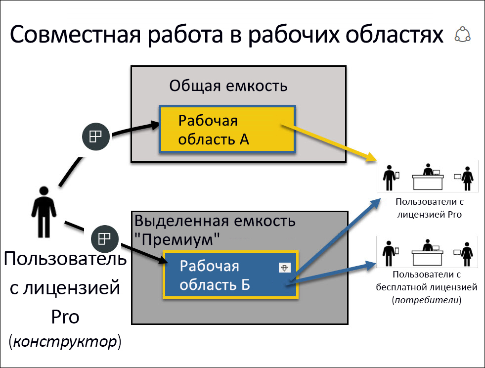

# Использование службы Power BI в качестве *потребителя*

[!INCLUDE[consumer-appliesto-ynnn](../includes/consumer-appliesto-ynnn.md)]

В качестве [*потребителя*](end-user-consumer.md) вы используете службу Power BI для просмотра отчетов и панелей мониторинга, чтобы принимать деловые решения на основе данных. Если вы работаете в Power BI в течение некоторого времени или общаетесь с коллегами-*конструкторами*, вероятно, вы уже знаете, что некоторые функции работают только при наличии лицензии, подписки или разрешений определенного типа. 

Возможные действия в службе Power BI зависят от трех факторов:
-    типа лицензии и подписки;
-    места хранения содержимого;
-    назначенных ролей и разрешений.

В этой статье описываются возможности каждого типа лицензии и то, как *место хранения содержимого* может влиять на *возможные действия с ним*. Вы также узнаете, где можно найти свою лицензию и подписку и как определить, где хранится содержимое. Дополнительные сведения о ролях и разрешениях см. в описании [ролей в рабочих областях](end-user-workspaces.md).

## Лицензии

Каждый пользователь службы Power BI имеет *бесплатную* лицензию или лицензию *Pro*. Если вы являетесь *потребителем* Power BI, вы, вероятно, используете бесплатную лицензию, управляемую администратором. 

Одновременно можно иметь несколько лицензий.  Возможности в службе всегда соответствуют лицензии более высокого уровня. 

## Емкость Power BI Premium

Premium — это подписка для организации, которая обеспечивает иной способ хранения содержимого — в выделенной емкости. Благодаря версии Premium все пользователи — как в организации, так и за ее пределами — могут просматривать ваше содержимое Power BI, не приобретая лицензии Power BI Pro для отдельных пользователей. 

Версия Premium позволяет распространять содержимое пользователям Pro, и при этом для просмотра этого содержимого получателями лицензии Pro не требуются. Лицензии Pro нужны конструкторам содержимого. Они подключаются к источникам данных, данным модели и создают отчеты и панели мониторинга, которые упаковываются в виде приложений рабочей области. Пользователь без лицензии Pro по-прежнему может получить доступ к рабочей области, которая находится в емкости Power BI Premium, если у него есть роль для просмотра.

В этих рабочих областях конструкторы назначают роли, такие как **наблюдатель**, **участник**, **член** и **администратор**. Они определяют возможности взаимодействия коллег с содержимым. Дополнительные сведения см. в статье о [разрешениях и ролях в рабочих областях](end-user-workspaces.md). 

Дополнительные сведения о емкости Premium см. в статье [Что такое Microsoft Power BI Premium?](../service-premium-what-is.md).

## Определение имеющихся лицензий

Чтобы узнать, какие лицензии назначены вам, перейдите на [страницу **Моя учетная запись** на сайте Майкрософт](https://portal.office.com/account).  Выберите вкладку **Подписки**.

Первый пользователь (Прадтанна) располагает версией Office 365 E5, которая включает в себя лицензию на Power BI Pro.

У второго пользователя (Залан) есть бесплатная лицензия Power BI. 

## Проверка наличия доступа к емкости Premium

Далее проверьте, есть ли у вашей организации емкость Premium. Оба пользователя выше, и Pro, и бесплатный, могут принадлежать к организации с емкостью Premium.  Давайте проверим второго (это Залан).  

Мы можем определить, есть ли у организации Залана емкость Premium, посмотрев доступный объем хранилища. 

- В службе Power BI выберите **Моя рабочая область** и затем щелкните значок шестеренки в правом верхнем углу. Выберите **Управление личным хранилищем**.

    

    Если у вас указано более 10 ГБ, вы являетесь сотрудником организации с подпиской Premium. На рисунке ниже показано, что объем хранилища у организации Залана достигает 100 ГБ.  

    

Обратите внимание, что пользователь Pro уже предоставил доступ к рабочей области Залану. Значок бриллианта означает, что эта рабочая область хранится в емкости Premium. 

## Определение содержимого, размещенного в емкости Premium

Другой способ узнать, есть ли у организации емкость Premium, — найти приложения и рабочие области приложений со значком бриллианта. Он означает, что содержимое хранится в емкости Premium. 

На рисунке ниже три приложения хранятся в емкости Premium.

    
Если *конструктор* размещает рабочую область в выделенной емкости Premium, *потребитель* имеет возможность просматривать общее содержимое, совместно работать с коллегами, использовать панели мониторинга и отчеты, а также выполнять другие действия **в этой рабочей области**. Спектр его разрешений задает администратор Power BI и конструктор содержимого. 

   

## Сборка

Когда организация приобретает подписку Premium, администратор обычно назначает лицензии Pro сотрудникам, которые будут работать в емкости Premium, создавая и публикуя содержимое. Затем администратор назначает бесплатные лицензии всем, кто будет использовать это содержимое. Пользователи Pro создают [рабочие области приложений](end-user-workspaces.md) и добавляют в них содержимое (панели мониторинга, отчеты, приложения). Чтобы пользователи с бесплатной лицензией могли работать совместно с другими в этих рабочих областях, администратор или пользователь Pro назначает рабочие области *выделенной емкости*.    
 

|Тип лицензии  |Общая емкость  |Выделенная емкость  |
|---------|---------|---------|
|**Бесплатный**     |  Предназначена для использования в качестве личной песочницы, в которой можно создавать содержимое для себя и работать с ним. Это отличный способ испытать службу Power BI. Вы не можете работать с содержимым других пользователей или делиться своим содержимым с ними. 1     |   Работайте с содержимым, назначенным выделенной емкости и предоставленным вам. Пользователи с бесплатными лицензиями и лицензиями Pro могут работать совместно.      |
|**Pro**     |  Работайте совместно с другими пользователями Pro путем создания и совместного использования содержимого.        |  Работайте совместно с другими пользователями с бесплатными лицензиями и лицензиями Pro путем создания и совместного использования содержимого.       |

1 См. раздел [Рекомендации и устранение неполадок](#considerations-and-troubleshooting). 

На приведенной ниже схеме слева представлены пользователи Pro, которые создают и совместно используют содержимое в рабочих областях приложений. 

- **Рабочая область A** была создана в организации без емкости Premium. 

- **Рабочая область B** была создана в организации, у которой есть подписка Premium, и сохранена в выделенной емкости. У этой рабочей области есть значок бриллианта.  

    

*Конструктор* Power BI Pro может совместно использовать ресурсы и работать с другими пользователями Pro в любой из трех рабочих областей. Но единственный способ, которым пользователь Power BI Pro может делиться содержимым и совместно работать с пользователями бесплатных лицензий, — это использовать рабочую область B, которая находится в выделенной емкости Premium.  В рабочей области конструктор назначает роли участникам совместной работы. Роль определяет действия, которые можно выполнять в рабочей области. *Потребителям* Power BI, как правило, назначается роль *Зритель*. Дополнительные сведения о ролях см. в статье [Совместная работа в рабочих областях](end-user-workspaces.md).

## Рекомендации и устранение неполадок
- Можно иметь несколько лицензий Power BI. Возможности в службе Power BI всегда соответствуют имеющейся лицензии наиболее высокого уровня. Например, если у вас есть и лицензия Pro, и бесплатная лицензия, служба Power BI будет использовать лицензию Pro.

- Если нужно создавать содержимое (панели мониторинга, отчеты, приложения) и предоставлять общий доступ к нему, то в Power BI требуется роль *потребителя*, а не *конструктора*. Рекомендуется перейти на пользовательскую лицензию Pro. Вы можете зарегистрироваться для получения бесплатной пробной версии Power BI Pro на 60 дней, выбрав диалоговое окно обновления, которое появляется в службе Power BI при каждой попытке использовать функцию Pro.

    

  После истечения срока действия 60-дневной пробной версии ваша лицензия меняется обратно на бесплатную лицензию Power BI. При этом вы потеряете доступ к функциям, для работы с которыми требуется лицензия Power BI Pro. Если вы хотите продолжить использование лицензии Pro, обратитесь к администратору с просьбой приобрести лицензию Power BI Pro. Если у вас нет администратора, перейдите на [страницу с ценами на Power BI](https://powerbi.microsoft.com/pricing/).     

- Срок действия бесплатной лицензии не ограничен. Поэтому если вы выполнили обновление до пробной версии Pro, а затем ее срок действия истек, или ваша организация предоставила вам лицензию Pro, а затем отозвала ее, у вас по-прежнему останется бесплатная лицензия, если только ее не отменит администратор или вы сами. 

- 1 Бесплатная пользовательская лицензия на службу Power BI идеально подходит для знакомства со службой или ее использования в целях анализа и визуализации личных данных в разделе **Моя рабочая область**. Ее нельзя использовать для совместной работы с коллегами в Power BI. Пользователи с бесплатными лицензиями не могут просматривать содержимое, опубликованное другими пользователями, или публиковать собственное содержимое для других пользователей Power BI. 

    

## Дальнейшие действия
- [Определите, являетесь ли вы *потребителем* Power BI](end-user-consumer.md)    
- [Сведения о рабочих областях](end-user-workspaces.md)    
- [Функции Power BI для потребителей по типам лицензий](end-user-features.md)
