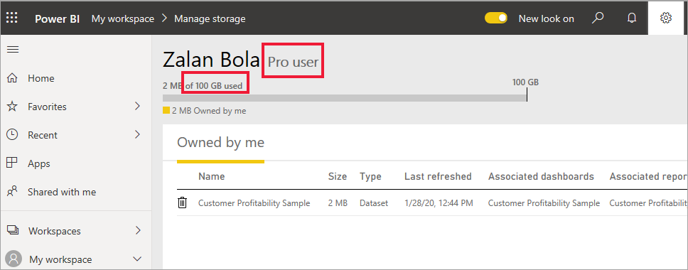

# Типы лицензий Power BI
В качестве *потребителя* вы используете службу Power BI для просмотра отчетов и панелей мониторинга, чтобы принимать деловые решения. Если вы работаете в Power BI в течение некоторого времени или общаетесь с коллегами-*с конструкторами*, то вы, вероятно, узнали, что есть функции, которые работают только при наличии лицензии определенного типа. 

В этой статье объясняются различия между типами лицензий: бесплатная, Pro, бесплатная емкость Premium и Pro с емкостью Premium. Вы также узнаете, как определить, какая лицензия у вас используется.  

Начнем с рассмотрения двух категорий лицензий — пользовательских лицензий и лицензий организации. 

## Пользовательские лицензии
Первый тип лицензии — это **пользовательская лицензия**. Каждый пользователь Power BI имеет бесплатную лицензию или лицензию Pro. Некоторые функции доступны только пользователям с лицензией Pro.  

- Лицензия Power BI Pro позволяет пользователю работать совместно с другими пользователями Pro путем создания и совместного использования содержимого. Только пользователи с лицензией Pro могут публиковать отчеты, подписываться на панели мониторинга и отчеты, а также сотрудничать с коллегами в рабочих областях. Лицензии Pro обычно используются *конструкторами*, разработчиками, аналитиками и администраторами.

- Бесплатная лицензия Power BI, несмотря на широкий спектр возможностей, все же предназначена для тех пользователей, которые только приступили к работе с Power BI, или пользователей, создающих содержимое самостоятельно. Бесплатная пользовательская лицензия идеально подходит для тех, кто использует примеры Майкрософт для изучения Power BI. Пользователи с бесплатными лицензиями не могут просматривать содержимое, опубликованное другими пользователями, или публиковать собственное содержимое для других пользователей Power BI.  

Пока все понятно?  ОК. Давайте добавим еще один слой — **емкость Premium**.

## Что делает Power BI Premium? Принципы работы
Емкость Premium представляет собой **корпоративную** лицензию. Воспринимайте ее как дополнительный уровень функциональности поверх всех **пользовательских** лицензий Power BI в организации. Одним из многих преимуществ для *потребителей* является то, что сотрудникам организации, у которых есть *бесплатные* пользовательские лицензии, становится доступна новая функциональность. Если у вашей компании есть лицензия на емкость Premium, пользователи Pro смогут обмениваться содержимым со всеми сотрудниками организации, при этом от пользователей, просматривающих содержимое, не потребуется наличия лицензии Power BI Pro.   

Когда организация приобретает лицензию на емкость Premium, администратор обычно назначает лицензии Pro сотрудникам, которые будут создавать и публиковать содержимое. Затем администратор назначает бесплатные лицензии всем, кто будет использовать это содержимое.  

Нужны дополнительные сведения о Premium? Читайте дальше. В противном случае перейдите к разделу [Как узнать, какие у вас есть лицензии](#find-out-which-license-you-have) ниже.

Когда организация приобретает лицензию на емкость Premium, она получает в службе Power BI зарезервированную емкость. Она не является общей. Емкость поддерживается отдельным оборудованием и полностью управляется корпорацией Майкрософт. Организации могут применять выделенную емкость в широком диапазоне или распределять ее между назначенными рабочими областями в зависимости от числа пользователей, потребностей рабочей нагрузки или других факторов, а также масштабировать ее по мере изменения потребностей.

Power BI Premium предоставляет выделенную емкость для более стабильной работы и поддержки более крупных объемов данных в Power BI. 

## Как узнать, какие у вас есть лицензии
Существует несколько способов поиска сведений о лицензиях Power BI. 

Сначала определите, какая **пользовательская лицензия** у вас есть.

- Некоторые версии Microsoft Office включают лицензию Power BI Pro.  Чтобы узнать, включает ли ваша версия Office службу Power BI, перейдите на [портал Office](https://portal.office.com/account) и выберите **Подписки**.

    Первый пользователь (Прадтанна) располагает версией Office 365 E5, которая включает в себя лицензию на Power BI Pro.

    

    У второго пользователя (Залан) есть бесплатная лицензия Power BI. 

    

Затем проверьте, имеет ли ваша учетная запись лицензию на емкость Premium. Оба пользователя выше, и Pro и бесплатный, могут принадлежать к организации с лицензией на емкость Premium.  Давайте проверим второго (это Залан).  

- В службе Power BI выберите **Моя рабочая область** и затем щелкните значок шестеренки в правом верхнем углу. Выберите **Управление личным хранилищем**.

    

    **Пользовательские** лицензии, как Pro, так и бесплатные, предоставляют 10 ГБ хранилища в облаке, которые можно использовать для размещения отчетов Power BI или книг Excel. Если у вас указано более 10 ГБ, вы являетесь членом учетной записи организации с лицензией на емкость Premium.

    Помните, что на странице портала Office в подписке второго пользователя (Залан) была указана бесплатная версия Power BI. Поскольку же ваша организация приобрела лицензию на емкость Premium, служба Power BI у Залана имеет версию **Pro**. Как *пользователь* в организации с лицензией на емкость Premium, он может просматривать общее содержимое, сотрудничать с коллегами, работать с приложениями и делать многое другое. Спектр его разрешений задается администратором Power BI. Большинство *пользователей* получают разрешения на следующие действия: использование вопросов и ответов, экспорт содержимого, повторное предоставление общего доступа к приложениям и создание подписок.  Однако возможность создания и публикации нового содержимого ограничена их коллегами: *конструкторами*, аналитиками, разработчиками и администраторами.   <!-- how can he be Pro if I assigned him a Free account in the O365 portal?  Is he a Pro user with consumer permissions? -->

    
