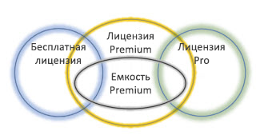
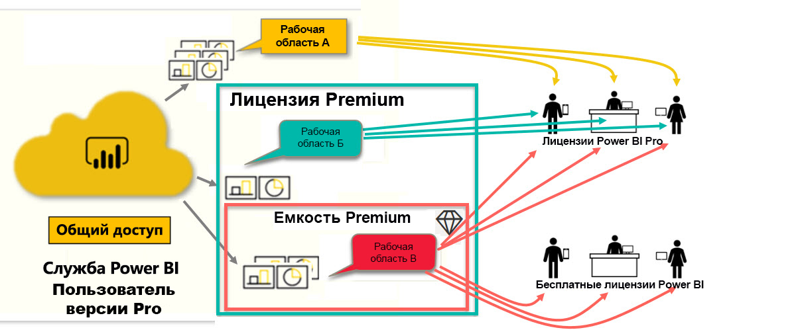

# Типы лицензий Power BI
В качестве *потребителя* вы используете службу Power BI для просмотра отчетов и панелей мониторинга, чтобы принимать деловые решения. Если вы работаете в Power BI в течение некоторого времени или общаетесь с коллегами-*с конструкторами*, то вы, вероятно, узнали, что есть функции, которые работают только при наличии лицензии определенного типа. 

В этой статье объясняются различия между типами лицензий и их сочетания: бесплатная, Pro, Premium и емкость Premium. Вы также узнаете, как определить, какие сочетания лицензий используются у вас.  

Начнем с рассмотрения двух категорий лицензий — пользовательских лицензий и лицензий организации. Нашей отправной точкой будут возможности по умолчанию, предоставляемые лицензиями. Затем мы рассмотрим, как администратор Power BI и владельцы содержимого могут использовать роли и разрешения для изменения возможностей лицензии по умолчанию. 

Например, даже если лицензия разрешает определенные действия, администратор может ограничить ее возможности, такие как экспорт данных, использование запросов на естественном языке в виде вопросов и ответов или публикация в Интернете. А когда *конструктор* отчетов назначает содержимое рабочей области, он может назначить вам роль рабочей области. Роли определяют, что вы можете и не можете делать в этой рабочей области. *Конструктор* может дополнительно настроить ограничения вашей лицензии с помощью параметров разрешений. Иными словами… это сложно. Надеюсь, эта статья разъяснит все сложности или по крайней мере большую их часть.

## Пользовательские лицензии
Первый тип лицензии — это **пользовательская** лицензия. Каждый пользователь службы Power BI имеет бесплатную лицензию или лицензию Pro. Определенные возможности доступны только пользователям с лицензиями Pro.  

- **Лицензия Power BI Pro** позволяет пользователю работать совместно с другими пользователями Pro путем создания и совместного использования содержимого. Только пользователи с лицензией Pro могут публиковать отчеты, подписываться на панели мониторинга и отчеты, а также сотрудничать с коллегами в рабочих областях. 

    

    Power BI Pro — это отдельная лицензия пользователя, которая позволяет пользователям читать отчеты и панели мониторинга, опубликованные в службе Power BI, и взаимодействовать с ними. Пользователи с этим типом лицензии могут обмениваться содержимым и совместно работать с другими пользователями Power BI Pro. Пользователи Power BI Pro могут публиковать содержимое совместно с другими пользователями или использовать содержимое, созданное другими. Исключением является содержимое, размещенное в [емкости Power BI Premium](#understanding-premium-and-premium-capacity). Лицензии Pro обычно используются *конструкторами* отчетов и разработчиками. Дополнительные сведения см. в разделе [Емкость Power BI Premium](#understanding-premium-and-premium-capacity) ниже.

- **Изолированная бесплатная лицензия Power BI**, несмотря на широкий спектр возможностей, все же предназначена для тех пользователей, которые только приступили к работе с Power BI, или пользователей, создающих содержимое самостоятельно. [Регистрация отдельного пользователя в службе Power BI](../service-self-service-signup-for-power-bi.md) Бесплатная изолированная лицензия не связана с лицензией организации. 

    Бесплатная изолированная пользовательская лицензия идеально подходит для тех, кто использует примеры Майкрософт для изучения Power BI. Пользователи с бесплатными изолированными лицензиями не могут просматривать содержимое, опубликованное другими пользователями, или публиковать собственное содержимое для других пользователей Power BI. 

    

Пока все понятно?  ОК. Давайте добавим еще один слой — **емкость Premium**.

## Основные сведения о лицензиях Premium и емкости Premium
Premium представляет собой лицензию **организации**. Воспринимайте ее как дополнительный уровень функциональности поверх всех **пользовательских** лицензий Power BI в организации. 

Когда организация приобретает лицензию Premium, администратор обычно назначает лицензии Pro сотрудникам, которые будут создавать и публиковать содержимое. Затем администратор назначает бесплатные лицензии всем, кто будет использовать это содержимое. Пользователи Pro создают [рабочие области](end-user-workspaces.md) и добавляют в них содержимое (панели мониторинга, отчеты, приложения). Чтобы разрешить другим пользователям совместно работать в этих рабочих областях, пользователи Pro используют сочетание *емкости*, разрешений и ролей. 

Когда организация приобретает лицензию Premium, она получает в службе Power BI зарезервированную емкость. Она не является общей. Емкость поддерживается отдельным оборудованием и полностью управляется корпорацией Майкрософт. Организации могут использовать общую выделенную емкость или распределять ее по конкретным рабочим областям. Рабочая область в емкости Premium — это место, где пользователи Pro могут совместно использовать ресурсы и работать с бесплатными пользователями, которым для этого не требуются учетные записи Pro.  

В емкости Premium лицензии Pro по-прежнему требуются для конструкторов содержимого. Они подключаются к источникам данных, данным модели и создают отчеты и панели мониторинга, которые упаковываются в виде приложений рабочей области. Пользователи без лицензии Pro могут получить доступ к рабочей области в Power BI Premium, если это содержимое находится в *емкости Premium* и владелец рабочей области предоставил им разрешения.

На приведенной ниже схеме слева представлены пользователи Pro, которые создают и совместно используют содержимое в рабочих областях.  
- **Рабочая область A** была создана в организации без лицензии Premium. 

- **Рабочая область B** была создана в организации, у которой есть лицензия Premium, но эта рабочая область не была сохранена в емкости Premium. У этой рабочей области нет значка бриллианта.

- **Рабочая область C** была создана в организации, у которой нет лицензии Premium, но эта рабочая область была сохранена в емкости Premium. У этой рабочей области есть значок бриллианта.  

*Конструктор* Power BI Pro может совместно использовать ресурсы и работать с другими пользователями Pro с помощью любой из трех рабочих областей. При условии, что он публикует рабочую область для всей организации или назначает роли рабочей области пользователям Pro. 

*Конструктор* Power BI Pro может совместно использовать ресурсы и работать с бесплатными пользователями только в рабочей области C. Рабочая область должна быть сохранена в емкости Premium, чтобы бесплатные пользователи могли получить доступ к этой рабочей области. В рабочей области конструктор назначает роли участникам совместной работы: *Администратор*, *Участник*, *Автор* или *Зритель*. Роль определяет действия, которые можно выполнять в рабочей области. *Потребителям* Power BI, как правило, назначается роль *Зритель*. Узнайте больше о [рабочих областях для потребителей Power BI](end-user-workspaces.md).

## Как узнать, какие у вас есть лицензии
Существует несколько способов поиска сведений о лицензиях Power BI. 

Сначала определите, какая **пользовательская лицензия** у вас есть.

- Некоторые версии Microsoft Office включают лицензию Power BI Pro.  Чтобы узнать, включает ли ваша версия Office службу Power BI, перейдите на [портал Office](https://portal.office.com/account) и выберите **Подписки**.

    Первый пользователь (Прадтанна) располагает версией Office 365 E5, которая включает в себя лицензию на Power BI Pro.

    

    У второго пользователя (Залан) есть бесплатная лицензия Power BI. 

    

Затем проверьте, имеет ли ваша учетная запись лицензию Premium. Оба пользователя выше, Pro и бесплатный, могут принадлежать к организации с лицензией Premium.  Давайте проверим второго (это Залан).  

- В службе Power BI выберите **Моя рабочая область** и затем щелкните значок шестеренки в правом верхнем углу. Выберите **Управление личным хранилищем**.

    

    **Пользовательские** лицензии, как Pro, так и бесплатные, предоставляют 10 ГБ хранилища в облаке, которые можно использовать для размещения отчетов Power BI или книг Excel. Если у вас указано более 10 ГБ, вы являетесь членом учетной записи организации с лицензией Premium.

    

    Помните, что на странице портала Office в подписке второго пользователя (Залан) была указана бесплатная версия Power BI. Но так как ваша организация приобрела лицензию Premium в службе Power BI, Залан получает не 10 ГБ, а 100 ГБ хранилища. Так как Залан — *потребитель* в организации с лицензией Premium, если *конструктор* размещает рабочую область в емкости Premium, Залан имеет возможность просматривать общее содержимое, совместно работать с коллегами, использовать приложения и многое другое. Спектр его разрешений задает администратор Power BI и конструктор содержимого. Обратите внимание, что пользователь Pro уже предоставил доступ к рабочей области Залану. Значок бриллианта позволяет понять, что эта рабочая область хранится в емкости Premium. 

   
## Основные сведения о ролях рабочей области
Мы уже рассмотрели пользовательские лицензии, лицензии Premium и емкость Premium. Теперь перейдем к *ролям* рабочей области.

Так как это статья для *потребителей* Power BI, мы рассмотрим следующий сценарий.

-  Вы являетесь *бесплатным* пользователем в организации с лицензией Power BI Premium. 
- Пользователь Power BI Pro создал коллекцию панелей мониторинга и отчетов и опубликовал ее как *приложение* для всей организации.  
- Приложение доступно в *рабочих областях*, размещенных в емкости Premium.    
- Рабочая область приложения содержит одну панель мониторинга и два отчета.
- Пользователь Pro назначил нам роль **Зритель**.

### Роль "Зритель"
Роли позволяют конструкторам *Power BI* управлять разрешениями в рабочих областях для удобной совместной работы различных команд. Одной из этих ролей является **Зритель**. 

Если рабочая область находится в емкости Premium Power BI, пользователи с ролью зрителя могут получить доступ к области, даже если у них нет лицензии Power BI Pro. Но так как роль "Зритель" не дает доступ к базовым данным и не позволяет их экспортировать, это надежный способ взаимодействия с панелями мониторинга, отчетами и приложениями.

> [!TIP]
> Чтобы узнать больше о других ролях ("Администратор", "Участник" и "Автор"), ознакомьтесь с [созданием рабочей области](../service-new-workspaces.md).

