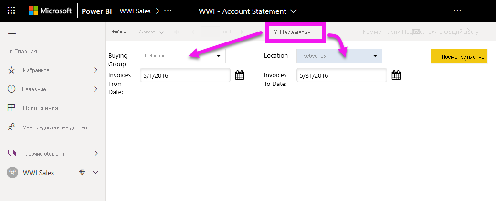
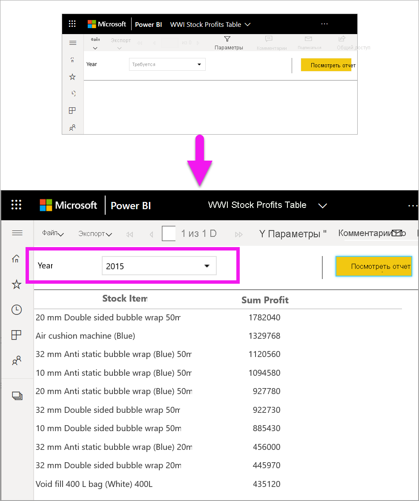
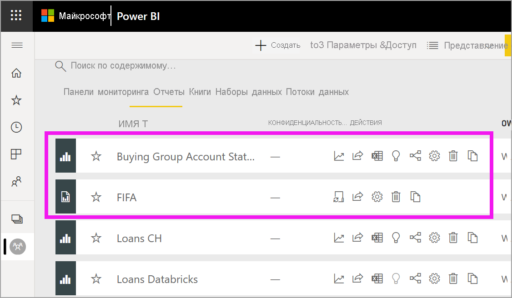
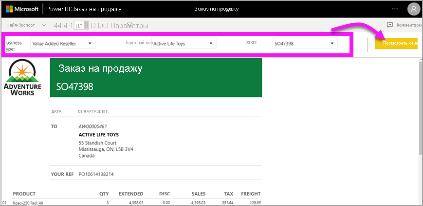
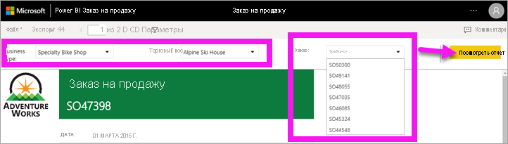
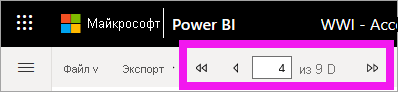
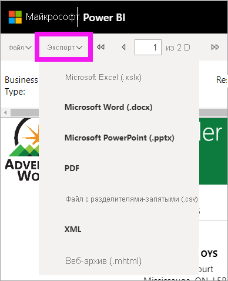
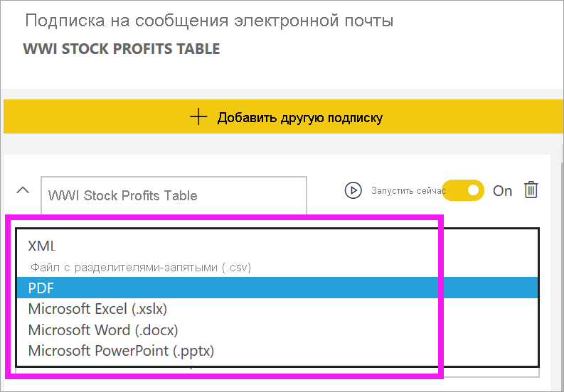

# Отчеты с разбивкой на страницы в службе Power BI

[!INCLUDE[consumer-appliesto-yyny](../includes/consumer-appliesto-yyny.md)]

Вы уже ознакомились с [отчетами Power BI](end-user-reports.md). Именно такие отчеты вам будут встречаться чаще всего. Однако есть и другой тип отчетов, который называется *отчеты с разбивкой на страницы*. *Разработчики* отчетов могут предоставлять вам доступ к отчетам с разбивкой на страницы в рабочей области емкости Premium или в приложении из такой рабочей области. 

## Что такое отчет с разбивкой на страницы

Под термином *с разбивкой на страницы* подразумевается то, что формат отчетов подбирается с учетом отображения на печатаемых страницах. Одним из преимуществ является то, что все данные отчета отображаются в таблице, даже если для этого потребуется много страниц. Иногда в качестве названия для отчетов с разбивкой на страницы употребляют описательное выражение "с точностью до пикселя". Оно означает, что *разработчики* могут точно настраивать макет отчета.

При создании отчета с разбивкой на страницы его *разработчик*, по сути, создает *определение отчета*. Оно не содержит никаких данных. В нем лишь указано, где получить нужные данные, какие данные следует отобразить и как именно. Когда вы запускаете отчет, обработчик отчетов анализирует определение отчета, извлекает нужные данные и объединяет их с макетом отчета, чтобы получить отображение отчета. Иногда в отчете отображаются данные по умолчанию. В других случаях необходимо ввести параметры, чтобы данные могли отобразиться в отчете. 

   

Как правило, взаимодействие заключается именно в этом — в настройке параметров. Если вы занимаетесь анализом счетов, то можете использовать отчеты с разбивкой на страницы для создания или печати счетов. Если вы менеджер по продажам, то можете использовать отчеты с разбивкой на страницы для просмотра заказов по магазинам или продавцам. 

Этот простой отчет с разбивкой на страницы показывает прибыль по годам после выбора параметра **Год**. 

По сравнению с отчетами с разбивкой на страницы отчеты Power BI являются гораздо более интерактивными. Отчеты Power BI поддерживают автоматизацию и гораздо больше типов визуальных элементов, в том числе визуальные элементы Power BI.

## Определение отчета с разбивкой на страницы

В списках содержимого и на начальной странице отчеты с разбивкой на страницы можно определить по значку .  Доступ к отчету с разбивкой на страницы может быть предоставлен вам напрямую или в составе [приложения Power BI](end-user-apps.md). Если *разработчик* отчета дал вам соответствующие разрешения, вы можете предоставить доступ к отчету с разбивкой на страницы другим пользователям, подписаться на него или подписать других пользователей.

## Взаимодействие с отчетом с разбивкой на страницы

Взаимодействие с отчетом с разбивкой на страницы происходит не так, как с другими отчетами. Вы можете выполнять такие действия, как печать, создание закладки, экспорт и комментирование, но интерактивных возможностей меньше. Для заполнения холста отчета с разбивкой на страницы часто требуются входные данные.  В других случаях в отчете отображаются данные по умолчанию, а чтобы увидеть другие данные, вы можете ввести параметры.

### Печать отчета с разбивкой на страницы

Формат отчетов *с разбивкой на страницы* подбирается с учетом особенностей страницы, предназначенной для печати. В напечатанном виде отчет будет выглядеть точно так же, как он представлен в браузере. Если отчет содержит длинную таблицу, она будет напечатана полностью, даже если потребуется несколько страниц. 

Отчеты с разбивкой на страницы могут распространяться на большое число страниц. Например, этот отчет содержит 563 страницы. Для каждой страницы соблюдается точное форматирование: на каждой странице размещен строго один счет и повторяются стандартные колонтитулы. При печати этого отчета между счетами будут разрывы страниц.

   

### Навигация по отчету с разбивкой на страницы

В этом отчете о заказах на продажу есть три параметра: тип деятельности, торговый посредник и номер заказа. 

Чтобы изменить отображаемую информацию, введите новые значения для параметров и нажмите кнопку **Просмотреть отчет**. В этом случае мы выбрали значения **Specialty bike shop**, **Alpine Ski House** и номер заказа **SO46085**. После нажатия кнопки **Просмотреть отчет** на холсте отчета появляются сведения об этом новом заказе на продажу.

Отобразится новый заказ на продажу в соответствии с выбранными параметрами. 

Некоторые отчеты с разбивкой на страницы имеют много страниц.  Для перемещения по отчету используйте элементы управления страницами. 

### Экспорт отчета с разбивкой на страницы
Экспортировать отчеты с разбивкой на страницы можно в разные форматы, включая PDF, Word, XML, PowerPoint, Excel и другие. При экспорте форматирование по возможности сохраняется. Например, в отчетах с разбивкой на страницы, экспортируемых в Excel, Word, PowerPoint, MHTML и PDF, форматирование сохраняется "с точностью до пикселя". 

### Подписка на отчет с разбивкой на страницы
Когда вы подписываетесь на отчет с разбивкой на страницы, Power BI отправляет вам сообщение электронной почты с отчетом во вложении. При настройке подписки можно указать частоту получения сообщений электронной почты: ежедневно, еженедельно, ежемесячно или каждый час. Подписка содержит вложение со всеми выходными данными отчета размером до 25 МБ. Экспортируйте весь отчет или заранее выберите параметры. Вы можете выбрать один из множества типов вложений, включая Excel, PDF, PowerPoint и другие.  

## Рекомендации и устранение неполадок

- Отчет с разбивкой на страницы может быть пустым, пока вы не выберете параметры и не нажмете кнопку **Просмотреть отчет**.

- Если у вас нет отчетов с разбивкой на страницы, возможно, никто еще не предоставил вам доступ к таким отчетам. Причина также может быть в том, что системный администратор не включил отчеты с разбивкой на страницы для вас. 

 

## Дальнейшие действия
- [Отчеты Power BI](end-user-reports.md)
- Появились дополнительные вопросы? Ответы на них см. в [сообществе Power BI](https://community.powerbi.com/).

