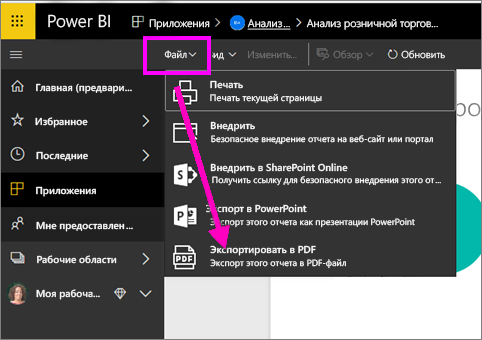
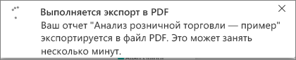
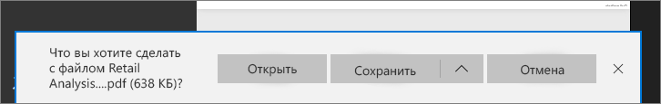

# Экспорт отчетов из Power BI в формат PDF
В Power BI можно опубликовать отчет в формате PDF и без труда создать на его основе документ. При **экспорте в формат PDF** каждая страница отчета Power BI становится в документе PDF отдельной страницей.

## Экспорт отчета из Power BI в формат PDF
В службе Power BI выберите отчет, чтобы он отобразился на холсте. Можно также выбрать отчет на главной странице, в разделе "Приложения" или в любом другом разделе в области навигации слева.

1. В строке меню выберите **Файл** > **Экспорт в PDF**.

    

    Откроется всплывающее окно, где можно выбрать **Текущее представление** или **Представление по умолчанию**.  **Текущее представление** позволяет экспортировать отчет в текущем состоянии с активными изменениями значений среза и фильтра.  Такой вариант выбирает большинство пользователей.  С другой стороны, **Представление по умолчанию** позволяет экспортировать отчет в исходном состоянии (как его опубликовал автор), не отражая внесенных вами изменений.
    
    Кроме того, существует флажок для экспорта скрытых вкладок отчета.  Установите его, чтобы экспортировать только те вкладки отчета, которые вы видите в браузере.  Чтобы включить в экспорт все скрытые вкладки, вы можете не устанавливать этот флажок.  Если флажок отображается серым цветом, значит, в отчете нет скрытых вкладок.  Сделав свой выбор, нажмите кнопку "Экспорт", чтобы продолжить.
    
    В правом верхнем углу появится индикатор выполнения. Экспорт может занять несколько минут. Пока он выполняется, вы можете продолжать работать в Power BI.

    

    Когда экспорт завершится, баннер уведомления изменится, сообщая, что служба Power BI завершила экспортирование.

2. После этого ваш файл станет доступным для скачивания в браузере. На рисунке ниже показано сообщение в нижней части браузера, предлагающее скачать файл.

    

Вот, собственно, и все. Вы можете скачать файл и открыть его в любом средстве просмотра PDF-файлов, в том числе имеющемся в Microsoft Edge.

## Рекомендации и ограничения
При работе с функцией **Экспорт в PDF** следует учитывать ряд рекомендаций и ограничений.

* **Визуальные элементы R** пока не поддерживаются. В файле PDF эти элементы будут пустыми, и будет выведено сообщение об ошибке.  

* **Пользовательские визуальные элементы**, которые прошли **сертификацию**, поддерживаются. Дополнительные сведения о сертифицированных пользовательских визуальных элементах, включая способы получения сертификации, см. в статье [Получение сертификации для пользовательского визуального элемента](../power-bi-custom-visuals-certified.md). Пользовательские визуальные элементы, которые не прошли сертификацию, не поддерживаются. В файле PDF вместо них будет выведено сообщение об ошибке.   

* Экспорт отчетов, в которых больше 30 страниц, пока не поддерживается.

* Процесс экспорта отчета в формат PDF может занять несколько минут, поэтому наберитесь терпения. На продолжительность экспорта могут влиять такие факторы, как структура отчета и текущая нагрузка на службу Power BI.

* Если в службе Power BI в меню нет пункта **Экспорт в PDF**, вероятно, эта функция отключена администратором клиента. Обратитесь к администратору клиента за подробными сведениями.

* Фоновые изображения будут обрезаны по ограничивающей области диаграммы. Настоятельно рекомендуем удалить фоновые рисунки перед экспортом в PDF.

* Отчеты, принадлежащие пользователям вне домена клиента Power BI (например, отчет, принадлежащий пользователю не из вашей организации, к которому он предоставил вам доступ), нельзя опубликовать в PDF.

* Если вы совместно используете панель мониторинга с кем-либо не из вашей организации (то есть этот пользователь находится вне клиента Power BI), этот пользователь не сможет экспортировать отчеты, связанные с общей панелью мониторинга, в формат PDF. Например, если вы aaron@contoso.com, вы сможете предоставить общий доступ cassie@cohowinery.com. Однако cassie@cohowinery.com не может экспортировать связанные отчеты в PDF.

* Если отчет содержит фоновое изображение страницы, для которого применен параметр "Подобрать размер", в экспортированном отчете в формат PDF появится искаженное изображение.  Чтобы получить оптимальный результат и избежать таких проблем с документом, мы рекомендуем использовать параметр "Нормальный" или "Заполнить".

* Служба Power BI использует параметр языка Power BI в качестве языка для экспорта в формат PDF. Чтобы просмотреть или настроить параметры языка, щелкните значок шестеренки и выберите **Параметры** > **Общие** > **Язык**.

## Дальнейшие действия
[Печать отчета](end-user-print.md)
