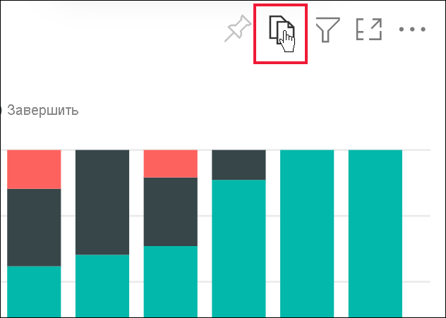
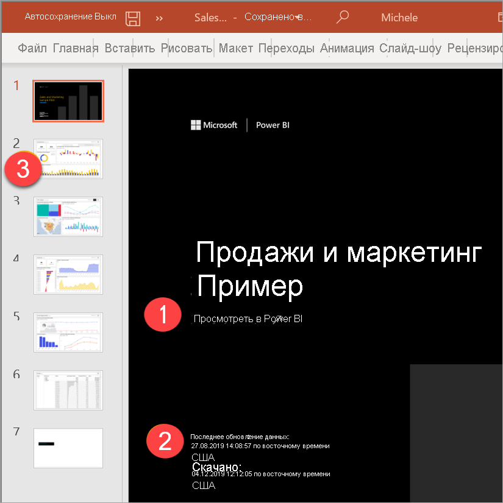

# Экспорт отчетов в PowerPoint

[!INCLUDE[consumer-appliesto-yynn](../includes/consumer-appliesto-yynn.md)]

С помощью службы Power BI (app.powerbi.com) можно опубликовать отчет в Microsoft PowerPoint и без труда создать на его основе набор слайдов. При экспорте в PowerPoint происходит следующее.

* Каждая страница отчета Power BI становится в PowerPoint отдельным слайдом.
* Каждая страница в отчете Power BI экспортируется как одно изображение с высоким разрешением в PowerPoint.
* Параметры фильтров и срезов, добавленных в отчет, можно сохранять.
* В PowerPoint создается ссылка на отчет Power BI.

Экспортировать **отчет Power BI** в программу **PowerPoint** недолго. Для этого нужно выполнить действия, описанные в следующем разделе.

Вы можете также скопировать один визуальный элемент за раз из службы Power BI и вставить его в PowerPoint (или любую другую программу, которая поддерживает эту вставку). Щелкните значок **Копировать как изображение**, чтобы скопировать визуальный элемент в буфер обмена. Затем откройте PowerPoint и вставьте визуальный элемент. Дополнительные сведения см. в статье [Копирование и вставка визуализации отчета](../visuals/power-bi-visualization-copy-paste.md).

## Экспорт отчета из службы Power BI в программу PowerPoint
В **службе Power BI** выберите отчет, чтобы он отобразился на холсте. Можно также выбрать отчет на **главной** странице, в разделе **Приложения** или в любом другом контейнере в области навигации.

[!INCLUDE [power-bi-service-new-look-include](../includes/power-bi-service-new-look-include.md)]

Когда отчет, который необходимо экспортировать в PowerPoint, отобразится на холсте, в строке меню выберите **Файл** > **Экспорт в PowerPoint**.

Откроется всплывающее окно, где можно выбрать **Текущие значения** или **Значения по умолчанию**. Вариант **Текущие значения** позволяет экспортировать отчет в текущем состоянии с активными изменениями значений среза и фильтра.  Такой вариант выбирает большинство пользователей. При прокрутке **текущее значение** не включает в себя состояние прокрутки визуальных элементов, а экспортирует верхнюю часть данных. С другой стороны, вариант **Значения по умолчанию** позволяет экспортировать отчет в исходном состоянии (как его опубликовал *разработчик*), не отражая внесенных вами изменений.

 
Кроме того, существует флажок для экспорта скрытых вкладок отчета. Установите его, чтобы экспортировать только те вкладки отчета, которые вы видите в браузере. Чтобы включить в экспорт все скрытые вкладки, снимите этот флажок. Если флажок недоступен, значит, в отчете нет скрытых вкладок. Примером скрытой вкладки может служить вкладка подсказки. [Пользовательские подсказки](../create-reports/desktop-tooltips.md) создаются *разработчиками* отчетов и не отображаются как вкладки отчета в службе Power BI для *пользователей*. 

Сделав свой выбор, нажмите кнопку **Экспорт**, чтобы продолжить. В окне браузера в правом верхнем углу службы Power BI появится баннер с уведомлением о том, что отчет экспортируется в PowerPoint. 

Это может занять несколько минут. На продолжительность экспорта могут влиять такие факторы, как структура отчета и текущая нагрузка на службу Power BI. Пока выполняется экспорт, вы можете продолжать работать в Power BI.

Когда процесс завершится, баннер уведомления изменится, сообщая, что служба Power BI завершила экспортирование. После этого ваш файл станет доступным для скачивания в браузере. На рисунке ниже показано сообщение в нижней части браузера, предлагающее скачать файл.

Вот, собственно, и все. Скачав файл и открыв его в PowerPoint, вы можете изменять его так же, как любую другую презентацию PowerPoint.

## Откройте файл PowerPoint
Открыв в PowerPoint файл, экспортированный из службы Power BI, вы увидите несколько интересных моментов. Взгляните на рисунок ниже, а затем прочтите описание некоторых полезных функций. Страницы в PowerPoint всегда создаются в стандартном размере 16:9 независимо от размеров или параметров исходной страницы в отчете Power BI.

1. На первой странице набора слайдов указано название отчета и приведена ссылка **Просмотреть в Power BI**, с помощью которой можно просмотреть соответствующий отчет в службе Power BI.
2. Вы также получаете полезные сведения об отчете. **Последнее обновление данных** показывает дату и время, на которых основан экспортируемый отчет. **Скачано** показывает дату и время экспорта отчета Power BI в файл PowerPoint. Время, указанное в пункте **Downloaded at** (Загружено в) устанавливается в соответствии с часовым поясом вашего компьютера на момент экспорта.

3. Каждая страница отчета представлена отдельным слайдом, как показано в области навигации слева. 
4. Опубликованный отчет отображается на языке, заданном в параметрах Power BI или в браузере. Чтобы просмотреть или настроить параметры языка, щелкните  > **Параметры** > **Общие** > **Язык**. Дополнительные сведения о языковых стандартах см. в статье [Поддерживаемые языки и страны (регионы) для Power BI](../fundamentals/supported-languages-countries-regions.md).

Если просмотреть отдельный слайд, вы увидите, что каждая страница отчета является отдельным изображением. Прокрутка в PowerPoint недоступна, так как каждый слайд представляет собой статистическое изображение.

Получившийся набор слайдов PowerPoint и все изображения из него можно использовать в различных целях. Выбор за вами.

## Рекомендации и устранение неполадок
При работе с функцией **Экспорт в PowerPoint** следует учитывать несколько рекомендаций и ограничений.
 

* Если команда **Экспорт** отсутствует, убедитесь в том, что вы включили новый интерфейс и просматриваете отчет, а не панель мониторинга.

    

* При выборе варианта **Текущие значения** для экспорта [фильтры URL-адресов](../collaborate-share/service-url-filters.md) в настоящее время не учитываются.

* Если при экспорте в PowerPoint в отчете используется пользовательский шрифт, этот шрифт будет заменен шрифтом по умолчанию.

* Следующие типы визуальных элементов не поддерживаются и не будут экспортированы в PowerPoint:
   - [Пользовательские визуальные элементы, которые не прошли сертификацию](../developer/visuals/power-bi-custom-visuals-certified.md)), не поддерживаются. 
   - [Визуальный элемент ESRI](../visuals/power-bi-visualizations-arcgis.md) не поддерживается.
   - Визуальные элементы R и Python не поддерживаются.
   - Фоновые изображения будут обрезаны по ограничивающей области диаграммы. Рекомендуем удалить фоновые рисунки перед экспортом в PowerPoint.

* Некоторые отчеты невозможно экспортировать. К ним относятся:
    - Отчеты, принадлежащие пользователям вне домена клиента Power BI (например, отчет, принадлежащий пользователю не из вашей организации, к которому он предоставил вам доступ).
    - Если вы совместно используете панель мониторинга с кем-либо не из вашей организации (то есть этот пользователь находится вне клиента Power BI), этот пользователь не сможет экспортировать отчеты, связанные с общей панелью мониторинга, в PowerPoint. Например, если вы aaron@contoso.com, вы сможете предоставить общий доступ david@cohowinery.com. Но david@cohowinery.com не может экспортировать связанные отчеты в PowerPoint.
    - Отчеты, содержащие более 50 страниц. Будут экспортированы только первые 50 страниц.
    - Отчеты, экспортируемые в более старые версии PowerPoint.
    - Отчеты, обработка которых занимает больше часа. 
    - Страницы отчета, загрузка которых занимает больше 6 минут. 

* Если в службе Power BI в меню нет пункта **Экспорт в PowerPoint**, вероятно, эта функция отключена администратором клиента. Обратитесь к администратору клиента за подробными сведениями.
* Служба Power BI использует параметр языка Power BI в качестве языка для экспорта в PowerPoint. Чтобы просмотреть или настроить параметры языка, щелкните  > **Параметры** > **Общие** > **Язык**.

## Дальнейшие действия
[Копирование визуальных элементов в виде статических изображений](../visuals/power-bi-visualization-copy-paste.md)    
[Печать отчета](end-user-print.md)
