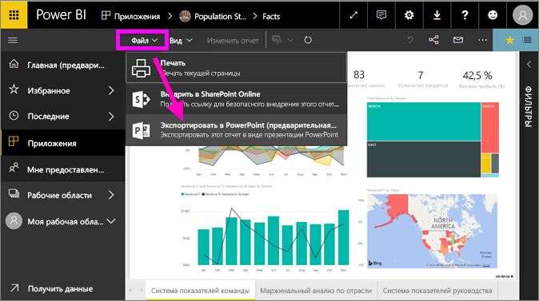
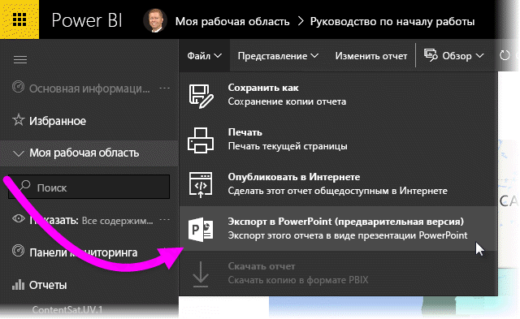
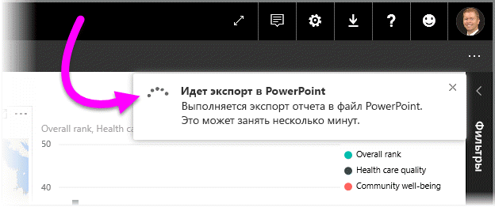
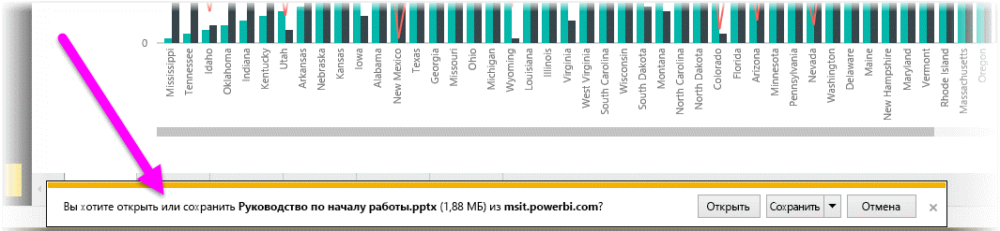
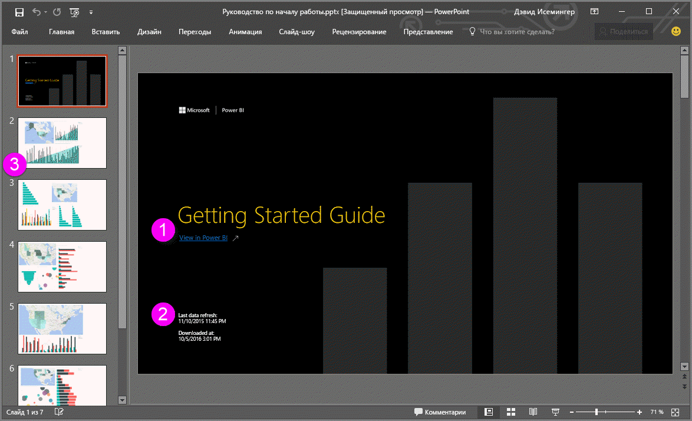
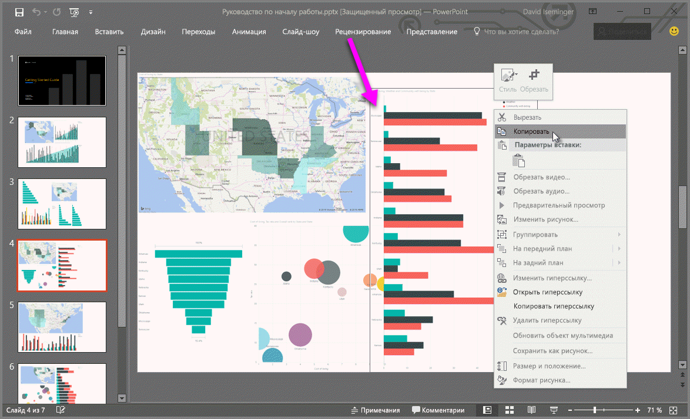

# Экспорт отчетов из Power BI в PowerPoint
В Power BI можно опубликовать отчет в **Microsoft PowerPoint** и без труда создать на его основе набор слайдов. При **экспорте в PowerPoint** происходит следующее:

* Каждая страница отчета Power BI становится в PowerPoint отдельным слайдом.
* Каждая страница в отчете Power BI экспортируется как одно изображение с высоким разрешением в PowerPoint.
<!-- * The filters and slicers settings that you added to the report are preserved. -->
* В PowerPoint создается ссылка на отчет Power BI. 

Экспортировать **отчет Power BI** в программу **PowerPoint** недолго. Для этого нужно выполнить действия, описанные в следующем разделе.

## Как экспортировать отчет из службы Power BI в программу PowerPoint
В службе Power BI выберите отчет, чтобы он отобразился на холсте. Можно также выбрать отчет на странице **Главная** в разделе **Приложения** или любом другом разделе в области навигации слева.

Когда отчет, который необходимо экспортировать в PowerPoint, отобразится на холсте, на панели меню в службе Power BI щелкните **Файл > Экспорт в PowerPoint**.

   
Откроется всплывающее окно, где можно выбрать **Текущее представление** или **Представление по умолчанию**.  **Текущее представление** позволяет экспортировать отчет в текущем состоянии с активными изменениями значений среза и фильтра.  Такой вариант выбирает большинство пользователей.  С другой стороны, **Представление по умолчанию** позволяет экспортировать отчет в исходном состоянии (как его опубликовал автор), не отражая внесенных вами изменений.
    
Кроме того, существует флажок для экспорта скрытых вкладок отчета.  Установите его, чтобы экспортировать только те вкладки отчета, которые вы видите в браузере.  Чтобы включить в экспорт все скрытые вкладки, вы можете не устанавливать этот флажок.  Если флажок отображается серым цветом, значит, в отчете нет скрытых вкладок.  Сделав свой выбор, щелкните **Экспорт**, чтобы продолжить.

В окне браузера в правом верхнем углу службы Power BI появится баннер с уведомлением о том, что отчет экспортируется в PowerPoint. Этот процесс может занять несколько минут. Пока выполняется экспорт, вы можете продолжать работать в Power BI.

Когда экспорт завершится, баннер уведомления изменится, сообщая, что служба Power BI завершила экспортирование.

После этого ваш файл станет доступным для скачивания в браузере. На рисунке ниже показано сообщение в нижней части браузера, предлагающее скачать файл.

Вот, собственно, и все. Скачав файл и открыв его в PowerPoint, вы можете изменять его точно так же, как любую другую презентацию PowerPoint.

## Просмотр экспортированного файла PowerPoint
Открыв в PowerPoint файл, экспортированный из службы Power BI, вы увидите несколько интересных моментов. Взгляните на рисунок ниже, а затем прочтите под ним описание некоторых полезных функций.

1. На первой странице набора слайдов указано название отчета и приведена ссылка **Просмотреть в Power BI**, с помощью которой можно просмотреть соответствующий отчет в службе Power BI.
2. Кроме того, здесь также приведены такие полезные сведения об отчете, как *время последнего обновления данных*, на которых основан экспортированный отчет, а также время и дата *скачивания*, то есть время и дата, когда отчет Power BI был экспортирован в файл PowerPoint.
3. Каждая страница отчета представлена отдельным слайдом, как показано в области навигации слева. 
4. Опубликованный отчет отображается на языке, заданном в параметрах Power BI или в браузере. Чтобы просмотреть или настроить параметры языка, выберите значок  **> "Параметры" > "Общие" > "Язык"**. Дополнительные сведения см. в статье [Поддерживаемые языки и страны (регионы) для Power BI](../supported-languages-countries-regions.md).
5. Презентация PowerPoint включает титульный слайд с экспортированными данными времени в надлежащем часовом поясе.

Если открыть отдельный слайд, вы увидите, что каждая страница отчета является отдельным изображением.

>[!NOTE]
> Один визуальный элемент для всех страниц отчета является нововведением. Предыдущая схема, когда для каждого визуального элемента требовалось отдельное изображение, больше не применяется. 
 

Получившийся набор слайдов PowerPoint и все изображения из него можно использовать в различных целях. Выбор за вами.

## Ограничения
При работе с функцией **Экспорт в PowerPoint** следует учитывать несколько рекомендаций и ограничений.

* **Визуальные элементы R** пока не поддерживаются. Такие визуальные элементы экспортируются в виде пустого изображения в PowerPoint с сообщением об ошибке: "Визуальный элемент не поддерживается".
* **Пользовательские визуальные элементы**, которые прошли **сертификацию**, поддерживаются. Дополнительные сведения о сертифицированных пользовательских визуальных элементах, включая способы получения сертификации, см. в статье [Получение сертификации для пользовательского визуального элемента](../power-bi-custom-visuals-certified.md). Пользовательские визуальные элементы, которые не прошли сертификацию, не поддерживаются. Они экспортируются в виде пустого изображения в PowerPoint с сообщением об ошибке: "Визуальный элемент не поддерживается".
* Экспорт отчетов, в которых больше 30 страниц, пока не поддерживается.
* Процесс экспорта отчета в PowerPoint может занять несколько минут, поэтому наберитесь терпения. На продолжительность экспорта могут влиять такие факторы, как структура отчета и текущая нагрузка на службу Power BI.
* Если в службе Power BI в меню нет пункта **Экспорт в PowerPoint**, вероятно, эта функция отключена администратором клиента. Обратитесь к администратору клиента за подробными сведениями.
* Фоновые изображения будут обрезаны по ограничивающей области диаграммы. Настоятельно рекомендуем удалить фоновые рисунки перед экспортом в PowerPoint.
* Страницы в PowerPoint всегда создаются в стандартном размере 16:9 независимо от размеров или параметров исходной страницы в отчете Power BI.
* Отчеты, принадлежащие пользователям вне домена клиента Power BI (например, отчет, принадлежащий пользователю не из вашей организации, к которому он предоставил вам доступ), нельзя опубликовать в PowerPoint.
* Если вы совместно используете панель мониторинга с кем-либо не из вашей организации (то есть этот пользователь находится вне клиента Power BI), этот пользователь не сможет экспортировать отчеты, связанные с общей панелью мониторинга, в PowerPoint. Например, если вы aaron@contoso.com, вы сможете предоставить общий доступ david@cohowinery.com. Но david@cohowinery.com не может экспортировать связанные отчеты в PowerPoint.
* Экспорт может не работать с более ранними версиями PowerPoint.
* Как упоминалось ранее, каждая страница отчета экспортируется в виде одного изображения в файл PowerPoint.
* Служба Power BI использует параметр языка Power BI в качестве языка для экспорта в PowerPoint. Чтобы просмотреть или настроить параметры языка, выберите значок  **> "Параметры" > "Общие" > "Язык"**.
* Время **загрузки** на слайде-обложке экспортированного файла PowerPoint совпадает с часовым поясом вашего компьютера во время экспорта.
* При выборе варианта "Текущие значения" для экспорта фильтры URL-адресов в настоящее время не учитываются.

## Дальнейшие действия
[Печать отчета](end-user-print.md)
