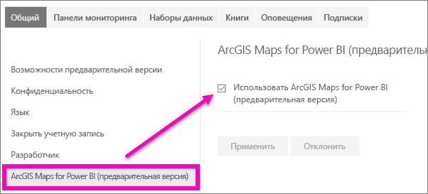

# Включить функции предварительной версии службы Power BI
## Что собой представляют *предварительные версии функций*?
Рамках улучшения в службе Power BI, мы выпускаем некоторые новые функции в виде *функции предварительной версии*. Чтобы опробовать предварительные версии функций, вы можете включать и отключать их.

## Поиск предварительных версий, их включение и отключение
1. Откройте меню "Параметры", щелкнув значок шестеренки в правом верхнем углу экрана Power BI и выбрав **параметры**.
   
   .
2. Откройте вкладку **Общие**. При наличии предварительной версии вы увидите параметр **Предварительные версии функций** или сами функции, перечисленные в левой части экрана.  В этом примере перечислены предварительные версии функций, доступные для ArcGIS Maps. 
   
   
3. Переместите переключатель в положение **Вкл.** или установите соответствующий флажок, чтобы ознакомиться с новыми возможностями. Затем нажмите кнопку **Применить**.
4. Чтобы отключить предварительные версии компонентов, выполните шаги 1 – 3 выше и на шаге 3 выберите **Off**, или снимите флажок и выберите **применить**.

Возникли вопросы или хотите оставить отзыв? [Посетите форум сообщества Power BI](http://community.powerbi.com/t5/Navigation-Preview-Forum/bd-p/NavigationPreview).

