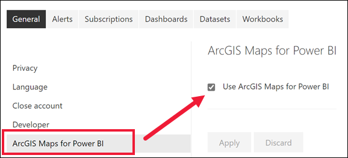

# Включение предварительных версий функций Power BI
## Что собой представляют *предварительные версии функций*?
В рамках улучшения службы Power BI мы выпускаем некоторые новые функции в виде *предварительных версий*. Чтобы опробовать предварительные версии функций, вы можете включать и отключать их.

> [!TIP]
> Предварительные версии функций также доступны для приложения Power BI Desktop. Дополнительные сведения см. на [форуме сообщества Power BI Desktop](https://community.powerbi.com/t5/Desktop/bd-p/power-bi-designer).
> 
> 

## Поиск предварительных версий, их включение и отключение
1. Откройте меню "Параметры", щелкнув значок шестеренки в правом верхнем углу окна Power BI и выбрав пункт **Параметры**.
   
   .
2. Откройте вкладку **Общие**. При наличии предварительной версии вы увидите параметр **Предварительные версии функций** или сами функции, перечисленные в левой части экрана.  В этом примере перечислены предварительные версии функций, доступные для ArcGIS Maps. 
   
   
3. Переместите переключатель в положение **Вкл.** или установите соответствующий флажок, чтобы ознакомиться с новыми возможностями. Затем нажмите кнопку **Применить**.
4. Чтобы отключить предварительные версии функций, выполните шаги 1–3 выше, на шаге 3 выберите **Выкл.** или снимите флажок и щелкните **Применить**.

Возникли вопросы или хотите оставить отзыв? [Посетите форум сообщества Power BI](http://community.powerbi.com/t5/Navigation-Preview-Forum/bd-p/NavigationPreview).

