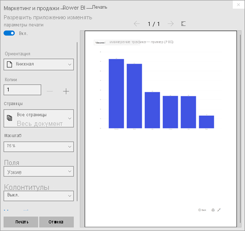

# Печать из службы Power BI

[!INCLUDE[consumer-appliesto-yynn](../includes/consumer-appliesto-yynn.md)]
## Что можно печатать
[!INCLUDE [power-bi-service-new-look-include](../includes/power-bi-service-new-look-include.md)]

Печать всей панели мониторинга, плитки на панели мониторинга, страницы отчета или визуального элемента отчета из службы Power BI. Если в отчете несколько страниц, их необходимо печатать по отдельности. 

## Рекомендации по печати

Большинство панелей мониторинга и отчетов Power BI создаются *разработчиками* отчетов для использования как в Интернете, так и на различных устройствах, где они должны выглядеть одинаково привлекательно. То, как содержимое отчета будет выглядеть на бумаге после печати, определяется браузером. 

В браузерах есть ряд параметров для настройки печати, но даже их может быть недостаточно для получения нужного результата. В этом случае можно сначала [экспортировать отчет в PDF](end-user-pdf.md), а затем напечатать PDF-файл. 

## Настройка параметров печати в браузере
При печати из Power BI в браузере открывается окно печати. Окна печати в разных браузерах могут отличаться. Однако все они предлагают сходные параметры для управления внешним видом отпечатанного документа. 

Ниже приведен ряд советов, которые помогут настроить форматирование при печати.

   > 
1. Если ширина панели мониторинга, отчета или визуального элемента больше высоты, рекомендуется использовать **альбомную ориентацию**. 

   

2. Чтобы уместить больше содержимого на листе, настройте такие элементы, как поля и масштаб. 

    

Поэкспериментируйте с параметрами, доступными в вашем браузере, пока не получите нужный результат. В некоторых браузерах есть даже параметры для печати фоновых изображений. 

## Печать панели мониторинга
1. Откройте панель мониторинга, которую хотите напечатать.
2. В левом верхнем углу щелкните "Экспорт" и выберите **Напечатать эту страницу**.
   
    

3. Откроется окно печати для браузера. Выберите параметры. Например, если ширина панели мониторинга больше высоты, может быть лучше изменить ориентацию на **альбомную**. Нажмите **Печать**.
   
    

## Печать плитки на панели мониторинга
1. Откройте панель мониторинга в [полноэкранном режиме](end-user-focus.md), щелкнув соответствующий значок  в верхней строке меню.

3. [Откройте плитку в режиме фокусировки](end-user-focus.md), наведя указатель на **Дополнительные параметры** (...) и выбрав команду **Открыть в режиме фокусировки** или значок фокусировки .
   
    

4. Наведите указатель мыши на плитку, чтобы открыть меню "Параметры".
   
    

4. Выберите значок "Печать". .     

5. Откроется окно печати для браузера. Выберите параметры. Например, если плитка не помещается на листе, можно изменить масштаб на 75 %. Нажмите **Печать**.

     

> [!TIP]
> Если вы выполнили все эти действия, но плитка по-прежнему выглядит не так, как нужно, попробуйте сделать следующее:
> 1. Откройте окно печати и внесите изменения в параметры печати, которые, по вашему мнению, дадут наилучший результат. Например, измените макет, поля и масштаб. 
> 2. Однако, вместо того чтобы начинать печать, нажмите кнопку **Отмена**. 
> 3. Выполните шаги 1–5 еще раз. Плитка изменится в соответствии с новыми параметрами в окне печати и станет готова к печати.

## Печать страницы отчета
Отчеты можно выводить на печать по одной странице за раз.

1. Чтобы напечатать текущую страницу отчета, откройте отчет и выберите **Файл** > **Печать**.
   
    
2. Откроется окно печати для браузера.

3. Выполните действия из раздела **Печать панели мониторинга** выше.
   

## Печать визуального элемента отчета
1. [Откройте визуальный элемент в режиме фокусировки](end-user-focus.md), наведя указатель на плитку и выбрав значок фокусировки  в правом верхнем углу.

2. В левом верхнем углу выберите **Экспорт** > **Печать**, чтобы распечатать визуальный элемент.

    

3. Выполните действия из раздела **Печать панели мониторинга** выше.

## Рекомендации и устранение неполадок

* Вопрос. Я не могу распечатать все страницы отчета за один раз.    
* Ответ. Так и должно быть. Страницы отчета можно выводить на печать только по одной.
* Вопрос. Я не могу распечатать отчет в PDF.    
* Ответ. Этот параметр отображается, только если в браузере настроен драйвер PDF.    
* Вопрос. То, что я вижу при выборе параметра **Печать**, не соответствует тому, что показано здесь.    
* Ответ. Экраны печати зависят от браузера и версии программного обеспечения.
* Вопрос. При печати выбран неправильный масштаб.  Панель мониторинга не уместилась на странице. Другие вопросы по масштабированию и ориентации.    
* Ответ. Мы не можем гарантировать, что печатные копии будут в точности соответствовать содержимому, отображаемому в службе Power BI. Power BI не позволяет управлять такими параметрами, как масштабирование, поля, сведения о визуальных элементах, ориентация и размер. Попробуйте настроить параметры печати в браузере. Некоторые из предложенных выше параметров — ориентация страницы (книжная или альбомная), размеры полей и масштаб. Если это не поможет, обратитесь к документации по вашему браузеру.      
* Вопрос. При попытке выполнить печать в полноэкранном режиме команда печати не отображается при наведении указателя мыши на визуальный элемент.   
* Ответ. Верните панель мониторинга или отчет в режим по умолчанию и повторно откройте визуальный элемент в режиме фокусировки, а затем в полноэкранном режиме. 

## Дальнейшие действия
[Предоставление общего доступа к панели мониторинга и отчетам коллегам и другим пользователям](../collaborate-share/service-share-dashboards.md)

Появились дополнительные вопросы? [Ответы на них см. в сообществе Power BI.](https://community.powerbi.com/)
