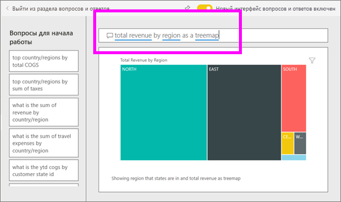
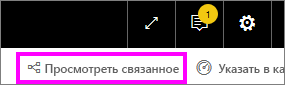
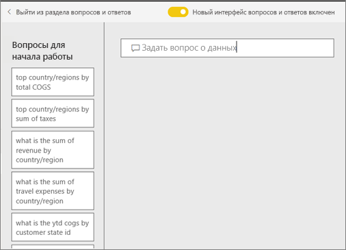

# Функция "Вопросы и ответы" для **потребителей** Power BI
## Что такое вопросы и ответы?
Иногда самый быстрый способ получить ответ по данным — задать вопрос, используя естественный язык. Например, «каков объем продаж за прошлый год».

Функцию "Вопросы и ответы" можно использовать для исследования данных с помощью интуитивно понятных возможностей, основанных на естественном языке, получая ответы в виде диаграмм и графиков. Компонент "Вопросы и ответы" отличается от подсистемы поиска: он выдает результаты только о данных в Power BI.

**Функция "Вопросы и ответы" в Power BI** доступна с лицензией Pro или Premium.  Особенности применения функций ["Вопросы ответы" в Power BI Mobile](mobile/mobile-apps-ios-qna.md) и ["Вопросы ответы" в Power BI Embedded](../developer/qanda.md) рассматриваются в отдельных статьях. В настоящее время функция **"Вопросы и ответы" в Power BI** поддерживает только ответы на вопросы, заданные на естественном языке (английском), хотя для испанского языка эта функция доступна в режиме предварительного доступа, который может быть включен вашим администратором Power BI.

Задать вопрос — это только начало.  Вы можете очень интересно провести время, уточняя данные или расширяя вопрос, обнаруживая новые надежные данные, фокусируясь на деталях и увеличивая поле зрения, чтобы получить более широкое представление. Вас наверняка порадует, какие полезные данные вы можете найти и какие открытия сделать.

Взаимодействие действительно интерактивное... и очень быстрое. Благодаря тому что функция основана на хранилище в памяти, ответ приходит почти мгновенно.

## Где можно использовать функцию "Вопросы и ответы"?
Вы найдете функцию "Вопросы и ответы" на панелях мониторинга в службе Power BI и в нижней части панели мониторинга в Power BI Mobile. Если разработчик не предоставил вам разрешений на редактирование, вы сможете только изучать здесь информацию, но не сможете сохранить визуализации, созданные с помощью функции "Вопросы и ответы".

## Использование функции "Вопросы и ответы" на панели мониторинга в службе Power BI
В службе Power BI (app.powerbi.com), панель мониторинга содержит закрепленные плитки, связанные с одним или несколькими наборами данных, по содержимому которых вы можете задавать вопросы. Чтобы увидеть, какие отчеты и наборы данных использовались для создания панели мониторинга, выберите **Просмотреть похожие** в строке меню.

## Как начать?
Во-первых, ознакомьтесь с содержимым. Взгляните на визуальные элементы на панели мониторинга и в отчете. Поймите тип и диапазон доступных вам данных. 

Например:

* Если подписи и значения оси визуализации содержат такие элементы, как "продажи", "учетная запись", "месяц" и "возможности", то можно уверенно задавать такие вопросы, как: "у какой *учетной записи* максимальные *возможности*" или "показать *продажи* по месяцам как линейчатую диаграмму".

* При наличии данных о производительности веб-сайта в Google Analytics можно задавать вопросы о времени, проведенном на веб-странице, количестве уникальных посещений страницы и уровне вовлечения пользователей. Или, если выполняется запрос демографических данных, можно задать вопросы о возрасте и доходе семьи по расположению.

Ознакомившись с данными, вернитесь к панели мониторинга и поместите курсор в поле вопроса. Откроется экран функции "Вопросы и ответы"

 

Еще до начала ввода компонент вопросов и ответов открывает новое окно с полезными предложениями. Вы видите фразы и вопросы, содержащие названия таблиц в базовых наборах данных, а так же Вы можете увидеть *подборку** вопросов, созданных владельцем набора данных.

Вы можете выбрать любой из них, чтобы добавить их в окно вопроса, а затем уточнить их, чтобы получить нужный ответ. 

Кроме того, функция помогает задавать вопросы с помощью подсказок, предложений и вариантов автозаполнения. 

 

### Какие визуализации использует компонент "Вопросы и ответы"?
Компонент "Вопросы и ответы" выбирает наиболее оптимальную визуализацию на основе отображаемых данных. Иногда данные в соответствующем наборе данных определяются как конкретный тип или категория, и это помогает функции "Вопросы и ответы" понять, как их следует отображать. Например, если данные определены как тип даты, скорее всего, они будут отображаться в виде графика. Данные, которые отнесены к категории "Города", скорее всего, будут отображаться как карта.

Кроме того, вы можете указать службе "Вопросы и ответы", какой визуальный элемент необходимо использовать, добавив его в свой вопрос. Однако помните, что функция "Вопросы и ответы" не всегда может отобразить данные в запрошенном вами типе визуализации. Функция "Вопросы и ответы" предложит список рабочих типов визуализаций.

## Рекомендации и устранение неполадок
**Вопрос.** Функция "Вопросы и ответы" не отображается на этой панели мониторинга.    
**Ответ 1.** Если вы не видите поле вопроса, сначала проверьте настройки. Для этого в правом верхнем углу панели инструментов Power BI щелкните значок шестеренки.   

Затем выберите **Параметры** > **Панели мониторинга**. Установите флажок **Show the Q&A search box on this dashboard** (Показать поле поиска "Вопросы и ответы" на этой панели мониторинга).    
  

**Ответ 2.** Иногда *разработчик* или администратор панели мониторинга отключает функцию "Вопросы и ответы". Обратитесь к нему, чтобы узнать, все ли в порядке, и снова включить функцию.   

**Вопрос.** При вводе вопроса не отображаются нужные результаты.    
**Ответ.** Обратитесь к *разработчику* панели мониторинга. Разработчик может выполнить ряд действий для улучшения результатов функции "Вопросы и ответы". Например, он может переименовать столбцы в наборе данных для использования терминов, которые легко распознаются (`CustomerFirstName` вместо `CustFN`). Так как разработчик действительно хорошо знает набор данных, он может добавить полезные вопросы в функцию "Вопросы и ответы".

## Дальнейшие действия
[Советы по функции "Вопросы и ответы" для потребителей Power BI](end-user-q-and-a.md)
