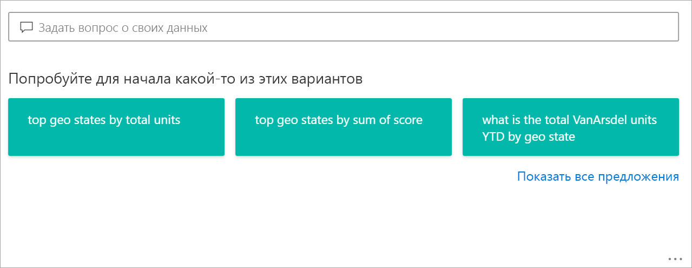
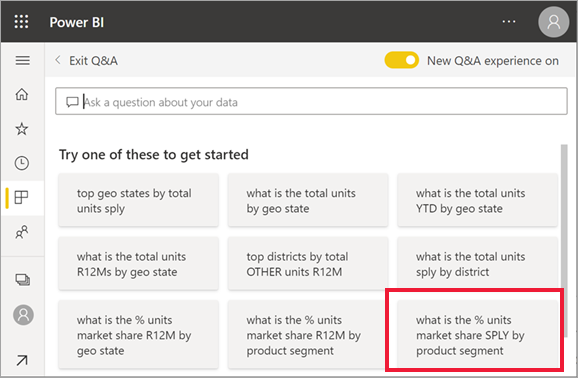
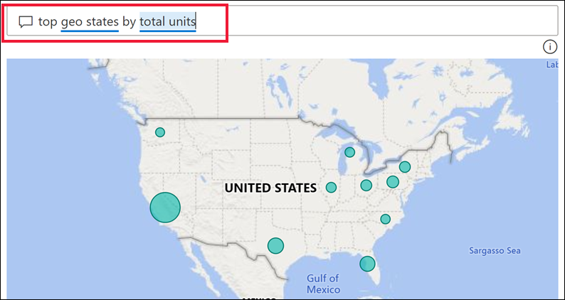
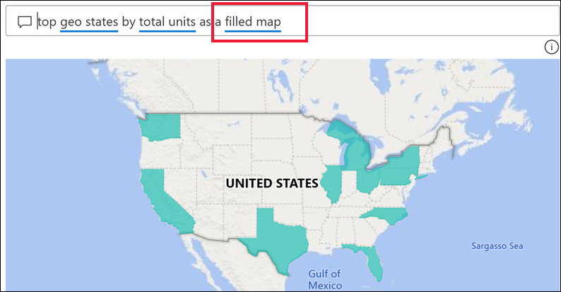
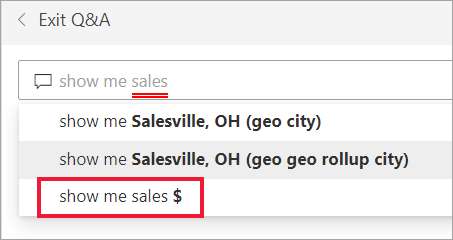
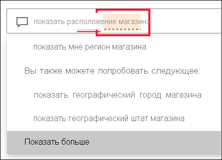
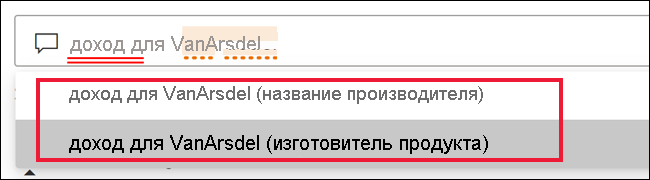
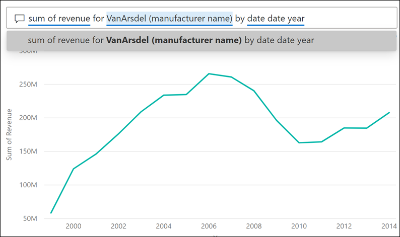
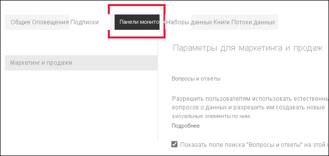
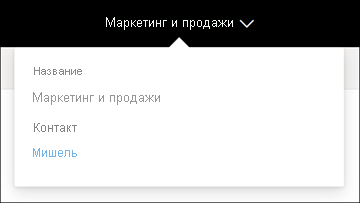

# Функция "Вопросы и ответы" для бизнес-пользователей Power BI

[!INCLUDE[consumer-appliesto-yyny](../includes/consumer-appliesto-yyny.md)]

[!INCLUDE [power-bi-service-new-look-include](../includes/power-bi-service-new-look-include.md)]

## Что такое вопросы и ответы?
Иногда самый быстрый способ получить ответ по данным — задать вопрос, используя естественный язык. Например, «каков объем продаж за прошлый год».

Функцию "Вопросы и ответы" можно использовать для исследования данных с помощью интуитивно понятных возможностей, основанных на естественном языке, получая ответы в виде диаграмм и графиков. Компонент "Вопросы и ответы" отличается от подсистемы поиска: он выдает результаты только о данных в Power BI.

## Какие визуализации использует компонент "Вопросы и ответы"?
Компонент "Вопросы и ответы" выбирает наиболее оптимальную визуализацию на основе отображаемых данных. Иногда данные в базовом наборе данных определяются как конкретный тип или категория, и это помогает функции "Вопросы и ответы" понять, как их следует отображать. Например, если данные определены как тип даты, скорее всего, они будут отображаться в виде графика. Данные, которые отнесены к категории "Города", скорее всего, будут отображаться как карта.

Кроме того, вы можете указать службе "Вопросы и ответы", какой визуальный элемент необходимо использовать, добавив его в свой вопрос. Однако помните, что функция "Вопросы и ответы" не всегда может отобразить данные в запрошенном вами типе визуализации. Функция "Вопросы и ответы" предложит список рабочих типов визуализаций.

## Где можно использовать функцию "Вопросы и ответы"?
Вы найдете функцию "Вопросы и ответы" на панелях мониторинга в службе Power BI и в нижней части панели мониторинга в Power BI Mobile. Если разработчик не предоставил вам разрешений на редактирование, вы сможете только изучать здесь информацию, но не сможете сохранить визуализации, созданные с помощью функции "Вопросы и ответы".

Кроме того, можно найти вопросы и ответы в отчетах, если автор *отчетов* добавил [соответствующий визуальный элемент](../visuals/power-bi-visualization-q-and-a.md).   

## Вопросы и ответы на панелях мониторинга

**Функция "Вопросы и ответы" в Power BI** доступна с лицензией Pro или Premium.  Особенности применения функций ["Вопросы ответы" в Power BI Mobile](mobile/mobile-apps-ios-qna.md) и ["Вопросы ответы" в Power BI Embedded](../developer/embedded/qanda.md) рассматриваются в отдельных статьях. В настоящее время функция **"Вопросы и ответы" в Power BI** поддерживает только ответы на вопросы, заданные на естественном языке (английском), хотя для испанского языка эта функция доступна в режиме предварительного доступа, который может быть включен вашим администратором Power BI.

Задать вопрос — это только начало.  Вы можете очень интересно провести время, уточняя данные или расширяя вопрос, обнаруживая новые надежные данные, фокусируясь на деталях и увеличивая поле зрения, чтобы получить более широкое представление. Вас наверняка порадует, какие полезные данные вы можете найти и какие открытия сделать.

Взаимодействие действительно интерактивное... и очень быстрое. Благодаря тому что функция основана на хранилище в памяти, ответ приходит почти мгновенно.

## Использование функции "Вопросы и ответы" на панели мониторинга в службе Power BI
В службе Power BI (app.powerbi.com), панель мониторинга содержит закрепленные плитки, связанные с одним или несколькими наборами данных, по содержимому которых вы можете задавать вопросы. Чтобы увидеть, какие отчеты и наборы данных использовались для создания панели мониторинга, в раскрывающемся списке **Дополнительные действия** выберите **See related content** (Просмотреть связанное содержимое).

## Как начать?
Во-первых, ознакомьтесь с содержимым. Взгляните на визуальные элементы на панели мониторинга и в отчете. Поймите тип и диапазон доступных вам данных. 

Например:

* Если подписи и значения оси визуализации содержат такие элементы, как "продажи", "учетная запись", "месяц" и "возможности", то можно уверенно задавать такие вопросы, как: "у какой *учетной записи* максимальные *возможности*" или "показать *продажи* по месяцам как линейчатую диаграмму".

* При наличии данных о производительности веб-сайта в Google Analytics можно задавать вопросы о времени, проведенном на веб-странице, количестве уникальных посещений страницы и уровне вовлечения пользователей. Или, если выполняется запрос демографических данных, можно задать вопросы о возрасте и доходе семьи по расположению.

Ознакомившись с данными, вернитесь к панели мониторинга и поместите курсор в поле вопроса. Откроется экран функции "Вопросы и ответы"

 

Еще до начала ввода компонент вопросов и ответов открывает новое окно с полезными предложениями. Вы видите фразы и вопросы, содержащие названия таблиц в базовых наборах данных, а так же Вы можете увидеть *подборку* вопросов, созданных владельцем набора данных.

Вы можете выбрать любой из них, чтобы добавить их в окно вопроса, а затем уточнить их, чтобы получить нужный ответ. 

 

Кроме того, Power BI помогает задавать вопросы с помощью таких возможностей, как подсказки, предложения и варианты автозаполнения. Power BI предоставляет эти возможности для функции "Вопросы и ответы" на панелях мониторинга, а также для визуального элемента "Вопросы и ответы". Они будут рассмотрены подробнее далее в разделе о [создании визуального элемента "Вопросы и ответы" с использованием собственного запроса на естественном языке](#create-a-visual-using-your-own-qa-question).

## Визуальный элемент "Вопросы и ответы" в отчетах Power BI

Визуальный элемент "Вопросы и ответы" принимает вопросы на естественном языке и выводит ответы в визуальном представлении. Как и любой другой визуальный элемент в отчете, элемент "Вопросы и ответы" поддерживает перекрестные фильтрацию и выделение, а также закладки и комментарии. 

Отличить его можно по полю для вопросов в верхней части окна. Здесь вы вводите вопросы на естественном языке. Визуальный элемент вопросов и ответов можно использовать снова и снова, чтобы задавать вопросы о данных. При выходе из отчета визуальный элемент возвращается к состоянию по умолчанию. 

## Использование функции "Вопросы и ответы" 
Чтобы использовать функцию "Вопросы и ответы" на панели мониторинга или визуальный элемент "Вопросы и ответы" в отчете, выберите один из предложенных вопросов или введите свой собственный вопрос на естественном языке. 

### Создание визуального элемента с использованием предлагаемого вопроса

Здесь мы выбрали **верхние географические состояния по общему количеству единиц**. Power BI автоматически определяет оптимально подходящий тип визуального элемента. В этом случае будет использоваться простая карта.

При необходимости вы можете указать, какой тип визуального элемента следует использовать в Power BI, добавив его название в сформированный на естественном языке запрос. Обратите внимание, что тип визуального элемента должен соответствовать вашим данным. Так, на основе используемых в нашем примере данных невозможно создать значащую точечную диаграмму. Тем не менее, заполненная карта в этом случае подойдет идеально.

Если вы не уверены, как сформулировать вопрос или какую терминологию следует использовать, разверните список **Показать все предложения** или изучите прочие визуальные элементы отчета. Это позволит вам получить представление о терминах и содержимом набора данных.

### Создание визуального элемента с использованием собственного вопроса для модуля "Вопросы и ответы"

1. Введите вопрос в поле вопроса, используя естественный язык. По мере ввода текста Power BI будет предлагать варианты автозаполнения, визуальные подсказки и обеспечивать обратную связь.

    **Автозаполнение** — в процессе ввода вопроса модуль "Вопросы и ответы" Power BI выводит актуальные и контекстные предложения, что позволяет ускорить работу. По мере ввода вы получаете мгновенные отзывы и результаты. Это похоже на ввод запроса в поисковой системе.

    В этом примере нужное предложение является последним. 

    

    **Сплошные и пунктирные подчеркивания** — в модуле "Вопросы и ответы" Power BI слова, распознанные и не распознанные системой, подчеркиваются. 

    Слова, распознанные Power BI, подчеркиваются сплошной синей линией. В приведенном ниже примере показано, что модуль "Вопросы и ответы" распознал термины **sales fact sentiment** (тональность факта продаж) и **region** (регион).

    

    Двойное подчеркивание красной линией указывает на слово, которое служба Power BI вообще не распознает. Примером может служить использование слова "география", которое не встречается в данных. Это слово имеется в русском словаре, но модуль "Вопросы и ответы" подчеркивает его красным. Модуль "Вопросы и ответы" Power BI не может создать визуализацию и предлагает попросить разработчика отчета добавить термин.  

    

    Если служба Power BI не уверена в слове, вы увидите подчеркивание пунктирной линией. Выберите слово, чтобы увидеть список предложений. Примером может служить слово "Расположение". Оно может содержаться в нескольких полях, поэтому система предложит выбрать нужное поле.  

    

    
    
    Модуль "Вопросы и ответы" в Power BI распознает слова, которые означают одно и то же, благодаря интеграции с Bing и Office. Однако слово подчеркивается, чтобы дать вам понять, что это не прямое соответствие.

    

    **Предложения** — по мере ввода текста в поле Power BI может сообщать о том, что вопрос не понятен, и предлагать помощь. В приведенном ниже примере Power BI предлагает два разных поля, которые распознаются для VanArsdel. 

    

    После выбора исправления Power BI обратите внимание, что все слова распознаны и подчеркнуты синим цветом. Ваши результаты отображаются в виде графика. 

    

    Однако график можно изменить на другой визуальный тип.  

    

## Рекомендации и устранение неполадок

**Вопрос.** Функция "Вопросы и ответы" не отображается на этой панели мониторинга.    
**Ответ 1.** Если вы не видите поле вопроса, сначала проверьте параметры. Для этого в правом верхнем углу панели инструментов Power BI щелкните значок шестеренки или в раскрывающемся меню выберите ** "Дополнительные параметры" (…)   

Затем выберите **Параметры** > **Панели мониторинга**. Установите флажок **Show the Q&A search box on this dashboard** (Показать поле поиска "Вопросы и ответы" на этой панели мониторинга).    
  

**Ответ 2.** Иногда у вас нет доступа к параметрам. Если владелец панели мониторинга или ваш администратор отключил модуль "Вопросы и ответы", обратитесь к ним, чтобы снова включить этот визуальный элемент. Чтобы найти владельца, в верхней строке меню выберите имя панели мониторинга.

    

**Вопрос.** При вводе вопроса не отображаются нужные результаты.    
**Ответ.** Выберите этот параметр, чтобы связаться с владельцем отчета или панели мониторинга. Это можно сделать непосредственно из страницы вопросов и ответов панели мониторинга или из визуального элемента. Вы также можете найти владельца в заголовке Power BI.  Владелец может выполнить ряд действий для улучшения результатов функции "Вопросы и ответы". Например, он может переименовать столбцы в наборе данных для использования терминов, которые легко распознаются (`CustomerFirstName` вместо `CustFN`). Так как владелец действительно хорошо знает набор данных, он может добавить полезные вопросы к предлагаемым вопросам раздела "Вопросы и ответы".

## Конфиденциальность

Корпорация Майкрософт может использовать ваши вопросы для улучшения Power BI. Дополнительные сведения см. в [заявлении о конфиденциальности Microsoft](https://go.microsoft.com/fwlink/?LinkId=521839).

## Дальнейшие действия
Сведения о том, как создатель *отчетов* может создать визуальный элемент и управлять им, см. в разделе [Тип визуального элемента "Вопросы и ответы"](../visuals/power-bi-visualization-q-and-a.md).
