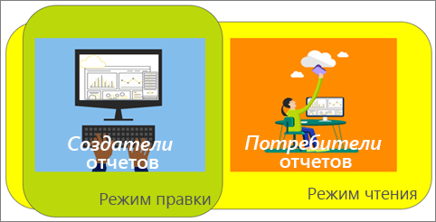
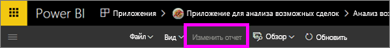
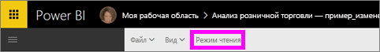

# Режимы чтения и правки в отчетах службы Power BI
В службе Power BI (не в Power BI Desktop) есть два режима для просмотра и взаимодействия с отчетами: чтения и правки. Режим чтения доступен для всех и специально разработан для *пользователей* данных, а режим правки доступен только *авторам* и владельцам отчетов.

## Режим чтения отчетов

 Режим чтения — это интересный и безопасный способ просмотра и взаимодействия с отчетом, который позволяет работать с данными и изучать их. Режим чтения предназначен для *пользователей* отчета, т. е. для тех, кто открывает отчеты из приложения или [имеет к ним общий доступ](../service-share-dashboards.md). Режим чтения обеспечивает отображение одного и того же отчета с одними и теми же визуализациями и, возможно, примененными фильтрами для каждого пользователя такого отчета.  Пользователи могут взаимодействовать с отчетами, изменять существующие фильтры (эти изменения сохраняются вместе с отчетом), но не могут добавлять новые фильтры.

> [!NOTE]
> В некоторых случаях пользователи отчетов могут видеть разные данные из-за применения функции безопасности на уровне строк и разрешений на просмотр данных.

## Режим правки отчетов

Режим правки доступен только для пользователей, создавших отчет или [совместно владеющих отчетом как участник или администратор рабочей области приложения](../service-create-distribute-apps.md).

Режим правки предназначен для *авторов* отчетов. В нем авторы могут выполнять импорт и устанавливать подключение к наборам данных, изучать информацию, а также создавать отчеты и панели мониторинга. В режиме правки *авторы* могут более глубоко изучать данные за счет добавления и удаления полей, изменения типа визуализации, создания новых визуализаций, добавления и удаления визуализаций и страниц из отчета. Они могут использовать созданные отчеты совместно с коллегами.

## Сравнение режимов чтения и правки
В этой таблице описаны не все возможности работы с отчетами в службе Power BI. Здесь перечислены задачи отчетов, которые доступны только в **одном** из режимов (чтения или правки).

|Задача  | Режим чтения  | Режим правки |
|-------------------------|-------|-------|
|**Отчеты в целом**  |
| [Создание или изменение отчетов](../service-report-create-new.md) | Нет  | Да |
| [Совместное использование отчетов с сотрудниками](../service-share-reports.md)| Да | Да, а также управление разрешениями, включая предоставление другим пользователям разрешений *владельца*. |
| [Создание постоянных (неизменных) детализированных фильтров, фильтров на уровне визуальных элементов, страниц и отчетов на панели "Фильтры"](../power-bi-report-add-filter.md) | Нет  | Да |
| [Использование панели "Фильтры" в отчетах](end-user-report-filter.md) | Да, можно использовать существующие фильтры, при этом изменения сохраняются вместе с отчетом, однако добавлять новые фильтры запрещено. | Да |
| [Использование панели "Аналитика" в отчетах](../service-analytics-pane.md) | Нет | Да |
| [Параметры **просмотра** отчетов](../power-bi-report-display-settings.md) | Да, за некоторыми исключениями. | Да, все, включая линии сетки, привязку и блокировку. |
| [Создание расписания обновления](../refresh-data.md) | Нет  | Да |
| [Подписка для получения отчета](end-user-subscribe.md) | Да | Нет |
| [Функция "Вопросы и ответы" — возможность задавать вопросы в отчетах](end-user-q-and-a.md) | Нет  | Да |
| [Просмотр метрик использования](../service-usage-metrics.md) | Да, на холсте отчета. | Да, в списке отчетов (в представлении содержимого). |
| [Просмотр связанных данных](end-user-related.md) | Да, на холсте отчета. | Да, в списке отчетов (в представлении содержимого). |
| [Сохранение отчета](../service-report-save.md) | Да, но только с помощью параметра **Сохранить как**. | Да |
| [Удаление отчета](../service-delete.md) | Нет  | Да |
|**Страницы отчета** |
| [Добавление или переименование страницы отчета](../power-bi-report-add-page.md)  | Нет  | Да  |
| [Дублирование страницы отчета](../power-bi-report-copy-paste-page.md) | Нет  | Да |
| [Удаление страницы отчета](../service-delete.md) | нет | да |
|**Работа с визуализациями в отчетах**|
| [Добавление визуализаций в отчет](../visuals/power-bi-report-add-visualizations-i.md) | Нет  | Да |
| [Добавление текстовых полей и фигур в отчет](../power-bi-reports-add-text-and-shapes.md) | Нет  | Да |
| [Используйте панель "Форматирование" в отчете](../service-the-report-editor-take-a-tour.md) | Нет | Да |
| [Настройка взаимодействия визуальных элементов](end-user-interactions.md) | Нет  | Да |
| [Отображение данных, используемых для создания визуальных элементов](end-user-show-data.md) | Нет  | Да |
| [Настройка детализации](end-user-drill.md) | Нет  | Да |
| [Изменение используемой визуализации](../visuals/power-bi-report-change-visualization-type.md) | Нет | Да|
| [Удаление визуализации, текстового поля или фигуры](../service-delete.md)| Нет | Да |

## Переключения между режимами чтения и правки
Помните, что только авторы и владельцы отчетов могут открывать отчет в режиме правки.

1. По умолчанию отчет, как правило, открывается в режиме чтения. Вы можете узнать, что находитесь в режиме чтения, если видите параметр **Изменить отчет**. Если параметр **Изменить отчет** неактивен, у вас нет разрешений открывать отчет в режиме правки.

   

2. Если параметр **Изменить отчет** активен, выберите его, чтобы открыть отчет в режиме правки.

   

   Теперь отчет используется в режиме правки с теми же [параметрами отображения](../power-bi-report-display-settings.md), с которыми вы работали в режиме чтения.

2. Чтобы вернуться в режим чтения, щелкните **Режим чтения** на панели навигации вверху.

    

## Дальнейшие действия
Есть разные способы взаимодействия с отчетами в режиме чтения с использованием срезов и разделения данных для обнаружения дополнительных сведений и получения ответов на вопросы.  Более подробно некоторые из них описаны в следующем разделе о [взаимодействии с отчетом в режиме чтения](../service-interact-with-a-report-in-editing-view.md).    
Переключение к [отчетам в Power BI](end-user-reports.md)    
