<!-- once the sample apps are live, change this so consumers can follow along -->
# Краткое руководство: сведения о возможностях Power BI для ***потребителей***
Изучив это краткое руководство, вы узнаете, как взаимодействовать с Power BI для получения ценных бизнес-сведений на основе данных. Целью этой статьи является краткий обзор различных действий, доступных для **потребителей** Power BI.

Если вы не зарегистрированы в Power BI, перед началом работы [пройдите бесплатную регистрацию](https://app.powerbi.com/signupredirect?pbi_source=web).

## Предварительные требования
- Служба Power BI (app.powerbi.com)
<!-- app from AppSource -->

## Режим чтения
Режим чтения доступен в службе Power BI для *потребителей* отчетов. Когда коллеги предоставляют вам доступ к отчету, вы используете режим чтения для просмотра отчета и взаимодействия с ним. 

Еще один режим отчета службы Power BI — [режим правки](../service-interact-with-a-report-in-editing-view.md), доступный для *конструкторов* отчета.  

Режим чтения — это эффективный и безопасный способ просмотра панелей мониторинга и отчетов. Когда вы просматриваете панели мониторинга и отчеты, к которым вам предоставлен доступ, базовые наборы данных остаются без изменений. 

В режиме чтения можно выполнять такие действия, как перекрестное выделение и фильтрация визуальных элементов на странице.  Просто выделите или выберите значение в одном из визуальных элементов, и это тут же отразится на состоянии других элементов. С помощью области фильтрации можно добавлять и изменять фильтры на странице отчетов, а также менять параметры сортировки значений в визуализации. Ниже приведены лишь некоторые из возможностей *потребителей* в Power BI.  Читайте дальше, чтобы узнать о них и многом другом.

 
### Просмотр приложения
*Приложения* в Power BI позволяют объединить связанные панели мониторинга и отчеты в одном решении.

1. Последовательно выберите **Приложения**  > **Get apps** (Получить приложения). 
   
     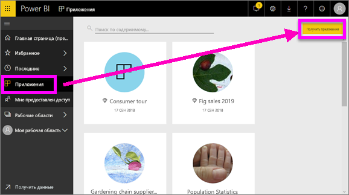
2. Выполните поиск в AppSource в разделе **Моя организация**, чтобы сократить количество результатов и найти необходимое приложение.
   
     
3. Выберите **Получить**, чтобы добавить его в контейнер "Приложения". 

### Просмотр панели мониторинга
Это приложение откроется на панели мониторинга. ***Панель мониторинга*** Power BI — это отдельная страница (часто называется полотном), на которой данные отображаются в виде визуализаций. Будучи ограниченной одной страницей, продуманная панель мониторинга содержит самые важные фрагменты таких данных.

Визуализации, отображаемые на панели мониторинга, называются *плитками*. Они *закрепляются* на панели мониторинга из отчетов.

### Подписка на панель мониторинга (или отчет)
Необязательно открывать Power BI, чтобы отслеживать панель мониторинга.  Вы можете на нее подписаться, и Power BI будет отправлять по электронной почте моментальный снимок этой панели мониторинга по заданному расписанию. 

.

1. В верхней строке меню выберите **Subscribe** (Подписаться) или нажмите значок конверта .
   
   

3. Для включения и отключения подписки используйте ползунок желтого цвета.  Также можно ввести данные для сообщения электронной почты. 

    На снимках экрана ниже обратите внимание, что при подписке на отчет вы фактически подписываетесь на *страницу* отчета.  Чтобы подписаться в отчете на несколько страниц, нажмите **Добавить другую подписку** и выберите другую страницу. 
      
   
   
    Обновление страницы отчета не приводит к обновлению набора данных. Только владелец набора данных может вручную обновить набор данных. Чтобы найти имена базовых наборов данных, выберите **Просмотреть связанное** в строке меню вверху.

### Просмотр связанного содержимого
В области **Связанное содержимое** вы можете видеть, как связано между собой содержимое службы Power BI: панели мониторинга, отчеты и наборы данных. Здесь отображается не только связанное содержимое. Эта область также позволяет выполнять действия с содержимым, а также переходы между ним.

На панели мониторинга или в отчете выберите **Просмотреть связанное** в верхней строке меню.

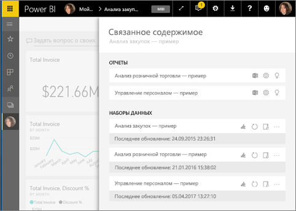

### Использование естественного языка в вопросах и ответах
Иногда самый быстрый способ получить ответ по данным — задать вопрос, используя естественный язык. Окно "Вопросы и ответы" находится в верхней части панели мониторинга. Например, "показать количество крупных возможных сделок по этапу продаж в виде воронки". 

### Добавление панели мониторинга в избранное
Добавив содержимое в *Избранное*, вы сможете открывать его из панели навигации слева. Левая панель навигации отображается почти в каждой области Power BI. Избранными обычно бывают панели мониторинга, страницы отчетов и приложения, которые вы чаще всего посещаете.

1. Выйдите из раздела вопросов и ответов, чтобы вернуться к панели мониторинга.    
2. В правом верхнем углу экрана службы Power BI выберите **Favorite** (Избранное) или нажмите значок звездочки .
   
   

### Открытие и просмотр отчета и страниц отчета
Отчет состоит из одной или нескольких страниц с визуализациями. Отчеты создаются *конструкторами отчетов* Power BI. [Общий доступ к отчетам предоставляется *потребителям* напрямую](end-user-shared-with-me.md) или в составе [приложения](end-user-apps.md). 

Отчеты можно открывать с панели мониторинга. Большинство плиток на панели мониторинга *закреплены* из отчетов. При выборе такой плитки открывается отчет, который использовался для ее создания. 

1. Выберите плитку на панели мониторинга. В этом примере мы выбрали плитку гистограммы Revenue (Доход).

    

2.  Откроется связанный с ней отчет. Обратите внимание: сейчас открыта страница Revenue Overview (Обзор доходов). Это страница отчета с гистограммой, которую мы выбрали на панели мониторинга.

    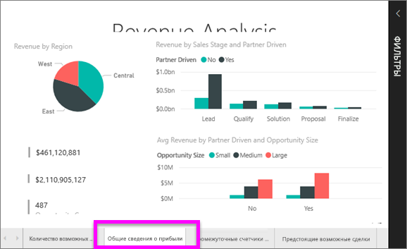

### Подстройка размеров отображения
Отчеты можно просматривать на различных устройствах с различными размерами экранов и соотношениями сторон.  Отрисовка по умолчанию может не соответствовать тому, что хотелось бы увидеть на устройстве.  

1. Чтобы ее настроить, в верхней строке меню выберите **Вид**.

    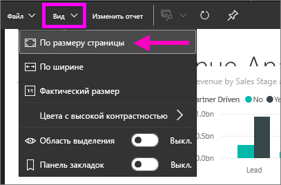

2.  Выберите один из параметров отображения. В этом примере мы выбрали **По размеру страницы**.

    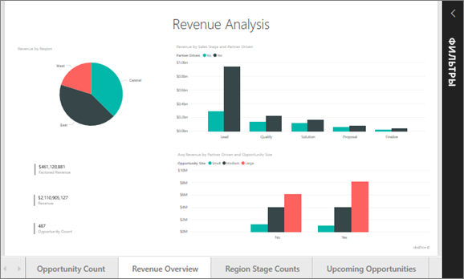    

### Использование панели "Фильтры" в отчетах
Если автор добавил фильтры на страницу отчета, вы можете взаимодействовать с ними и сохранять изменения в отчете.

1. Щелкните значок **фильтра** в правом верхнем углу.
   
   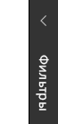  

2. Выберите визуальный элемент, чтобы сделать его активным. Вы увидите фильтры, примененные к этим визуальным элементам (фильтры уровня визуального элемента), всей странице отчета (фильтры уровня страницы) и всему отчету (фильтры уровня отчета).
   
   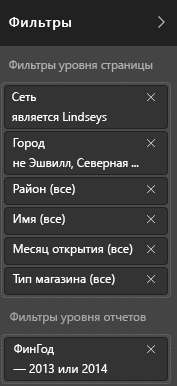

3. Наведите указатель мыши на фильтр и откройте его, щелкнув стрелку вниз.
   
   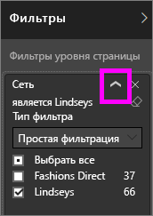

4. Внесите изменения в фильтры и посмотрите, как это повлияет на визуальные элементы.  
   
     
     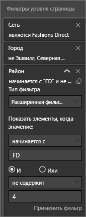

### Обратите внимание, каким образом все визуальные элементы на странице связаны между собой
Перекрестное выделение и фильтрация связанных визуализаций на странице Все визуализации на одной странице отчета соединены друг с другом.  Это означает, что, если выбрать одно или несколько значений в одной визуализации, другие визуализации, в которых также используются выбранные значение, изменятся соответствующим образом.

> 
### Отображение сведений о визуализации
Наводите указатель мыши на визуальные элементы для просмотра сведений.

### Сортировка визуализации
Визуальные элементы на странице отчета можно сортировать и сохранять с примененными изменениями. 

1. Наведите указатель мыши на визуальный элемент, чтобы сделать его активным.    
2. Выберите многоточие (...), чтобы открыть параметры сортировки.

     

###  Открытие панели **Выбор**
Вы можете легко перемещаться между визуализациями на странице отчета. 

1. Выберите **Вид > Область выделения**, чтобы открыть панель выбора. Задайте для **области выделения** значение "Вкл."

    

2. Область выделения откроется на холсте отчета. Выберите визуальный элемент в списке, чтобы сделать его активным.

    

### Увеличение масштаба отдельных визуальных элементов
Наведите указатель мыши на визуальный элемент и выберите значок **режима фокусировки** . Открытая визуализация в режиме фокусировки разворачивается, заполняя собой весь холст отчета.

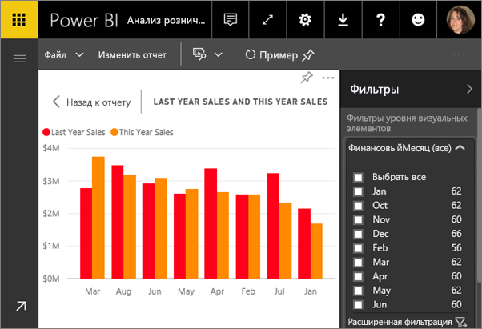

Чтобы отобразить эту визуализацию без строк меню, области фильтров и других элементов интерфейса, щелкните значок перехода в **полноэкранный режим** в верхней строке меню .

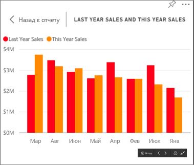

### Отображение данных, использованных для создания визуализации
Визуализация Power BI создается на основе данных из базовых наборов данных. Если вы хотите копнуть поглубже, Power BI дает возможность *просмотреть* данные, лежащие в основе визуального элемента. Если выбрать функцию **Показать данные**, Power BI отобразит рядом с визуализацией или под ней связанную информацию.

1. В службе Power BI откройте отчет и выберите визуальный элемент.  
2. Чтобы отобразить данные, лежащие в основе визуального элемента, нажмите кнопку с многоточием и выберите команду **Показать данные**.
   
   

Вы прочитали краткий обзор некоторых действий, доступных для **потребителей** в службе Power BI.  

## Очистка ресурсов
- Если вы подключены к приложению, в области навигации слева выберите **Приложения**, чтобы открыть список содержимого приложений. Наведите указатель мыши на приложение, которое необходимо удалить, и щелкните значок урны.

- Если вы импортировали пример отчета Power BI или подключились к нему, в области навигации слева откройте **Моя рабочая область**. С помощью вкладок в верхней части странице найдите панель мониторинга, отчет и набор данных и выберите значок урны для каждого элемента.

## Дальнейшие действия

