# Краткое руководство: сведения о возможностях Power BI для *потребителей*
Изучив это краткое руководство, вы узнаете, как взаимодействовать с Power BI для получения ценных бизнес-сведений на основе данных. Целью этой статьи является краткий обзор различных действий, доступных для **потребителей** Power BI.

Если вы не зарегистрированы в Power BI, перед началом работы [пройдите бесплатную регистрацию](https://app.powerbi.com/signupredirect?pbi_source=web).

## Что такое Power BI? 
Power BI — это коллекция программных служб, приложений и соединителей, которые взаимодействуют друг с другом, чтобы превратить разрозненные источники данных в согласованные, визуально иммерсивные и интерактивные аналитические данные. Представлены ли ваши данные простой электронной таблицей Excel или коллекцией данных из различных источников, Power BI позволяет легко подключаться к источникам данных, визуализировать (или выявлять) важные аспекты и предоставлять общий доступ к результатам всем, кому это необходимо. 

## Режим чтения
Режим чтения доступен в службе Power BI для *потребителей* отчетов. Когда коллеги предоставляют вам доступ к отчету, панели мониторинга или приложению, вы используете режим чтения для просмотра отчета и взаимодействия с ним. 

Просто откройте службу Power BI в браузере или на мобильном устройстве. Вы и ваши коллеги работаете с одними и теми же надежными приложениями, панелями мониторинга и отчетами, которые обновляются автоматически, поэтому у вас под рукой всегда самое последнее содержимое.   

Поскольку содержимое не является статическим, вы можете углубленно изучать его, искать тенденции, аналитические сведения и другие данные бизнес-аналитики. Анализируйте доступное содержимое и даже задавайте ему вопросы своими словами. Или просто откиньтесь на спинку стула и позвольте своим данным выполнять интересные аналитические операции, отправлять вам оповещения при изменении данных и отсылать отчеты по электронной почте в соответствии с заданным расписанием. Все ваши данные доступны вам в любое время и с любого устройства независимо от их расположения — в облаке или локальной среде. 

Читайте дальше, чтобы узнать о них и многом другом.

## Содержимое Power BI
При использовании термина "содержимое" в Power BI мы имеем в виду отчеты, панели мониторинга и приложения. Это стандартные блоки, которые используются для исследования данных и принятия бизнес-решений. 

> [!NOTE]
> Панели мониторинга, отчеты и приложения можно также просматривать и совместно использовать на мобильных устройствах.

###  Приложения

*Приложения* — это тип содержимого Power BI, который объединяет связанные панели мониторинга и отчеты в одном месте. Приложение может иметь одну или несколько панелей мониторинга и один или несколько отчетов, объединенные вместе. Приложения, создаваемые *разработчиками* Power BI, которые распространяют приложения среди *потребителей*, таких как вы. 

Например, чтобы просмотреть приложение, можно выбрать **Приложения** в панели навигации и указать приложение, которое требуется открыть.

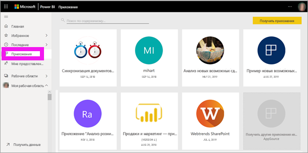

Дополнительные сведения о просмотре приложений см. в статье [Приложения Power BI](end-user-apps.md)

### Отчеты

Отчет Power BI — это разностороннее представление набора данных с визуальными элементами, которые отображают различные результаты и сведения, полученные из этого набора данных. В отчете может быть один визуальный элемент или несколько страниц, заполненных визуальными элементами. Отчеты, создаваемые *разработчиками* Power BI, которые распространяют отчеты среди *потребителей*, таких как вы.

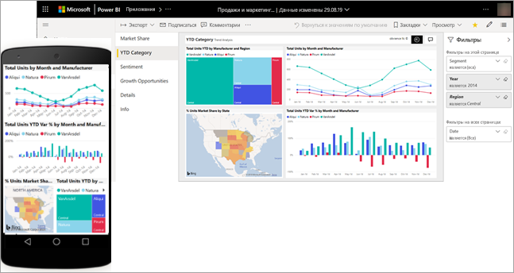

Дополнительные сведения о просмотре отчетов см. в статье [Отчеты Power BI](end-user-reports.md)

### Панели мониторинга

Панель мониторинга Power BI — это отдельная страница (часто называется полотном), на которой данные отображаются в виде визуализаций. Будучи ограниченной одной страницей, продуманная панель мониторинга содержит самые важные фрагменты таких данных.

Визуализации, отображаемые на панели мониторинга, называются плитками. Они закрепляются на панели мониторинга *разработчиками* отчетов. В большинстве случаев, выбрав плитку, можно перейти на страницу отчета, на которой была создана эта визуализация. 

Дополнительные сведения о просмотре панелей мониторинга см. в статье [Панели мониторинга Power BI](end-user-dashboards.md)
 
## Взаимодействие в службе Power BI

### Совместная работа с коллегами
Не тратьте лишнее время на общение по электронной почте. Добавьте личный комментарий или начните беседу о панели мониторинга со своими коллегами непосредственно с панели мониторинга. Функция комментариев — это лишь один из способов, которыми вы можете взаимодействовать с другими пользователями. 

Дополнительные сведения о [комментариях](end-user-comment.md)

### Расслабьтесь и позвольте Power BI сделать всю работу за вас
Автоматизация в службе Power BI обеспечивается за счет подписок и оповещений. 

#### Подписка на панель мониторинга (или отчет)
Необязательно открывать Power BI, чтобы отслеживать панель мониторинга.  Вы можете на нее подписаться, и Power BI будет отправлять по электронной почте моментальный снимок этой панели мониторинга по заданному расписанию. 

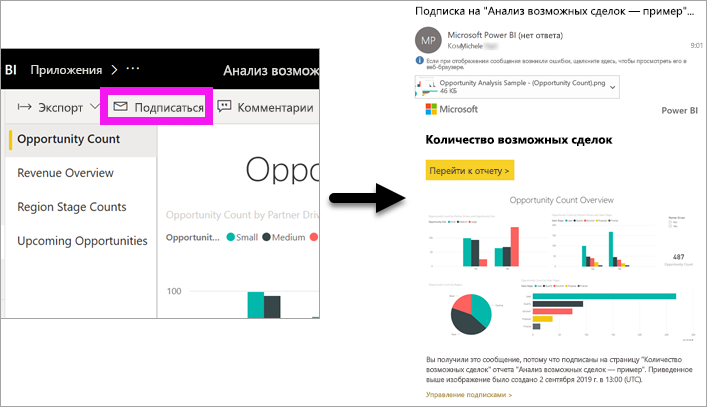.

 Дополнительные сведения о [подписках Power BI](end-user-subscribe.md)

#### Получайте оповещения при достижении пороговых значений в данных
Ваши данные постоянно изменяются, что автоматически отражается визуальными элементами. Если вы хотите получать уведомления о том, что значения данных вышли за пределы установленного диапазона, настройте оповещения о данных. Поддерживаются оповещения для датчиков, ключевых показателей эффективности и карточек.    

Как только значение выйдет за пределы установленного диапазона или порогового значения, служба Power BI автоматически направит вам сообщение электронной почты.  
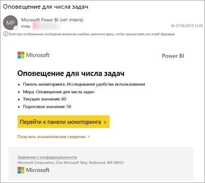

Дополнительные сведения об [оповещениях Power BI](end-user-alerts.md)

### Использование естественного языка в вопросах и ответах
Иногда самый быстрый способ получить ответ по данным — задать вопрос, используя естественный язык. Окно "Вопросы и ответы" находится в верхней части панели мониторинга. Например, "показать количество крупных возможных сделок по этапу продаж в виде воронки". 

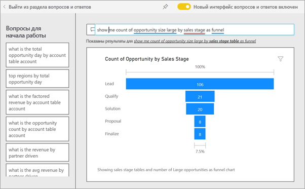

Дополнительные сведения в разделе [вопросов и ответов для службы Power BI](end-user-q-and-a.md)

### Отображение сведений о визуализации
Визуальные элементы состоят из точек данных, при наведении указателя мыши на которые можно просмотреть сведения.

### Добавление панели мониторинга в избранное
Добавив содержимое в *избранное*, вы сможете открывать его из панели навигации. Панель навигации отображается почти в каждой области Power BI. Избранными обычно бывают панели мониторинга, страницы отчетов и приложения, которые вы чаще всего посещаете.

В правом верхнем углу службы Power BI выберите **Избранное** или, если этот элемент не отображается, нажмите кнопку с многоточием (...) и щелкните пункт **Избранное** в раскрывающемся меню. 
   
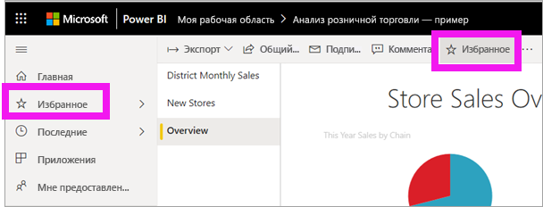

Ознакомьтесь с другими действиями, представленными в раскрывающемся списке.  Они будут более подробно рассматриваться в других статьях.  Для получения дополнительных сведений воспользуйтесь оглавлением Power BI или полем **поиска**. 

Дополнительные сведения об [избранных и рекомендуемых элементах](end-user-favorite.md)

### Подстройка размеров отображения
Отчеты можно просматривать на различных устройствах с различными размерами экранов и соотношениями сторон.  Отрисовка по умолчанию может не соответствовать тому, что хотелось бы увидеть на устройстве.  

Чтобы внести изменения, выберите **Вид** в строке меню в правом верхнем углу и один из параметров отображения. 

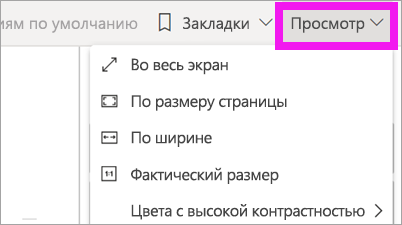

### Обратите внимание, каким образом все визуальные элементы на странице связаны между собой
Перекрестное выделение и фильтрация связанных визуализаций на странице отчета. Все визуализации на одной странице отчета соединены друг с другом.  Это означает, что, если выбрать одно или несколько значений в одной визуализации, другие визуализации, в которых также используются выбранные значение, изменятся соответствующим образом.

> 

Дополнительные сведения о [взаимодействии визуальных элементов](end-user-interactions.md)

<!-- ###  Open the **Selection** pane
Easily navigate between the visualizations on the report page. 

1. Select **View > Selection pane** to open the Selection pane. Toggle **Selection pane** to On.

    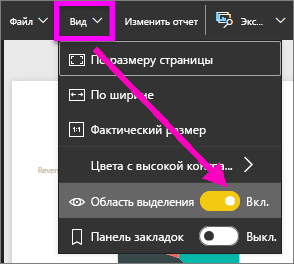

2. The Selection pane opens on your report canvas. Select a visual from the list to make it active.

     -->

### Увеличение масштаба отдельных визуальных элементов
Наведите указатель мыши на визуальный элемент и выберите значок **режима фокусировки** . Открытая визуализация в режиме фокусировки разворачивается, заполняя собой весь холст отчета.

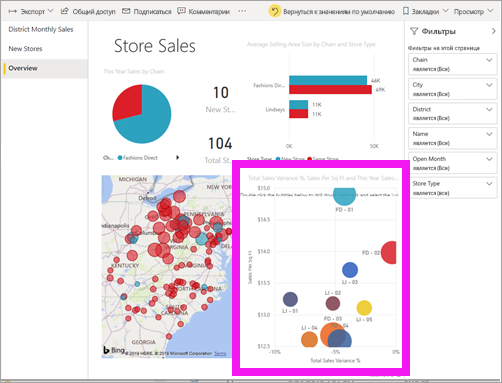

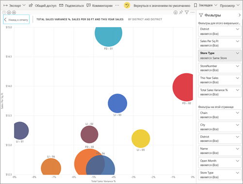

<!-- To display that same visualization without the distraction of menubars, filter pane, and other chrome -- select the **Full Screen** icon from the top menubar    .

 -->

Дополнительные сведения о [режиме фокусировки и полноэкранном режиме](end-user-focus.md)

### Сортировка визуализации
Визуальные элементы на странице отчета можно сортировать и сохранять с примененными изменениями. 

Наведите указатель мыши на визуальный элемент, чтобы сделать его активным, и нажмите кнопку с многоточием (...), чтобы открыть параметры сортировки.

 

Дополнительные сведения о [сортировке визуальных элементов](end-user-search-sort.md)

### Отображение данных, использованных для создания визуализации
Визуализация Power BI создается на основе данных из базовых наборов данных. Если вы хотите копнуть поглубже, Power BI дает возможность *просмотреть* данные, лежащие в основе визуального элемента. Если выбрать функцию **Показать данные**, Power BI отобразит рядом с визуализацией или под ней связанную информацию.

Если визуальный элемент активен, нажмите кнопку с многоточием (...) и выберите **Показать данные**.
   
   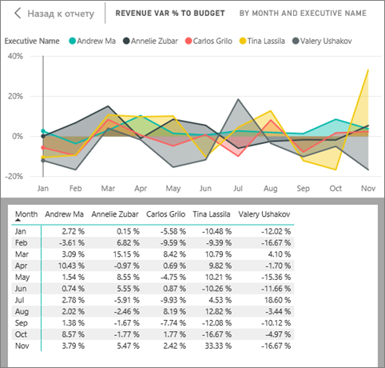

### Экспорт данных в Excel
Вы можете не только просматривать данные, которые использовались при создании визуального элемента, но и экспортировать и просматривать их в Microsoft Excel. При экспорте в Excel создается отдельный документ — электронная таблица, которая не является частью Power BI. Любые изменения, которые вы вносите в файл Excel, никак не влияют на данные в Power BI. Power BI обладает достаточной универсальностью и позволяет подготовить данные для просмотра или иного применения в других приложениях.

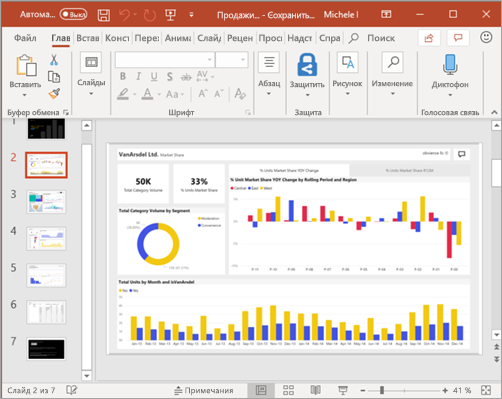

<!-- Exporting isn’t limited to individual visuals; you can export entire reports to PowerPoint or PDF to share with your colleagues.

 -->

В этой статье приведен краткий обзор основных возможностей службы Power BI для *потребителей*.  

## Очистка ресурсов
- Если вы подключены к приложению, в области навигации слева выберите **Приложения**, чтобы открыть список содержимого приложений. Наведите указатель мыши на приложение, которое необходимо удалить, и щелкните значок урны.

- Если вы импортировали пример отчета Power BI или подключились к нему, в области навигации слева откройте **Моя рабочая область**. С помощью вкладок в верхней части странице найдите панель мониторинга, отчет и набор данных и выберите значок урны для каждого элемента.

## Дальнейшие действия
[Power BI для потребителей](end-user-consumer.md)

