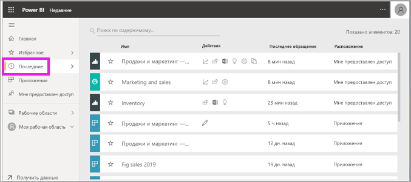
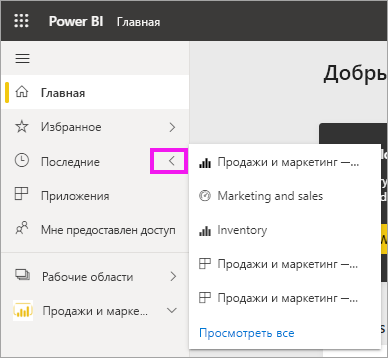
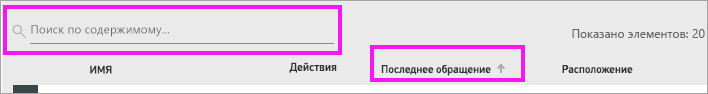

# **Недавнее** содержимое в службе Power BI
Недавнее содержимое — это последние элементы, которые вы просматривали в службе Power BI, но оно включает не более 20 элементов.  Например, это панели мониторинга, отчеты, приложения и книги.

Посмотрите, как Аманда заполняет списки **Недавнего** содержимого в службе Power BI, а затем сделайте то же самое, выполнив пошаговые инструкции, приведенные под видео.

<iframe width="560" height="315" src="https://www.youtube.com/embed/G26dr2PsEpk" frameborder="0" allowfullscreen></iframe>

> [!NOTE]
> В этом видео используется более старая версия службы Power BI.

## Отображение недавно просмотренного содержимого
Чтобы увидеть пять недавно использованных элементов, в области навигации щелкните стрелку справа от элемента **Недавнее**.  Отсюда можно выбрать недавно использованное содержимое, чтобы открыть его. Здесь перечислено 5 недавно использованных элементов.

Если у вас есть более пяти недавно использованных элементов, выберите **Просмотреть все**, чтобы открыть экран "Недавнее". Вы также можете выбрать **Недавнее** или щелкнуть соответствующий значок  в панели навигации.

## Действия, доступные в списке содержимого **Недавнее**.
Доступные действия будут зависеть от параметров, назначенных *автором* содержимого. Некоторые из параметров могут включать следующее.
* Щелкните значок звездочки для [добавления панели мониторинга, приложения или отчета в избранное](end-user-favorite.md) .
* Повторное предоставление доступа к некоторым панелям мониторинга и отчетам  .
* [Открытие отчета в Excel](end-user-export.md)  
* [Просмотр аналитических сведений](end-user-insights.md), которые Power BI находит в данных .
* [Поиск требуемых элементов с помощью поля поиска и сортировки](end-user-search-sort.md), если список длинный. Чтобы узнать, можно ли отсортировать столбец, наведите на него указатель мыши, чтобы увидеть, отображается ли стрелка. В этом примере при наведении указателя мыши на поле **Последнее обращение** отображается стрелка. Последнее содержимое можно отсортировать по дате доступа. 

    

## Дальнейшие действия
[Приложения службы Power BI](end-user-apps.md)

Появились дополнительные вопросы? [Ответы на них см. в сообществе Power BI.](https://community.powerbi.com/)

