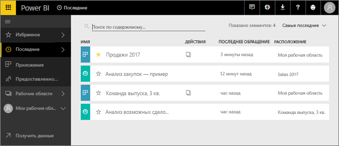
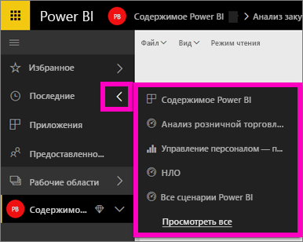
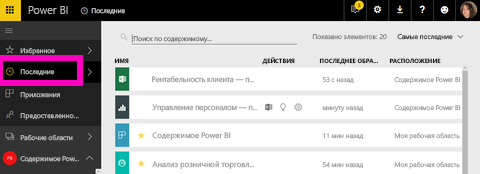

# **Недавно просмотренное** содержимое в службе Power BI
Недавнее содержимое — это последние элементы, которые вы просматривали в службе Power BI, но оно включает не более 20 элементов.  Это содержимое включает панели мониторинга, отчеты, приложения и книги во всех рабочих областях.

Посмотрите, как Аманда заполняет списки **Недавнего** содержимого в службе Power BI, а затем сделайте то же самое, выполнив пошаговые инструкции, приведенные под видео.

<iframe width="560" height="315" src="https://www.youtube.com/embed/G26dr2PsEpk" frameborder="0" allowfullscreen></iframe>

## Отображение недавно просмотренного содержимого
Чтобы увидеть пять недавно использованных элементов, в левой области навигации щелкните стрелку справа от элемента **Recent** (Недавнее).  Отсюда можно выбрать недавно использованное содержимое, чтобы открыть его. Здесь перечислено 5 недавно использованных элементов.

Если у вас есть более 5 недавно использованных элементов, выберите **Просмотреть все**, чтобы открыть экран Recent (Недавнее) (см. ниже). Вы также можете выбрать **Recent** (Недавнее) или щелкнуть соответствующий значок  в левой панели навигации.

Отсюда вы можете взаимодействовать с содержимым так же, как и на отдельных вкладках [**Панели мониторинга**](end-user-dashboards.md), [**Отчеты**](end-user-reports.md), **Книги** и на экране <!--[**Apps**](end-user-apps.md)--> приложений.

## Дальнейшие действия
<!--[Power BI service Apps](end-user-apps.md)-->

Появились дополнительные вопросы? [Ответы на них см. в сообществе Power BI.](http://community.powerbi.com/)

