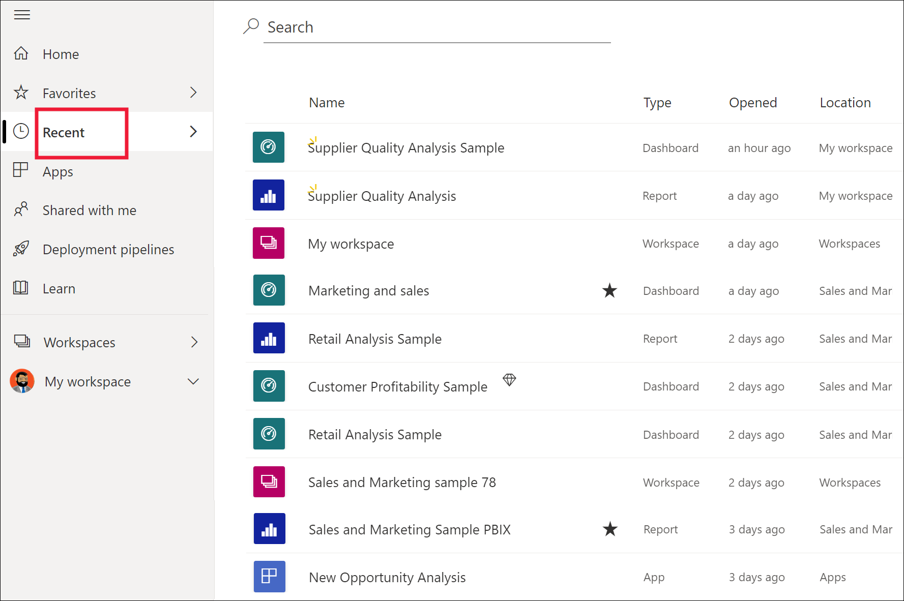

# **Недавнее** содержимое в службе Power BI

[!INCLUDE[consumer-appliesto-yyny](../includes/consumer-appliesto-yyny.md)]

**Недавнее** содержимое — это последние элементы, которые вы просматривали в службе Power BI. Это панели мониторинга, отчеты, приложения и книги. При выборе элемента **Последние** на панели навигации Power BI отображает это содержимое в порядке убывания даты.  Чтобы изменить порядок сортировки, выберите один из заголовков и выберите сортировку по возрастанию или по убыванию.

Обратите внимание, что два элемента являются [избранными](end-user-favorite.md), так как у них есть значок звезды. И один элемент (Рентабельность клиента — пример) хранится в [емкости Premium](end-user-license.md).

## Отображение пяти последних просмотренных элементов

Чтобы отобразить только один из пяти недавно просмотренных элементов, в области навигации щелкните стрелку справа от элемента **Последние**.  В списке выберите содержимое, чтобы открыть его. 

## Отображение всего недавнего содержимого

Если у вас более пяти недавно просмотренных элементов, выберите **Просмотреть все**, чтобы открыть экран **Последние**. Как это было сделано в начале статьи, вы можете пропустить всплывающий элемент и открыть окно **Последние**, выбрав в области навигации слово **Последние**или значок .

## Поиск и сортировка списка недавнего содержимого

Если список длинный, [выполните поиск требуемых элементов с помощью поля поиска и сортировки](end-user-search-sort.md). Чтобы узнать, можно ли отсортировать столбец, наведите на него указатель мыши, чтобы увидеть, отображается ли стрелка. В этом примере при наведении указателя мыши на поле **Тип** отображается стрелка. Последнее содержимое можно отсортировать в алфавитном порядке по типу. 

Посмотрите, как Аманда заполняет списки **Недавнего** содержимого в службе Power BI, а затем сделайте то же самое, выполнив пошаговые инструкции, приведенные под видео.

<iframe width="560" height="315" src="https://www.youtube.com/embed/G26dr2PsEpk" frameborder="0" allowfullscreen></iframe>

> [!NOTE]
> В этом видео используется более старая версия службы Power BI.

<!--
## Actions available from the **Recent** content list
The actions available to you will depend on the settings assigned by the content *designer*. Some of your options may include:
* Select the star icon to [favorite a dashboard, report, or app](end-user-favorite.md) .
* Some dashboards and reports can be re-shared  .
* [Open the report in Excel](end-user-export.md)  
* [View insights](end-user-insights.md) that Power BI finds in the data . -->

## Дальнейшие действия
[Приложения службы Power BI](end-user-apps.md)

Остались вопросы? [Ответы на них см. в сообществе Power BI.](https://community.powerbi.com/)

