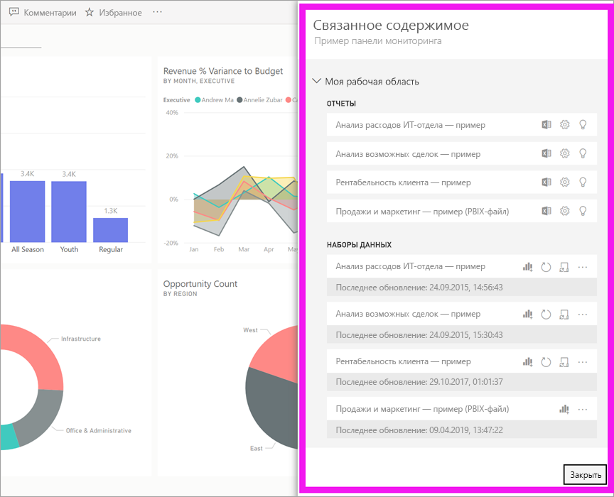
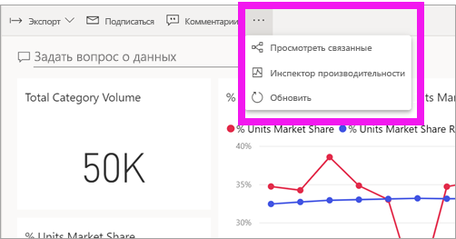
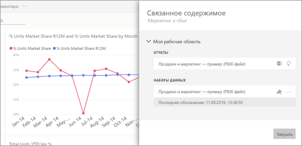
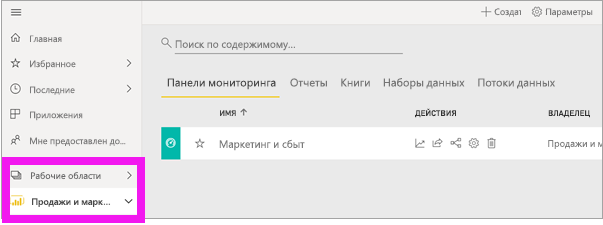
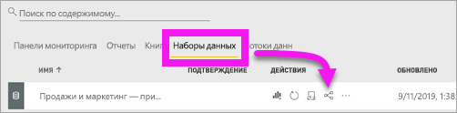

# Просмотр связанного содержимого в службе Power BI

[!INCLUDE [power-bi-service-new-look-include](../includes/power-bi-service-new-look-include.md)]

В области **Связанное содержимое** вы можете видеть, как связано между собой содержимое службы Power BI: панели мониторинга, отчеты и наборы данных. Область **Связанное содержимое** выполняет роль панели запуска для выполнения действий. Здесь можно открывать панель мониторинга или отчет, создавать аналитические сведения, анализировать данные в Excel и многое другое.  

В Power BI отчеты создаются на основе наборов данных, визуализации отчетов закрепляются на панелях мониторинга и связываются с созданными отчетами. Но как узнать, на каких панелях мониторинга размещаются визуализации из отчета по маркетингу? И как найти эти панели мониторинга? Есть ли на панели мониторинга с анализом закупок визуализации на основе нескольких наборов данных? Если отображаются, как они называются и как их можно открыть и отредактировать? Используется ли набор данных по кадрам в каких-либо отчетах или панелях мониторинга? Или же его можно перемещать, не рискуя нарушить связи? Область **Связанное содержимое** предоставит вам ответы на все эти вопросы.  Здесь не только отображается связанное содержимое. Эта область позволяет выполнять действия с содержимым и переходить к соответствующему содержимому.

> [!NOTE]
> Функция связанного содержимого не поддерживается для наборов данных при потоковой передаче.
> 
> 

## Просмотр связанного содержимого для панели мониторинга или отчета
Просмотрите описание связанного содержимого на панели мониторинга. Затем сделайте то же самое в соответствии с пошаговыми инструкциями, приведенными под видео, используя набор данных "Анализ закупок — пример".

<iframe width="560" height="315" src="https://www.youtube.com/embed/B2vd4MQrz4M#t=3m05s" frameborder="0" allowfullscreen></iframe>

Откройте панель мониторинга или отчет и щелкните **Дополнительные параметры** (...) в строке меню, а затем выберите в раскрывающемся списке **Просмотреть похожие**.

Откроется область **Связанное содержимое**. Для панели мониторинга отображаются все отчеты, которые содержат закрепленные на панели мониторинга визуализации, а также связанные наборы данных. На этой панели мониторинга закреплены визуализации, связанные только с одним отчетом, который, в свою очередь, основан только на одном наборе данных. 

Здесь вы можете выполнять разные действия со связанным содержимым.  Например, вы можете выбрать имя отчета или панели мониторинга, чтобы открыть их.  Для работы с отображенным отчетом щелкните значок [анализа в Excel](../service-analyze-in-excel.md) или [получения аналитики](end-user-insights.md). Для набора данных можно просмотреть дату и время последнего обновления, [выполнить анализ в Excel](../service-analyze-in-excel.md) и [получить аналитические сведения](end-user-insights.md).  

## Просмотр содержимого, связанного с набором данных
Чтобы открыть область **связанного содержимого**, вам нужны по крайней мере разрешения на *просмотр* набора данных. В этом сценарии мы используем пример [Анализ закупок](../sample-procurement.md).

На панели навигации найдите заголовок **Рабочие области** и выберите в списке соответствующую. Если у вас есть содержимое в рабочей области, оно будет отображаться на холсте справа. 

В рабочей области перейдите на вкладку **Наборы данных** и найдите значок **просмотра связанных элементов** .

Щелкните значок, чтобы открыть область **Связанное содержимое**.

Здесь вы можете выполнять разные действия со связанным содержимым. Например, вы можете выбрать имя панели мониторинга или отчета, чтобы открыть эти элементы.  Вы можете щелкнуть соответствующий значок, чтобы [предоставить другим пользователям совместный доступ к любой панели мониторинга в списке](../service-share-dashboards.md) или открыть для нее окно **Параметры**. Для работы с отчетами можно щелкнуть значок [анализа в Excel](../service-analyze-in-excel.md), [переименования](../service-rename.md) или [получения данных](end-user-insights.md).  

## Ограничения и устранение неполадок
* Если вы не видите ссылку для просмотра связанных элементов, найдите этот значок: . Щелкните значок, чтобы открыть область **Связанное содержимое**.
* Чтобы открыть связанное содержимое для отчета, необходимо находиться в [режиме чтения](end-user-reading-view.md).
* Функция связанного содержимого не поддерживается для наборов данных при потоковой передаче.

## Дальнейшие действия
* [Приступая к работе с Power BI](../service-get-started.md)
* Появились дополнительные вопросы? [Ответы на них см. в сообществе Power BI.](http://community.powerbi.com/)

