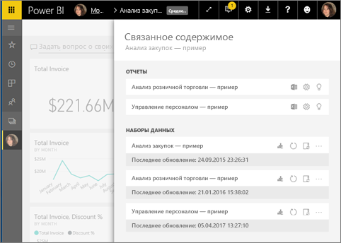
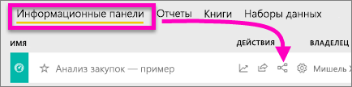
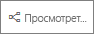
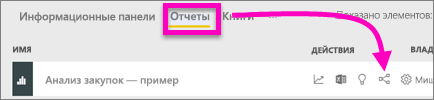
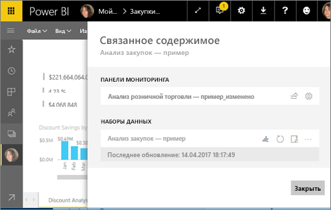
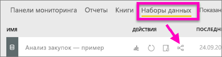
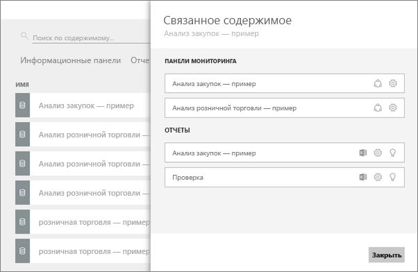

# Просмотр связанного содержимого в службе Power BI
В области **Связанное содержимое** вы можете видеть, как связано между собой содержимое службы Power BI: панели мониторинга, отчеты и наборы данных. Область "Связанное содержимое" выполняет роль панели запуска для выполнения действий. Здесь можно обновить или переименовать элементы, создать аналитические сведения и многое другое. Выберите связанный отчет или панель мониторинга. Эти элементы откроются в рабочей области Power BI.   

В Power BI отчеты создаются на основе наборов данных, визуализации отчетов закрепляются на панелях мониторинга и связываются с созданными отчетами. Но как узнать, на каких панелях мониторинга размещаются визуализации из отчета по маркетингу? И как найти эти панели мониторинга? Есть ли на панели мониторинга с анализом закупок визуализации на основе нескольких наборов данных? Если отображаются, как они называются и как их можно открыть и отредактировать? Используется ли набор данных по кадрам в каких-либо отчетах или панелях мониторинга? Или же его можно перемещать, не рискуя нарушить связи? Область **Связанное содержимое** предоставит вам ответы на все эти вопросы.  Здесь не только отображается связанное содержимое. Эта область позволяет выполнять действия с содержимым и переходить к соответствующему содержимому.

> [!NOTE]
> Функция связанного содержимого не поддерживается для наборов данных при потоковой передаче.
> 
> 

## Просмотр связанного содержимого на панели мониторинга
Просмотрите описание связанного содержимого на панели мониторинга. Затем сделайте то же самое в соответствии с пошаговыми инструкциями, приведенными под видео, используя набор данных "Анализ закупок — пример".

<iframe width="560" height="315" src="https://www.youtube.com/embed/B2vd4MQrz4M#t=3m05s" frameborder="0" allowfullscreen></iframe>

Чтобы открыть область **связанного содержимого**, вам нужны по крайней мере разрешения на *просмотр* панели мониторинга. В этом сценарии мы используем пример [Анализ закупок](../sample-procurement.md).

**Способ 1**

В рабочей области перейдите на вкладку **Панели мониторинга** и щелкните значок **просмотра связанных элементов** .

 

**Способ 2**

В открытой панели мониторинга выберите    в верхней строке меню.

Откроется область **Связанное содержимое**. На ней отображаются все отчеты, которые содержат закрепленные на панели мониторинга визуализации, а также связанные наборы данных. На этой панели мониторинга закреплены три визуализации, связанные с разными отчетами, которые, в свою очередь, основаны на трех разных наборах данных.

Здесь вы можете выполнять разные действия со связанным содержимым.  Например, вы можете выбрать имя отчета, чтобы открыть его.  Для работы с отображенным отчетом щелкните значок [анализа в Excel](../service-analyze-in-excel.md), [переименования](../service-rename.md) или [получения данных](end-user-insights.md). Для работы с набором данных щелкните значок [создания нового отчета](../service-report-create-new.md), [обновления](../refresh-data.md), переименования, [анализа в Excel](../service-analyze-in-excel.md), [получения данных](end-user-insights.md). Или откройте окно **Параметры** для набора данных.  

## Просмотр содержимого, связанного с отчетом
Чтобы открыть область **связанного содержимого**, вам нужны по крайней мере разрешения на *просмотр* отчета. В этом сценарии мы используем пример [Анализ закупок](../sample-procurement.md).

**Способ 1**

В рабочей области перейдите на вкладку **Reports** (Отчеты) и щелкните значок **просмотра связанных элементов** .

 

**Способ 2**

Откройте отчет в [режиме чтения](end-user-reading-view.md) и выберите  в верхней строке меню.

Откроется область **Связанное содержимое**. На ней отображается связанный набор данных и все панели мониторинга, которые содержат по крайней мере одну закрепленную плитку, связанную с отчетом. С этим отчетом связаны визуализации, прикрепленные к двум разным панелям мониторинга.

Здесь вы можете выполнять разные действия со связанным содержимым.  Например, вы можете выбрать имя панели мониторинга, чтобы открыть ее.  Вы можете щелкнуть соответствующий значок, чтобы [предоставить другим пользователям совместный доступ к любой панели мониторинга в списке](../service-share-dashboards.md) или открыть для нее окно **Параметры**. Для работы с набором данных можно выбрать значок [создания нового отчета](../service-report-create-new.md), [обновления](../refresh-data.md), переименования, [анализа в Excel](../service-analyze-in-excel.md), [получения данных](end-user-insights.md). Также можно открыть окно **Параметры** для набора данных.  

## Просмотр содержимого, связанного с набором данных
Чтобы открыть область **связанного содержимого**, вам нужны по крайней мере разрешения на *просмотр* набора данных. В этом сценарии мы используем пример [Анализ закупок](../sample-procurement.md).

В рабочей области перейдите на вкладку **Наборы данных** и найдите значок **просмотра связанных элементов** .

Щелкните значок, чтобы открыть область **Связанное содержимое**.

Здесь вы можете выполнять разные действия со связанным содержимым. Например, вы можете выбрать имя панели мониторинга или отчета, чтобы открыть эти элементы.  Вы можете щелкнуть соответствующий значок, чтобы [предоставить другим пользователям совместный доступ к любой панели мониторинга в списке](../service-share-dashboards.md) или открыть для нее окно **Параметры**. Для работы с отчетами можно щелкнуть значок [анализа в Excel](../service-analyze-in-excel.md), [переименования](../service-rename.md) или [получения данных](end-user-insights.md).  

## Ограничения и устранение неполадок
* Если вы не видите ссылку для просмотра связанных элементов, найдите этот значок: . Щелкните значок, чтобы открыть область **Связанное содержимое**.
* Чтобы открыть связанное содержимое для отчета, необходимо находиться в [режиме чтения](end-user-reading-view.md).
* Функция связанного содержимого не поддерживается для наборов данных при потоковой передаче.

## Дальнейшие действия
* [Приступая к работе с Power BI](../service-get-started.md)
* Появились дополнительные вопросы? [Ответы на них см. в сообществе Power BI.](http://community.powerbi.com/)

