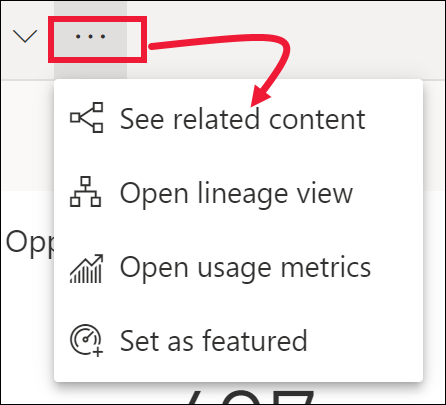

# Просмотр связанного содержимого в службе Power BI

[!INCLUDE[consumer-appliesto-yyny](../includes/consumer-appliesto-yyny.md)]

[!INCLUDE [power-bi-service-new-look-include](../includes/power-bi-service-new-look-include.md)]

В области **Связанное содержимое** вы можете видеть, как связано между собой содержимое службы Power BI: панели мониторинга, отчеты и наборы данных. Область **Связанное содержимое** выполняет роль панели запуска для выполнения действий. Здесь можно открывать панель мониторинга или отчет, создавать аналитические сведения, анализировать данные в Excel и многое другое.  

В службе Power BI отчеты создаются на основе наборов данных, визуализации отчетов закрепляются на панелях мониторинга и связываются с созданными отчетами. Но как узнать, на каких панелях мониторинга размещаются визуализации из отчета по маркетингу? И как найти эти панели мониторинга? Есть ли на панели мониторинга с анализом закупок визуализации на основе нескольких наборов данных? Если отображаются, как они называются и как их можно открыть и отредактировать? Используется ли набор данных по кадрам в каких-либо отчетах или панелях мониторинга? Или же его можно перемещать, не рискуя нарушить связи? Область **Связанное содержимое** предоставит вам ответы на все эти вопросы.  Здесь не только отображается связанное содержимое. Эта область позволяет выполнять действия с содержимым и переходить к соответствующему содержимому.

> [!NOTE]
> Функция связанного содержимого не поддерживается для наборов данных при потоковой передаче.
> 
> 

## Просмотр связанного содержимого для панели мониторинга или отчета
Просмотрите описание связанного содержимого на панели мониторинга. Затем сделайте то же самое в соответствии с пошаговыми инструкциями, приведенными под видео, используя пример "Анализ закупок".

> [!NOTE]
> Это видео основано на более старой версии службы Power BI. 

<iframe width="560" height="315" src="https://www.youtube.com/embed/B2vd4MQrz4M#t=3m05s" frameborder="0" allowfullscreen></iframe>

Откройте панель мониторинга или отчет и щелкните **Дополнительные параметры** (…) в строке меню, а затем выберите в раскрывающемся списке **See related content** (Просмотреть связанное содержимое).

Откроется область **Связанное содержимое**. Для панели мониторинга отображаются все отчеты, которые содержат закрепленные на панели мониторинга визуализации, а также связанные наборы данных. На этой панели мониторинга закреплены визуализации, связанные только с одним отчетом, который, в свою очередь, основан только на одном наборе данных. Если вы посмотрите на изображение в начале этой статьи, вы увидите связанное содержимое для панели мониторинга, на которой закреплены визуализации из четырех отчетов и двух наборов данных.

Здесь вы можете выполнять разные действия со связанным содержимым в зависимости от разрешений.  Например, вы можете выбрать имя отчета или панели мониторинга, чтобы открыть их.  Для отображенного отчета выберите значок, чтобы открыть и изменить параметры отчета, [получить аналитические данные](end-user-insights.md) и т. д. Для набора данных можно просмотреть дату и время последнего обновления, [выполнить анализ в Excel](../collaborate-share/service-analyze-in-excel.md), [получить аналитические сведения](end-user-insights.md), обновить и т. д.  

<!-- ## See related content for a dataset
You'll need at least *view* permissions to a dataset to open the **Related content** pane. In this example, we're using the [Procurement Analysis sample](../create-reports/sample-procurement.md).

From the nav pane, locate the **Workspaces** heading and select a workspace from the list. If you have content in a workspace, it will display in the canvas to the right. 

In a workspace, select the **Datasets** tab and locate the **See related** icon .

Select the icon to open the **Related content** pane.

From here, you can take direct action on the related content. For example, select a dashboard or report name to open it.  For any dashboard in the list, select an icon to [share the dashboard with others](../collaborate-share/service-share-dashboards.md) or to open the **Settings** window for the dashboard. For a report, select an icon to [analyze in Excel](../collaborate-share/service-analyze-in-excel.md), [rename](../create-reports/service-rename.md), or [get insights](end-user-insights.md).  -->

## Ограничения и устранение неполадок
* Если вы не видите ссылку для просмотра связанных элементов, найдите этот значок: . Щелкните значок, чтобы открыть область **Связанное содержимое**.
* Чтобы открыть связанное содержимое для отчета, необходимо находиться в [режиме чтения](end-user-reading-view.md).
* Функция связанного содержимого не поддерживается для наборов данных при потоковой передаче.

## Дальнейшие действия
* [Приступая к работе с Power BI](../fundamentals/service-get-started.md)
* Появились дополнительные вопросы? [Ответы на них см. в сообществе Power BI.](https://community.powerbi.com/)
