# Ознакомление с панелью "Фильтры" отчета

[!INCLUDE[consumer-appliesto-yyny](../includes/consumer-appliesto-yyny.md)]

[!INCLUDE [power-bi-service-new-look-include](../includes/power-bi-service-new-look-include.md)]

Эта статья содержит подробную информацию о панели **Фильтры** отчета в службе Power BI. Используйте фильтры, чтобы получать новые ценные сведения в данных.

Существует много различных способов фильтрации данных в Power BI. Дополнительные сведения см. в разделе [Фильтрация и выделение в отчетах Power BI](../power-bi-reports-filters-and-highlighting.md).

## Работа с панелью "Фильтры" отчета

При совместной работе над отчетом следует найти панель **Фильтры**. В некоторых случаях она свертывается вдоль правого края отчета. Щелкните панель, чтобы развернуть ее.

Панель **Фильтры** содержит фильтры, которые были добавлены в отчет *разработчиком*. *Пользователи*, такие как вы, могут взаимодействовать с существующими фильтрами и сохранять изменения, но не могут добавлять в отчет новые фильтры. Например, на снимке экрана выше конструктор добавил три фильтра уровня страницы: **сегмент — все**, **год — 2014**, а **регион — центральный**. Вы можете взаимодействовать с этими фильтрами и изменять их, однако добавить четвертый фильтр уровня страницы нельзя.

В службе Power BI отчеты сохраняют любые изменения, внесенные в панели **Фильтры**. Служба переносит эти изменения и в мобильную версию отчета. 

Чтобы восстановить для **панели фильтров** заданные разработчиком значения по умолчанию, выберите **Вернуться к значениям по умолчанию** в верхней строке меню.

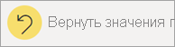 

> [!NOTE]
> Если параметр **Восстановить по умолчанию** не отображается, возможно, он был отключен *создателем отчета*. *Создатель* также может блокировать определенные фильтры, чтобы их нельзя было изменить.

## Просмотр всех фильтров на странице отчета

На панели **Фильтры** отображаются все фильтры, добавленные разработчиком отчета. Панель **Фильтры** — это также область, где можно просмотреть сведения о фильтрах и работать с ними. Сохраните внесенные изменения или используйте параметр **Вернуться к значениям по умолчанию** для возврата к исходным параметрам фильтра.

Если вы хотите сохранить изменения, можно также создать личную закладку. Дополнительные сведения см. в статье [Что такое закладки?](end-user-bookmarks.md).

Панель **Фильтры** отображает и контролирует несколько типов фильтров отчетов: отчет, страница отчетов и визуальный элемент.

В этом примере мы выбрали визуализацию с тремя фильтрами. Страница отчета также содержит фильтры, перечисленные в разделе **Фильтры на этой странице**. Кроме того, весь отчет также содержит фильтр **Дата**.

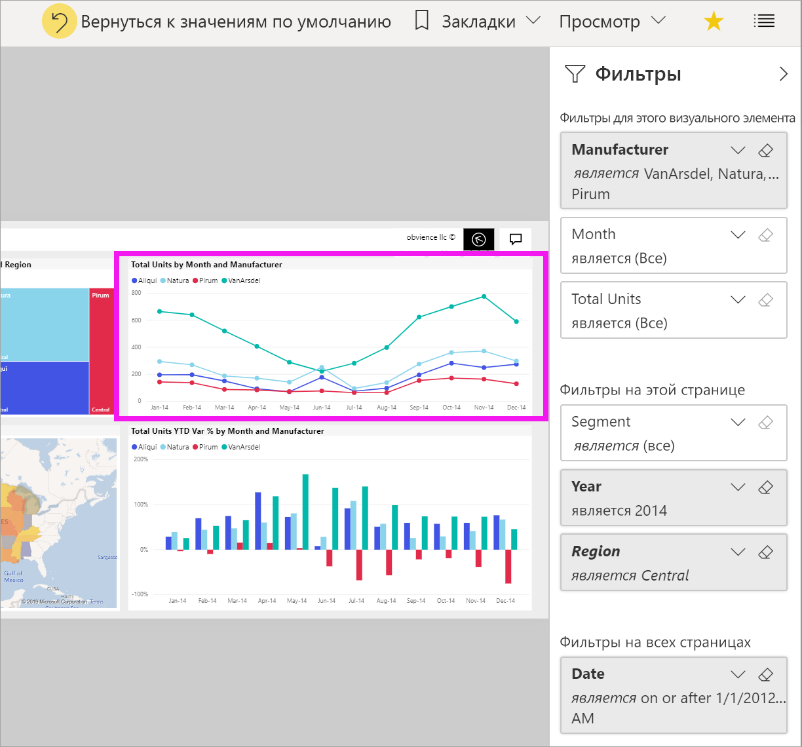

Рядом с некоторыми фильтрами указано **(все)** . **(Все)**  означает, что в фильтре включаются все значения. В примере выше поле **Segment(All)** означает, что эта страница отчета включает данные о всех сегментах продуктов. 

Вот как пользователи, просматривающие этот отчет, могут взаимодействовать с этими фильтрами

### Просмотр только фильтров, примененных в визуальном элементе

Чтобы получить подробный список фильтров, примененных для конкретного визуального элемента, наведите указатель мыши на визуальный элемент, чтобы увидеть значок фильтра . Выберите его, чтобы отобразить всплывающее окно со всеми фильтрами, срезами и другими компонентами, которые влияют на этот визуальный элемент. Фильтры во всплывающем окне включают в себя те же фильтры, которые отображаются на панели **Фильтры**, а также дополнительную фильтрацию, влияющую на выбранный визуальный элемент.

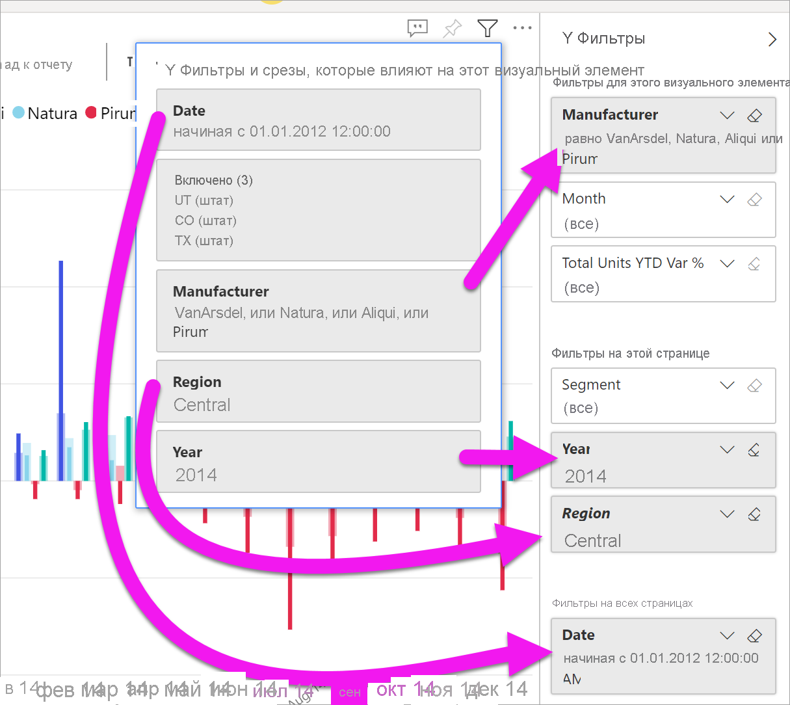

Ниже приведены типы фильтров, которые отображаются в этом представлении:

- Базовые фильтры
- Срезы
- Перекрестное выделение
- Перекрестная фильтрация
- Расширенные фильтры
- Фильтры первых N элементов
- Фильтрация относительных дат
- Синхронизация срезов
- Фильтры включения и исключения
- Фильтры, передаваемые по URL-адресу

В этом примере:
1. Фильтр **Включено** сообщает нам о перекрестной фильтрации визуального элемента. Это означает, что штаты Юта, Колорадо и Техас были выбраны на одном из визуальных элементов на этой странице отчетов. В этом случае, это карта. В результате выбора этих трех штатов были удалены данные для всех остальных штатов, отображаемых на выбранной линейчатой диаграмме.  

1. **Дата** — это фильтр, применяемый ко всем страницам в этом отчете.

1. Фильтры **регион — центральный** и **год — 2014** применяются к этой странице отчета.

4. **Производитель — VanArsdel, Natura, Aliqui или Pirum** — это фильтр, применяемый к этому визуальному элементу.

### Поиск в фильтре

Иногда фильтр может иметь длинный список значений. Используйте поле поиска, чтобы найти и выбрать нужное значение.

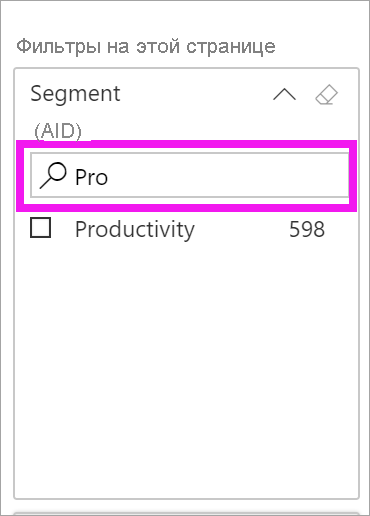

### Отображение сведений о фильтре

Чтобы понять суть фильтра, изучите доступные значения и счетчики.  Чтобы просмотреть данные о фильтре, наведите курсор мыши и выберите стрелку рядом с именем фильтра.
  
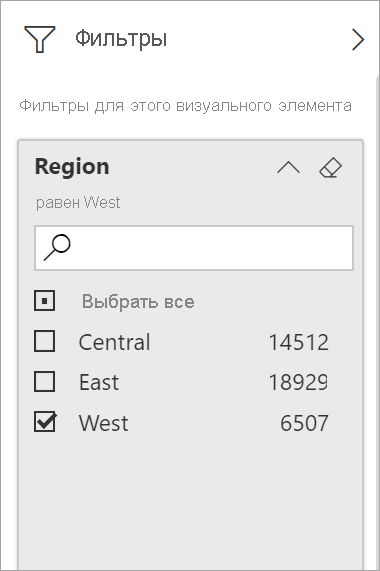

### Изменение выбранных фильтров

Один из способов анализа данных — взаимодействовать с фильтрами. Вы можете изменить выбранные параметры фильтра с помощью стрелки раскрывающегося списка рядом с именем поля.  В зависимости от фильтра и типа данных, которые фильтрует Power BI, параметры находятся в диапазоне от простого выбора в списке до определения диапазонов дат или чисел. В расширенном фильтре ниже мы изменили фильтр **Total Units YTD** (Всего единиц за текущий год) на древовидной диаграмме, чтобы выбрать диапазон от 2000 до 3000. Обратите внимание, что это изменение удаляет Pirum с диаграммы "дерево".
  
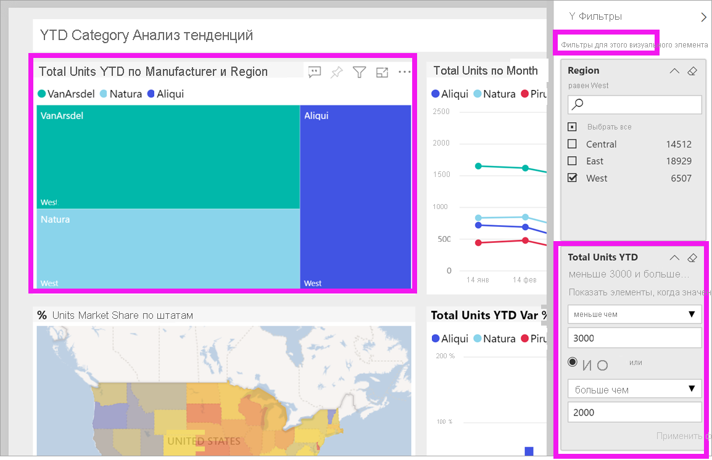

> [!TIP]
> Чтобы одновременно выбрать более одного значения фильтра, удерживайте нажатой клавишу CTRL. Большинство фильтров поддерживает множественный выбор.

### Восстановление значений фильтра по умолчанию

Если вы хотите отменить все изменения, которые вы внесли в фильтры, выберите команду **Вернуться к значениям по умолчанию** в верхней строке меню.  Фильтры вернутся в исходное состояние, заданное создателем отчета.

### Очистка фильтра

Чтобы сбросить фильтр до "(Все)", очистите его, выбрав значок ластика рядом с именем фильтра.

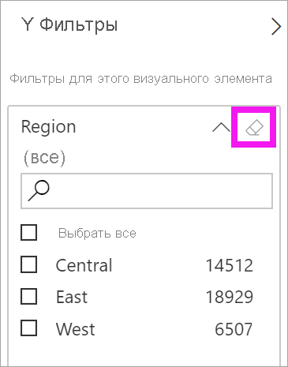
  
<!--  too much detail for consumers

## Types of filters: text field filters
### List mode
Ticking a checkbox either selects or deselects the value. The **All** checkbox can be used to toggle the state of all checkboxes on or off. The checkboxes represent all the available values for that field.  As you adjust the filter, the restatement updates to reflect your choices. 

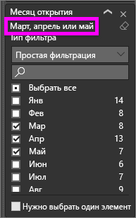

Note how the restatement now says "is Mar, Apr or May".

### Advanced mode
Select **Advanced Filtering** to switch to advanced mode. Use the dropdown controls and text boxes to identify which fields to include. By choosing between **And** and **Or**, you can build complex filter expressions. Select the **Apply Filter** button when you've set the values you want.  

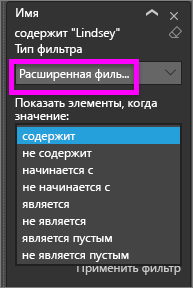

## Types of filters: numeric field filters
### List mode
If the values are finite, selecting the field name displays a list.  See **Text field filters** &gt; **List mode** above for help using checkboxes.   

### Advanced mode
If the values are infinite or represent a range, selecting the field name opens the advanced filter mode. Use the dropdown and text boxes to specify a range of values that you want to see. 

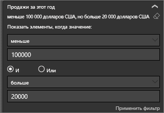

By choosing between **And** and **Or**, you can build complex filter expressions. Select the **Apply Filter** button when you've set the values you want.

## Types of filters: date and time
### List mode
If the values are finite, selecting the field name displays a list.  See **Text field filters** &gt; **List mode** above for help using checkboxes.   

### Advanced mode
If the field values represent date or time, you can specify a start/end time when using Date/Time filters.  

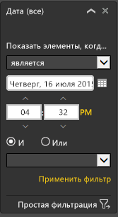

-->

## Дальнейшие действия

Сведения о [взаимных кросс-фильтрации и перекрестном выделении визуальных элементов на странице отчета](end-user-interactions.md)