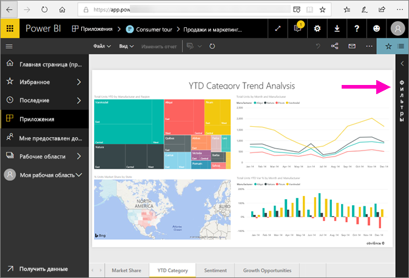
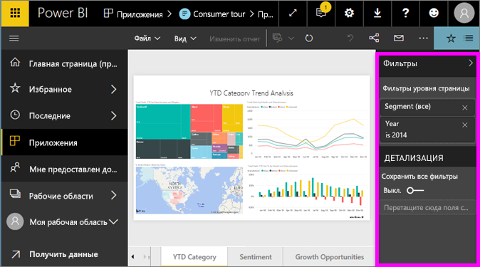
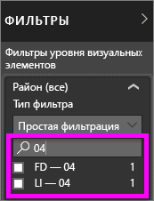
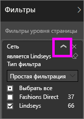
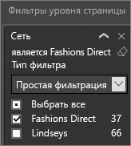
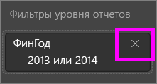

# Ознакомление с панелью "Фильтры" отчета
Эта статья содержит подробную информацию о панели "Фильтры" отчета в службе Power BI.

Так как в Power BI есть много разных способов фильтрации данных, мы рекомендуем сначала ознакомиться со статьей [О фильтрах и выделении](../power-bi-reports-filters-and-highlighting.md).

## Работа с панелью "Фильтры" отчета
При совместной работе над отчетом следует найти панель **Фильтры**. В некоторых случаях она свертывается вдоль правого края отчета. Щелкните панель, чтобы развернуть ее.   

Панель "Фильтры" содержит фильтры, которые были добавлены к отчету в *конструкторе отчетов*. *Пользователи*, такие как вы, могут взаимодействовать с фильтрами и сохранять изменения, но не могут добавлять в отчет новые фильтры. Например, на снимке экрана выше конструктор добавил два фильтра уровня страницы: "Сегмент" и "Год". "Сегмент" и "Год". Вы можете взаимодействовать с этими фильтрами и изменять их, однако добавить третий фильтр уровня страницы нельзя.

В службе Power BI отчеты сохраняют все изменения, вносимые на панели "Фильтры", и эти изменения в мобильную версию отчета. Чтобы восстановить для панели фильтров заданные разработчиком значения по умолчанию, выберите **Вернуться к значениям по умолчанию** в верхней строке меню.     

## Открытие панели "Фильтры"
Когда отчет открыт, панель "Фильтры" отображается на холсте отчетов справа. Если область не отображается, разверните ее, щелкнув стрелку в правом верхнем углу.  

В этом примере мы выбрали визуализацию с шестью фильтрами. Страница отчета также содержит фильтры, перечисленные в разделе **Фильтры уровня страницы**. В отчете используется один [фильтр детализации](../power-bi-report-add-filter.md), и весь отчет также содержит фильтр:  **ФинГод** — 2013 или 2014.

Напротив некоторых фильтров отображается слово **All**. Это значит, что все значения включены в фильтр.  Например, поле **Chain(All)**, изображенное на снимке экрана выше, означает, что эта страница отчета включает данные обо всех сетях магазинов.  С другой стороны, фильтр уровня отчета **FiscalYear is 2013 or 2014** означает, что в отчет включены только данные за финансовые года 2013 и 2014.

Вот как пользователи, просматривающие этот отчет, могут взаимодействовать с этими фильтрами

- Выполните поиск на странице, в визуальном элементе, отчете и фильтрах детализации, чтобы найти и выбрать нужное значение. 

    

- Чтобы просмотреть данные о фильтре, наведите курсор мыши и выберите стрелку рядом с фильтром.
  
   
* Чтобы изменить фильтр, выберите, например, **Lindseys** вместо **Fashions Direct**.
  
     

* Чтобы восстановить исходное состояние фильтров, выберите **Вернуться к значениям по умолчанию** в верхней строке меню.    
    
    
* Чтобы удалить фильтр, выберите значок **x** рядом с его именем.
  
    

  Если удалить фильтр, он исчезнет из списка, но данные из отчета не удаляются.  Например, если удалить фильтр **FiscalYear is 2013 or 2014**, данные о фискальных годах останутся в отчете, но фильтрация больше не будет выполняться только по 2013 и 2014 годам. Отобразятся данные по всем фискальным годам.  При этом удаленный фильтр больше нельзя изменять, так как он исчезает из списка. Лучше удалить фильтр с помощью значка ластика .
  
  

## Очистка фильтра
 В основном или расширенном режиме фильтрации выберите значок с изображением ластика   для очистки фильтра. 

## Типы фильтров: фильтры текстовых полей
### Режим списка
Установка или снятие флажка позволяет выбирать или отменять выбор значения. Флажок **Все** может использоваться для включения или отключения флажков. Флажки представляют все доступные значения для этого поля.  При настройке фильтра формулировка обновляется, отражая сделанный выбор. 

Обратите внимание, что теперь используется формулировка is Mar, Apr or May (март, апрель или май).

### Расширенный режим
Выберите **Расширенная фильтрация** , чтобы переключиться в расширенный режим. С помощью раскрывающихся списков и текстовых полей определите включаемые поля. Выбрав **И** или **Или**, можно создать сложные выражения фильтрации. Задав нужные значения, нажмите кнопку **Применить фильтр**.  

## Типы фильтров: фильтры числовых полей
### Режим списка
Если значения являются конечными, при выборе имени поля отображается список.  Сведения об использовании флажков см. выше, в подразделе **Фильтры текстовых полей** &gt; **Режим списка**.   

### Расширенный режим
Если значения являются бесконечными или представляют диапазон, при выборе имени поля открывается расширенный режим фильтрации. С помощью раскрывающихся списков и текстовых полей укажите нужный диапазон значений. 

Выбрав **И** или **Или**, можно создать сложные выражения фильтрации. Задав нужные значения, нажмите кнопку **Применить фильтр**.

## Типы фильтров: дата и время
### Режим списка
Если значения являются конечными, при выборе имени поля отображается список.  Сведения об использовании флажков см. выше, в подразделе **Фильтры текстовых полей** &gt; **Режим списка**.   

### Расширенный режим
Если значения поля представляют дату или время, при использовании фильтров даты и времени можно указать начальное и конечное время.  

## Дальнейшие действия
[Сведения о взаимных кроссфильтрации и перекрестном выделении визуальных элементов на странице отчета](end-user-interactions.md)