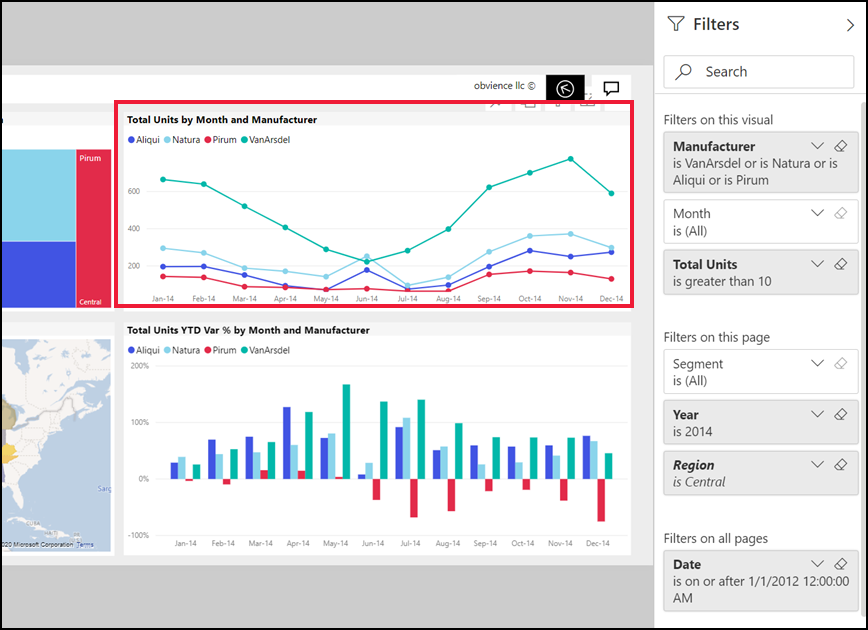

# Ознакомление с панелью "Фильтры" отчета
В этой статье рассматривается панель "фильтры" отчета в службе Power BI. Используйте фильтры, чтобы получать новые ценные сведения в данных.

Так как в Power BI есть много разных способов фильтрации данных, мы рекомендуем сначала ознакомиться со статьей [О фильтрах и выделении](../power-bi-reports-filters-and-highlighting.md).

## Работа с панелью "Фильтры" отчета
При совместной работе над отчетом следует найти панель **Фильтры**. В некоторых случаях она свертывается вдоль правого края отчета. Щелкните панель, чтобы развернуть ее.   

Панель "Фильтры" содержит фильтры, которые были добавлены к отчету в *конструкторе отчетов*. *Потребители* как вы, может взаимодействовать с существующие фильтры и сохраните изменения, но нельзя добавлять новые фильтры в отчет. Например, на снимке экрана выше конструктор добавил два фильтра уровня страницы: "Сегмент" и "Год". Разделить и год. Вы можете взаимодействовать с этими фильтрами и изменять их, однако добавить третий фильтр уровня страницы нельзя.

В службе Power BI отчеты сохраняют все изменения, внесенные в панель "фильтры", и эти изменения переносятся мобильную версию отчета. Чтобы восстановить для панели фильтров заданные разработчиком значения по умолчанию, выберите **Вернуться к значениям по умолчанию** в верхней строке меню.  

   

## Просмотреть все фильтры для страницы отчета
Панель "фильтры" отображаются все фильтры, которые добавлены в отчет по *конструктор*. Панель "фильтры" также представляет собой область, где можно просмотреть сведения о фильтрах и взаимодействовать с ними. Можно сохранить изменения, которые осуществляют или используют **восстановить значения по умолчанию** для возврата к исходным параметрам фильтра.

Если вы хотите сохранить изменения, можно также создать личные закладки.  Дополнительные сведения см. в разделе [добавить закладку в отчет](end-user-bookmarks.md).

Существует несколько типов фильтров отчетов, которые выводятся и управляемое из панели «фильтры» применяемые в визуальном элементе, на странице отчета и ко всему отчету.

В этом примере мы выбрали визуальный элемент, имеющий 2 фильтров. Страница отчета также содержит фильтры, перечисленные в разделе **фильтры на этой странице** заголовок. И весь отчет также содержит фильтр для даты.

Напротив некоторых фильтров отображается слово **All**. Это значит, что все значения включены в фильтр.  Например **Segment(All)** на снимке экрана выше сообщает, что эта страница отчета включают данные о всех сегментах продукта.  С другой стороны, фильтр уровня страницы **регион — Западная часть** сообщает о том, что страница отчета содержит только данные для западного региона.

Вот как пользователи, просматривающие этот отчет, могут взаимодействовать с этими фильтрами

### Просмотр только этих фильтров, применяемых в визуальном элементе
Чтобы получить подробный обзор фильтров, применяемых для конкретного визуального, наведите указатель мыши на визуализацию, чтобы увидеть значок фильтра . Щелкните этот значок фильтра, чтобы просмотреть это всплывающее окно с все фильтры, срезы и т. д, влияющие на нем. Во всплывающем располагаются те же фильтры, которые отображаются на **фильтры** области. 

 
Ниже приведены типы фильтров, в этом представлении можно отобразить.
- Базовые фильтры
- Срезы
- Перекрестное выделение
- Перекрестная фильтрация
- Расширенные фильтры
- Фильтры первых N элементов
- Фильтрация относительных дат
- Синхронизация срезов
- Фильтры включения и исключения
- Фильтры, передаваемые по URL-адресу

В примере ниже:
1. Мы видим, что на гистограмме была перекрестной фильтрации.
2. **Включенные** сообщает о том, что кросс фильтра относится **сегмент**, и три включаются. 
3. Срез был применен для **квартал**.
4. **Регион** — это фильтр, применяемый к этой странице отчета и
5. **isVanArsdel** и **год** , фильтров, применяемых к этому визуальному.

### Поиск в фильтре
Иногда фильтр может иметь длинный список значений. Используйте поле поиска найдите и выберите нужное значение. 

### Сведения о фильтре отображения
Сведения о фильтре, рассмотрим доступные значения и счетчики.  Просмотрите данные о фильтре, наведите курсор мыши и выбрав стрелку рядом с именем фильтра. 
  

### Изменение фильтров
Один из способов найти аналитические данные — взаимодействовать с фильтрами. Вы можете изменить выбранные параметры фильтра, с помощью стрелки раскрывающегося списка рядом с именем поля.  В зависимости от фильтра и тип данных, которому выполняется фильтрация варианты находится в диапазоне от простого выбирается из списка для определения диапазонов дат или чисел. В расширенный фильтр мы изменили фильтр **общее Units YTD** на древовидной диаграмме, чтобы быть в диапазоне от 2000 до 3000. Обратите внимание на то, что эта функция удаляет Prirum из диаграммы "дерево". 
  

> [!TIP]
> Чтобы одновременно выбрать более одного значения фильтра, удерживайте нажатой клавишу CTRL. Большинство фильтров поддерживает множественный выбор. 

### Восстановить значения по умолчанию фильтр
Если вы хотите восстановить все изменения вы внесли фильтры, выберите **восстановить значения по умолчанию** в верхней строке меню.  При этом восстанавливается фильтры в исходное состояние, задаваемое при помощи отчета *конструктор*. 

    
### Очистка фильтра
Если имеется только один фильтр, который вы хотите присвоить **(все)** , снимите его, выбрав значок с изображением ластика  рядом с именем фильтра.
  
<!--  too much detail for consumers

## Types of filters: text field filters
### List mode
Ticking a checkbox either selects or deselects the value. The **All** checkbox can be used to toggle the state of all checkboxes on or off. The checkboxes represent all the available values for that field.  As you adjust the filter, the restatement updates to reflect your choices. 

Note how the restatement now says "is Mar, Apr or May".

### Advanced mode
Select **Advanced Filtering** to switch to advanced mode. Use the dropdown controls and text boxes to identify which fields to include. By choosing between **And** and **Or**, you can build complex filter expressions. Select the **Apply Filter** button when you've set the values you want.  

## Types of filters: numeric field filters
### List mode
If the values are finite, selecting the field name displays a list.  See **Text field filters** &gt; **List mode** above for help using checkboxes.   

### Advanced mode
If the values are infinite or represent a range, selecting the field name opens the advanced filter mode. Use the dropdown and text boxes to specify a range of values that you want to see. 

By choosing between **And** and **Or**, you can build complex filter expressions. Select the **Apply Filter** button when you've set the values you want.

## Types of filters: date and time
### List mode
If the values are finite, selecting the field name displays a list.  See **Text field filters** &gt; **List mode** above for help using checkboxes.   

### Advanced mode
If the field values represent date or time, you can specify a start/end time when using Date/Time filters.  

-->

## Дальнейшие действия
[Сведения о взаимных кроссфильтрации и перекрестном выделении визуальных элементов на странице отчета](end-user-interactions.md)