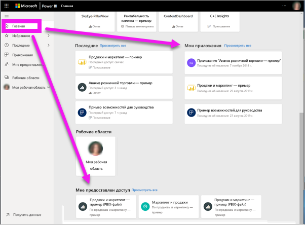
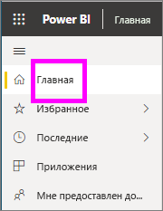
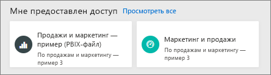
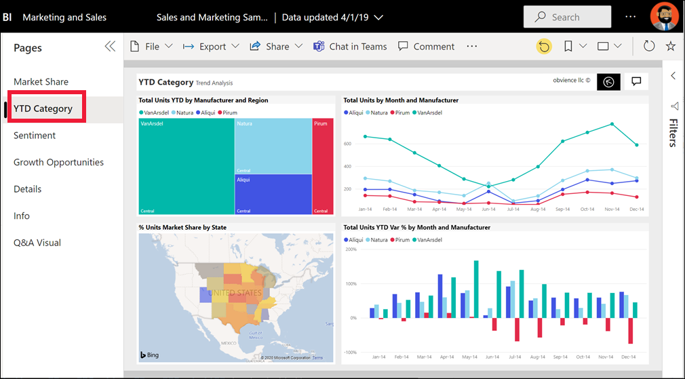
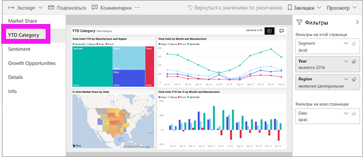
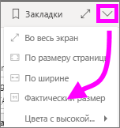
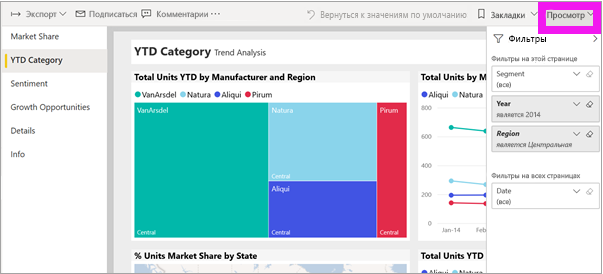
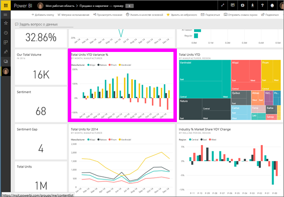
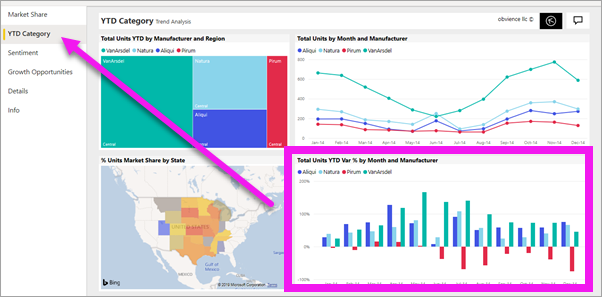

# Просмотр отчета в службе Power BI для *потребителей*
Отчет состоит из одной или нескольких страниц с визуализациями. Отчеты создаются *разработчиками* Power BI. [Общий доступ к отчетам предоставляется *потребителям* напрямую](end-user-shared-with-me.md) или в составе [приложения](end-user-apps.md). 

Есть много способов открыть отчет. Мы рассмотрим два из них: через главную страницу или через панель мониторинга. 

<!-- add art-->

## Открытие отчета через главную страницу Power BI
Давайте откроем отчет, к которому напрямую предоставлен общий доступ, а затем другой отчет, включенный в приложение.

   

### Открытие отчета, к которому вам предоставлен общий доступ
*Разработчики* Power BI могут предоставить вам прямой доступ к отчету. Содержимое, к которому таким образом предоставлен общий доступ, отображается в контейнере **Мне предоставлен доступ** на панели навигации, а также в разделе **Мне предоставлен доступ** на холсте главной страницы.

1. Откройте службу Power BI (app.powerbi.com).

2. На панели навигации выберите **Главная**, чтобы отобразить холст главной страницы.  

   
   
3. Прокрутите вниз, пока не увидите раздел **Мне предоставлен доступ**. Найдите значок отчета . На этом снимке экрана показана одна панель мониторинга и один отчет с именем *Продажи и маркетинг — пример*. 
   
   

4. Выберите *карточку* отчета, чтобы открыть отчет.

   

5. Обратите внимание на вкладки в левой части.  Каждая из них представляет страницу *отчета*. В данный момент открыта страница *Возможность роста*. Перейдите на вкладку *Категории с начала года*, чтобы открыть эту страницу отчета. 

   

6. Теперь вы видите всю страницу отчета. Чтобы изменить отображение (масштаб) страницы, выберите раскрывающийся список "Вид" в правом верхнем углу (**>**) и выберите **Фактический размер**.

   

   

### Открытие отчета, который включен в приложение
Если вы получили приложения от коллег или из AppSource, они будут доступны на главной странице и в контейнере **Приложения** на панели навигации. [Приложения](end-user-apps.md) представляет собой набор панелей мониторинга и отчетов.

1. Вернитесь на главную страницу, выбрав пункт **Главная** на панели навигации.

7. Прокрутите вниз, пока не увидите раздел **Мои приложения**.

   

8. Выберите одно из приложений, чтобы открыть его. В зависимости от параметров, заданных *конструктором* приложения, откроется панель мониторинга, отчет или список содержимого приложения. Если при выборе приложения:
    - открывается отчет, то все готово;
    - открывается панель мониторинга, перейдите к разделу ***Открытие отчета с панели мониторинга***.

## Открытие отчета с панели мониторинга
Отчеты можно открывать с панели мониторинга. Большинство [плиток](end-user-tiles.md) на панели мониторинга *закреплены* из отчетов. При выборе такой плитки открывается отчет, который использовался для ее создания. 

1. Выберите плитку на панели мониторинга. В этом примере мы выбрали плитку гистограммы Total Units YTD... (Всего единиц с начала года...).

    

2.  Откроется связанный с ней отчет. Обратите внимание, что у нас открыта страница YTD Category (Категория с начала года). Это страница отчета с гистограммой, которую мы выбрали на панели мониторинга.

    

> [!NOTE]
> Не все плитки направляют к отчетам. При выборе плитки, [созданной с помощью функции "Вопросы и ответы"](end-user-q-and-a.md), откроется экран этой функции. Если вы выберете плитку, [созданную с помощью мини-приложения **Добавить плитку** на панели мониторинга](../service-dashboard-add-widget.md), могут выполняться различные действия, такие как воспроизведение видео, открытие веб-сайта и т. д.  

##  Другие способы открытия отчета
Когда вы освоитесь с навигацией в службе Power BI, вы сможете выбрать для себя наиболее удобные рабочие процессы. Другие способы доступа к отчетам:
- из области навигации с помощью элементов **Избранное** и **Последние**;    
- при помощи параметра [Просмотреть похожие](end-user-related.md);    
- из сообщения электронной почты, если кто-нибудь [предоставил вам доступ](../service-share-reports.md) или вы [настроили оповещение](end-user-alerts.md);    
- из вашего [центра уведомлений](end-user-notification-center.md);    
- и прочие.

## Дальнейшие действия
Есть [очень много способов взаимодействовать с отчетом](end-user-reading-view.md).  Для начала попробуйте поочередно выбрать каждую вкладку сбоку от холста отчета.

